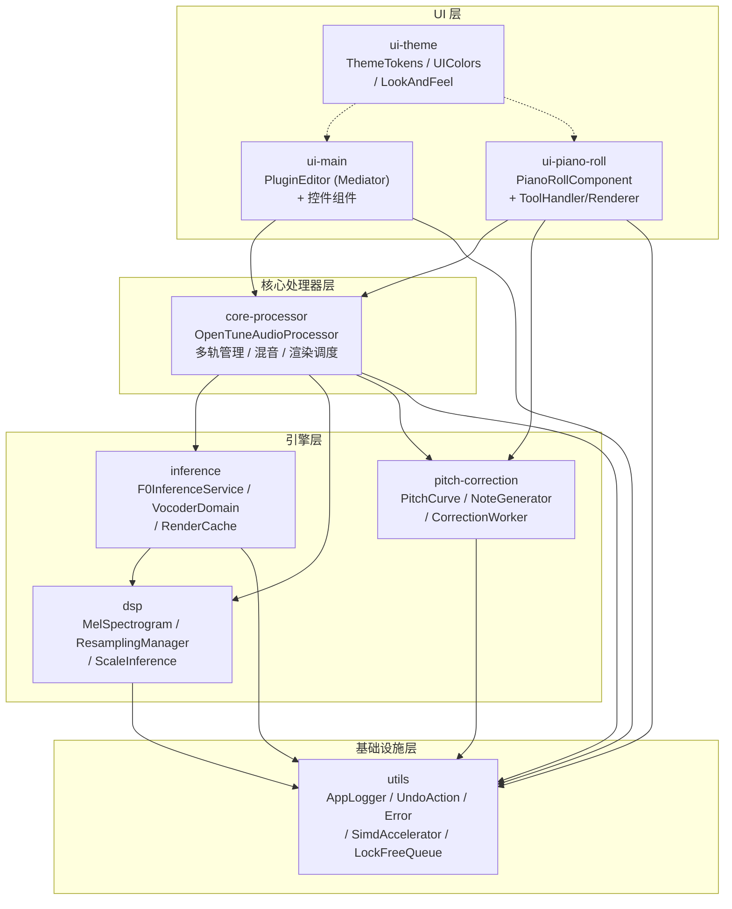
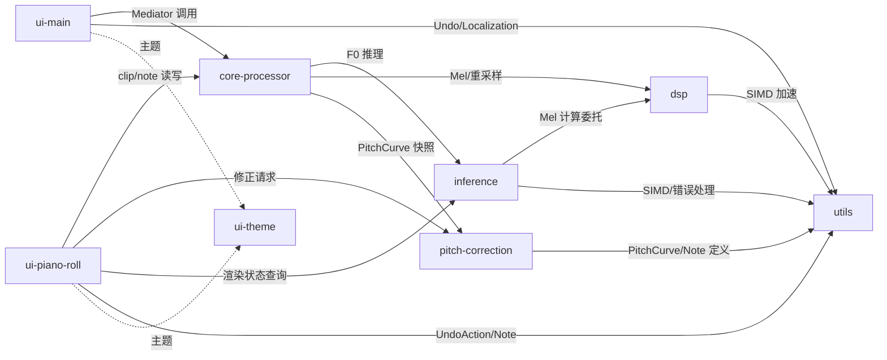
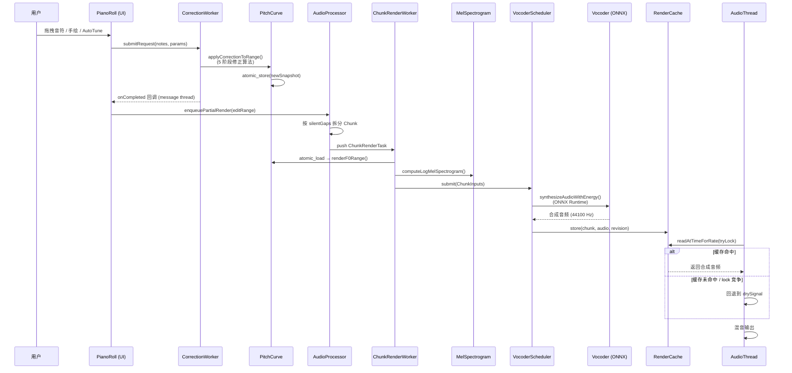

# OpenTune — 系统架构

## 概述

OpenTune 是一款基于 JUCE (C++17) 的 AI 修音独立应用。核心能力：通过 RMVPE 模型提取
人声基频 (F0)，用户在钢琴卷帘编辑器中编辑音高，再由 NSF-HiFiGAN 声码器合成保持原始
音色的修正音频。

## 分层架构



**层级说明：**

| 层级 | 模块 | 职责 |
|------|------|------|
| UI 层 | ui-main, ui-piano-roll, ui-theme | 用户交互、视觉呈现、主题管理 |
| 核心处理器层 | core-processor | 中枢调度：多轨管理、音频 I/O、渲染管线协调、Undo/Redo |
| 引擎层 | inference, dsp, pitch-correction | AI 推理、信号处理、音高修正算法 |
| 基础设施层 | utils | 日志、错误处理、无锁数据结构、SIMD 加速、平台适配 |

## 模块依赖关系



## 关键时序：用户编辑到音频输出



## 线程模型

| 线程 | 数量 | 职责 | 关键同步原语 |
|------|------|------|-------------|
| Audio Thread | 1 | 实时混音输出 (`processBlock`) | `ScopedReadLock`, `ScopedTryLock` (非阻塞), `atomic` |
| Message Thread (UI) | 1 | 用户交互、状态写入 | `ScopedWriteLock`, `MessageManager` |
| ChunkRenderWorker | 1 | Mel 频谱 + F0 准备 | `mutex` + `condition_variable`, `ScopedReadLock` |
| VocoderRenderScheduler | 1 | 声码器推理调度 | `mutex` + `condition_variable` |
| F0ExtractionService Workers | 2 | RMVPE F0 推理 | `LockFreeQueue`, `shared_mutex` |
| PianoRollCorrectionWorker | 1 | 音高修正计算 | `mutex`, `atomic` |

**关键不变量：Audio Thread 永不阻塞。** 所有缓存/数据访问均使用非阻塞 `TryLock` 或
lock-free `atomic` 操作，竞争失败时回退到 dry signal。

## 数据流总览

```
导入阶段:
  音频文件 → ResamplingManager (→44100Hz) → clip.audioBuffer
            → F0ExtractionService (→16kHz → RMVPE) → PitchCurve.originalF0

编辑阶段 (纯算法):
  用户编辑 → CorrectionWorker → PitchCurve.applyCorrectionToRange()
           → atomic_store(新快照) → enqueuePartialRender()

渲染阶段:
  ChunkRenderTask → renderF0Range() + computeLogMelSpectrogram()
                  → VocoderScheduler → NSF-HiFiGAN (ONNX)
                  → RenderCache.store()

播放阶段:
  processBlock → tracksLock_(ReadLock) → drySignal + RenderCache(TryLock)
              → 混音 → AudioOutput
```

## 关键技术决策

| 决策 | 选择 | 理由 |
|------|------|------|
| **COW 不可变快照** | `PitchCurve` 通过 `atomic_store/load` 发布 `shared_ptr<const Snapshot>` | 实现 lock-free 的音频线程读取，零优先级反转 |
| **两阶段导入** | prepare (后台) + commit (写锁) | 最小化 UI 线程写锁持有时间 |
| **固定 44100Hz 存储** | 所有音频和渲染以 44100Hz 为基准 | 与 HiFiGAN 声码器原生采样率一致，避免多次重采样 |
| **Rust-style Result\<T\>** | `std::variant<T, Error>` 无异常传播 | 项目约定不抛异常（仅外部 API 边界 catch） |
| **运行时 SIMD 分派** | 函数指针而非模板特化 | 单一二进制支持 AVX2/NEON/Accelerate 多平台 |
| **Mediator UI 架构** | `PluginEditor` 为中心协调者 | 单一协调点简化跨组件通信，代价是 ~2800 行 |
| **版本协议缓存** | `desiredRevision` vs `publishedRevision` 双版本号 | 精确识别缓存有效性，避免过期数据 |
| **thread_local Mel 处理器** | `computeLogMelSpectrogram` 使用 `thread_local` 实例 | 多线程安全 + 复用 FFT 对象避免重复分配 |
| **Token-based 主题系统** | 基础色 → 语义 Token → 全局缓存三层 | 新增主题只需添加 Layer 1+2，全局切换零运行时开销 |
| **串行声码器调度** | `VocoderRenderScheduler` 单线程顺序执行 | 避免 ONNX Runtime 并发推理的资源竞争 |

## 外部依赖

| 依赖 | 版本 | 用途 |
|------|------|------|
| JUCE | vendored (JUCE-master) | GUI 框架、音频 I/O、线程原语 |
| ONNX Runtime | 1.17.3 | AI 模型推理 (CPU / CoreML / DirectML) |
| r8brain-free-src | vendored | 高质量音频重采样 (24-bit 精度) |

## 代码规模

| 模块 | 约行数 | 文件数 |
|------|--------|--------|
| core-processor | ~5,000 | 7 |
| inference | ~3,500 | 23 |
| dsp | ~930 | 6 |
| pitch-correction | ~2,300 | 9 |
| ui-piano-roll | ~6,050 | 13 |
| ui-main | ~10,000 | 28 |
| ui-theme | ~4,000 | 12 |
| utils | ~5,600 | 31 |
| **合计** | **~37,400** | **~129** |
