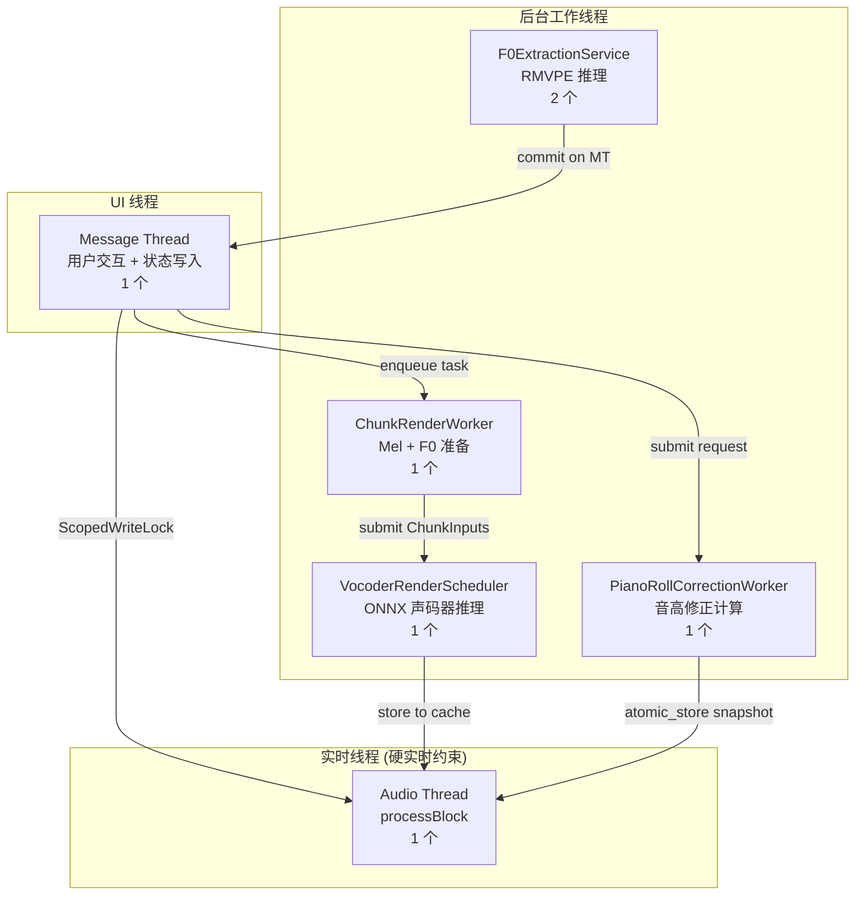

# 横切关注点 — 线程模型与并发安全

## 概述

OpenTune 是一个实时音频应用，线程安全是其最关键的横切关注点。系统运行时涉及 6 种
线程角色，通过精心设计的同步原语层次确保：

1. **音频线程永不阻塞** (零优先级反转)
2. **数据一致性** (COW 快照 + 读写锁)
3. **安全降级** (lock contention 时回退到 dry signal)

## 线程角色总览



## 线程详细说明

### 1. Audio Thread (`processBlock`)

**约束**: 硬实时，必须在缓冲区周期内完成（通常 ~5ms @ 512 samples / 44100Hz）。

**访问的共享资源**:

| 资源 | 锁策略 | 回退 |
|------|--------|------|
| `tracks_` 数组 | `juce::ScopedReadLock(tracksLock_)` | — |
| `RenderCache` | `juce::SpinLock::ScopedTryLock` | dry signal |
| `PitchCurveSnapshot` | `std::atomic_load` (lock-free) | — |
| `positionAtomic_` | `std::atomic<double>` | — |
| `isPlaying_` 等状态 | `std::atomic<bool>` | — |

**关键保证**:
- `juce::ScopedNoDenormals` 防止 CPU 因非规格化浮点减速
- 所有缓存/数据访问均为非阻塞或 lock-free
- `ScopedTryLock` 失败时回退到预重采样的 dry signal

### 2. Message Thread (UI)

**职责**: JUCE 消息循环线程，处理用户交互、状态写入、异步回调接收。

**写操作**:

| 操作 | 锁策略 |
|------|--------|
| Clip 导入/删除/移动 | `juce::ScopedWriteLock(tracksLock_)` |
| 音符编辑 | 通过 PianoRollComponent → PitchCurve setters |
| F0 提取结果 commit | `callAsync` 回到 Message Thread |
| 主题切换 | `UIColors` static 字段直接写入 |

**两阶段导入设计**: 重计算在后台线程 (`std::async`)，仅 commit 阶段持有 `WriteLock`，
最小化锁持有时间。

### 3. ChunkRenderWorker (`chunkRenderWorkerThread_`)

**职责**: 从渲染任务队列取任务，准备 Mel 频谱和修正后 F0，提交给声码器调度器。

**同步**:
- `chunkQueueMutex_` + `chunkQueueCv_`: 任务队列的 wait/notify
- `ScopedReadLock(tracksLock_)`: 读取 clip 音频数据
- `std::atomic_load(snapshot)`: 读取 PitchCurve 快照 (lock-free)

### 4. VocoderRenderScheduler

**职责**: 串行执行声码器推理任务。

**同步**:
- `queueMutex_` + `queueCV_`: 任务队列
- `VocoderInferenceService::runMutex_`: 保护 ONNX Session 并发安全
- 完成后写入 `RenderCache` (SpinLock)

**设计理由**: ONNX Runtime Session 不保证线程安全，故声码器推理采用串行调度。

### 5. F0ExtractionService Workers (2 个)

**职责**: 异步执行 RMVPE F0 提取推理。

**同步**:
- `LockFreeQueue<Task>`: 任务分发 (MPMC 无锁队列)
- `entriesMutex_`: 保护活跃任务表
- `std::shared_mutex` (F0InferenceService 内部): 保护模型访问
- Token 取消机制: 每个任务携带 `validity token`，取消时 token 递增使旧任务失效
- 结果通过 `juce::MessageManager::callAsync` 提交到 Message Thread

### 6. PianoRollCorrectionWorker

**职责**: 后台执行 `PitchCurve::applyCorrectionToRange()` 五阶段音高修正算法。

**同步**:
- `pendingRequestMutex_`: 保护请求 handoff
- `completedRequestMutex_`: 保护完成结果
- `std::atomic<uint64_t> version_`: 版本号，新请求覆盖旧请求（最新优先）
- 修正结果通过 `std::atomic_store` 发布新的 PitchCurveSnapshot

## 同步原语清单

### JUCE 原语

| 原语 | 使用位置 | 用途 |
|------|---------|------|
| `juce::ReadWriteLock` | `PluginProcessor::tracksLock_` | 轨道数据读写保护。Audio thread 持 ReadLock，UI thread 持 WriteLock |
| `juce::SpinLock` | `RenderCache::lock_` | 渲染缓存保护。轻量自旋锁，适合短临界区 |
| `juce::ScopedNoDenormals` | `processBlock` 入口 | 禁用非规格化浮点，防止 CPU 性能骤降 |
| `juce::MessageManager::callAsync` | F0 结果 commit | 将回调调度到 Message Thread |

### STL 原语

| 原语 | 使用位置 | 用途 |
|------|---------|------|
| `std::atomic<T>` | `positionAtomic_`, `isPlaying_`, `f0Ready_` 等 (~40+ 实例) | Lock-free 状态标志和计数器 |
| `std::atomic_store/load` | `PitchCurve::snapshot_` | COW 快照的 lock-free 发布/读取 |
| `std::mutex` + `std::condition_variable` | `chunkQueueMutex_/Cv_`, `schedulerMutex_/Cv_` | Worker 线程的任务队列同步 |
| `std::shared_mutex` | `F0InferenceService::Impl` | 允许多读单写的模型访问 |

### 自定义原语

| 原语 | 位置 | 用途 |
|------|------|------|
| `LockFreeQueue<T>` | `Source/Utils/LockFreeQueue.h` | MPMC 有界无锁环形队列，`alignas(64)` 缓存行对齐，用于 F0 任务分发 |

## Lock-Free 模式

### 1. COW (Copy-on-Write) 不可变快照

**核心**: `PitchCurve` 通过 `std::atomic_store/load` 发布 `shared_ptr<const PitchCurveSnapshot>`。

```
写入端 (Message/CorrectionWorker Thread):
1. clone 当前快照
2. 修改克隆
3. std::atomic_store(&snapshot_, newSnapshot)

读取端 (Audio/ChunkRender Thread):
1. auto snap = std::atomic_load(&snapshot_)
2. 使用 snap (不可变，安全)
```

**优势**:
- 读取端完全 lock-free
- 读取端看到的数据始终一致（不可变快照）
- 无 ABA 问题（shared_ptr 引用计数管理生命周期）

**代价**: 每次修改分配新快照（但修正操作频率低，开销可接受）

### 2. LockFreeQueue — MPMC 无锁队列

**位置**: `Source/Utils/LockFreeQueue.h` (156 行)

```
结构:
alignas(64) std::atomic<size_t> enqueuePos_;  // 生产者位置
alignas(64) std::atomic<size_t> dequeuePos_;  // 消费者位置
Cell {
    std::atomic<size_t> sequence;               // 序列号
    T data;
};
```

**算法**: 基于 sequence 的 CAS (Compare-and-Swap) 循环:
- 入队: CAS `enqueuePos_` → 写入数据 → store `sequence = pos + 1`
- 出队: CAS `dequeuePos_` → 读取数据 → store `sequence = pos + capacity`

**使用**: `F0ExtractionService` 的任务分发队列

### 3. Atomic 状态标志

`PluginProcessor` 中大量使用 `std::atomic<T>`:
- 播放状态: `isPlaying_`, `loopEnabled_`, `isFadingOut_`
- 位置: `positionAtomic_` (shared_ptr 共享)
- 初始化状态: `f0Ready_`, `vocoderReady_`
- 性能计数器: `perfCacheChecks_`, `perfCacheMisses_`

`PlayheadOverlayComponent` 使用全 atomic 属性确保 VBlank 线程安全读取。

## 数据流与锁层次

```
┌─────────────────────────────────────────────────────────────────┐
│                        锁层次（从外到内）                         │
│                                                                  │
│  Level 1: tracksLock_ (ReadWriteLock)                           │
│    ├── 保护: tracks_ 数组, clip 数据                             │
│    ├── ReadLock: Audio Thread, ChunkRenderWorker                │
│    └── WriteLock: Message Thread (导入/删除/移动 clip)           │
│                                                                  │
│  Level 2: RenderCache::lock_ (SpinLock)                         │
│    ├── 保护: chunk map, revision numbers                        │
│    ├── ScopedLock: RenderWorker (write), UI Thread (stats)      │
│    └── ScopedTryLock: Audio Thread (non-blocking read)          │
│                                                                  │
│  Level 3: PitchCurve::snapshot_ (atomic, lock-free)             │
│    ├── atomic_store: CorrectionWorker, Message Thread           │
│    └── atomic_load: Audio Thread, ChunkRenderWorker             │
│                                                                  │
│  Level 4: Task queues (mutex + cv)                              │
│    ├── chunkQueueMutex_: ChunkRender task queue                 │
│    ├── queueMutex_: VocoderScheduler task queue                 │
│    └── pendingRequestMutex_: CorrectionWorker request           │
│                                                                  │
│  Level 5: Service internals                                      │
│    ├── f0InitMutex_: F0 模型懒初始化                             │
│    ├── vocoderInitMutex_: Vocoder 模型懒初始化                   │
│    ├── runMutex_: ONNX Session 推理保护                          │
│    └── entriesMutex_: F0 活跃任务表                              │
└─────────────────────────────────────────────────────────────────┘
```

## 线程安全保证摘要

| 保证 | 实现方式 |
|------|---------|
| Audio Thread 永不阻塞 | TryLock + atomic + lock-free COW |
| 轨道数据一致性 | ReadWriteLock (读多写少优化) |
| PitchCurve 快照一致性 | COW 不可变快照 + atomic 发布 |
| 渲染缓存一致性 | SpinLock + 版本号双校验 |
| ONNX Session 线程安全 | mutex 保护 (串行推理) |
| F0 任务分发无锁 | LockFreeQueue (MPMC) |
| 异步结果安全回收 | callAsync 回到 Message Thread |
| 播放头流畅性 | VBlank + 全 atomic 属性 |
| 导入不卡 UI | 两阶段: prepare (后台) + commit (WriteLock 短持) |

## 已知设计折衷

1. **PitchCurve setter 无并发保护**: 多个 UI 操作同时调用 setter 可能导致竞态。
   当前依赖 Message Thread 单线程保证（所有 setter 仅在 Message Thread 调用）。

2. **CorrectionWorker 4ms 轮询**: 使用 `sleep(4ms)` 而非条件变量唤醒，存在延迟
   和 CPU 浪费。（参见 pitch-correction 模块待确认项 #6）

3. **VocoderRenderScheduler 串行**: 受限于 ONNX Session 线程安全约束，声码器推理
   无法并行。多核利用率受限于此瓶颈。

4. **SpinLock 自旋开销**: RenderCache 使用 SpinLock 而非 mutex，高竞争时会浪费
   CPU 周期。但对于短临界区和 Audio Thread 的 TryLock 模式，SpinLock 开销最小。
