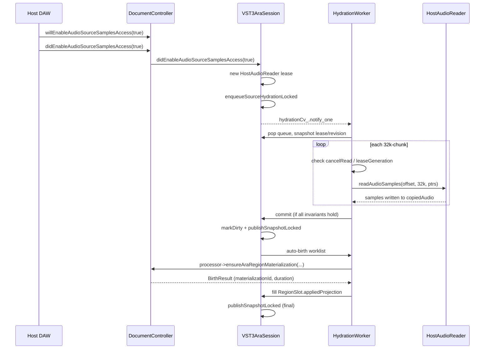
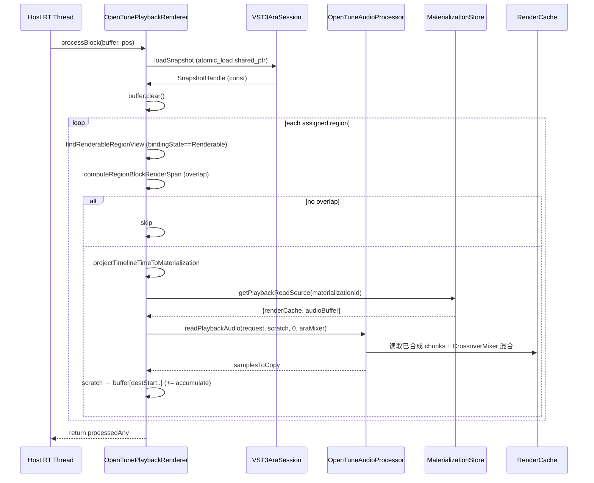
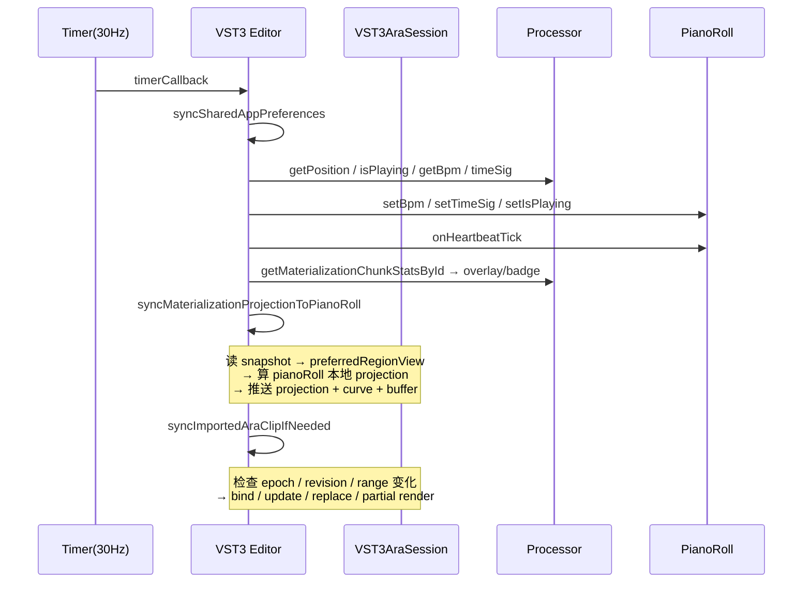

# ara-vst3 模块业务流程

本文档描述 `ara-vst3` 模块的 ARA 生命周期、采样访问流程、auto-birth materialization、实时渲染契约以及并发约束。

---

## 1. ARA 2 生命周期总览

JUCE 封装的 ARA SDK 把宿主与插件的交互拆成 "编辑事务"（editing）与 "采样访问"（sample access）两条主轴。OpenTune 的实现把所有事件都路由到 `VST3AraSession`。

### 1.1 编辑事务（Editing Transaction）

```
host: willBeginEditing(document)
  └─ DC → session_->willBeginEditing()
       └─ editingDepth_++
host: doAdd/Update/Remove…（多次）
  └─ 所有变更 only markSnapshotDirtyLocked (不直接 publish)
host: didEndEditing(document)
  └─ DC → session_->didEndEditing()
       └─ editingDepth_--
       └─ if editingDepth_==0 && pendingSnapshotPublication_
            publishSnapshotLocked  → nextPublishedEpoch_++
```

**设计意图**：编辑事务期间宿主可能连续下发数十个回调（例如拖动 region 边界），若每次都 publish 会让 Renderer 在一个 audio block 内看到几百个 epoch 变更。用 `editingDepth_` 聚批到事务末尾才 publish，保证 RT 端 "一个 block 一份 snapshot"。

### 1.2 采样访问（Sample Access）

```
host: willEnableAudioSourceSamplesAccess(audioSource, enable)
  │
  ├── enable == false
  │    ├─ clearSourcePayloadLocked  (复位 copiedAudio)
  │    └─ invalidateSourceReaderLeaseLocked
  │         ├─ leaseGeneration++
  │         ├─ cancelRead = true
  │         ├─ 若 readingFromHost → retiringReaderLease = move(readerLease)
  │         └─ 否则直接 readerLease.reset()
  │
  └── enable == true
       (状态标记)

host: didEnableAudioSourceSamplesAccess(audioSource, enable)
  │
  ├── enable == false
  │    └─ sampleAccessEnabled = false
  │
  └── enable == true
       ├─ sampleAccessEnabled = true
       ├─ cancelRead = false
       ├─ readerLease == nullptr → new HostAudioReader(audioSource), leaseGeneration++
       ├─ readingFromHost == true → enablePendingHydration = true (worker 完成后再入队)
       └─ else enqueueSourceHydrationLocked
```

### 1.3 生命周期不变式

1. **`willEnable(false)` 先清 payload 再清 lease**：保证外部看不到 payload 存在但 reader 已失效的中间态。
2. **`retiringReaderLease` 只在 worker 还在使用 reader 时才保留**：由 `drainDeferredSourceCleanupLocked` 在后续回调入口处 sweep。
3. **`pendingRemoval` 延后真正 erase**：`willDestroyAudioSource` 标记 pendingRemoval；真正 erase 在 worker 完成后的下一次 drain 或 worker loop 内部 commit 分支末尾进行。
4. **`editingDepth_ > 0` 期间不 publish**：例外路径：`willEnableAudioSourceSamplesAccess(false)` 会立即 publish，因为 host 期望 enable 状态对外可见。

---

## 2. Hydration 流程（从宿主拷贝 PCM）

`VST3AraSession` 拥有专用 worker 线程 `hydrationWorkerThread_`。

### 2.1 入队条件 `sourceNeedsHydrationLocked`

```cpp
return sourceSlot.sampleAccessEnabled
    && sourceSlot.readerLease != nullptr
    && sourceSlot.numSamples > 0
    && sourceSlot.numChannels > 0
    && (sourceSlot.copiedAudio == nullptr
        || sourceSlot.hydratedContentRevision != sourceSlot.contentRevision);
```

即：sample access 开启 + 有 lease + 尺寸有效 + （尚未 hydrate 或 hydrate 版本落后于 content 版本）。

### 2.2 worker 循环主干

```
loop forever:
  1. wait on hydrationCv_ until queue non-empty or !running
  2. pop audioSource, sourceSlot->queuedForHydration = false
  3. 再次校验 sourceNeedsHydrationLocked && !readingFromHost
  4. 若 numSamples > INT_MAX → AppLogger::error + skip
  5. sourceSlot->readingFromHost = true
     快照 reader / numChannels / numSamples / targetContentRevision / leaseGeneration
  6. 分配 copiedAudio (numChannels × numSamples)
  7. 按 kHydrationChunkSamples (32768) chunk 循环：
       - 锁验证 cancelRead / leaseGeneration / sampleAccessEnabled
       - 设置 hostReadInFlight = true
       - reader->readAudioSamples(offset, chunkSamples, channelPointers)
       - hostReadInFlight = false
  8. 锁：readingFromHost = false, cancelRead = false
  9. enablePendingHydration? → re-enqueue
  10. canCommit 校验（五项全真才 commit）
  11. commit:
        - sourceSlot.copiedAudio = move(copiedAudio)
        - hydratedContentRevision = targetContentRevision
        - markSnapshotDirtyLocked
        - 若 editingDepth_==0 → publishSnapshotLocked
        - auto-birth 所有未绑定 region (详见 §3)
  12. pendingRemoval && !pendingLeaseReset → sources_.erase(audioSource)
```

### 2.3 Commit 校验（all of）

```cpp
readSuccess
&& !canceled
&& sourceSlot->sampleAccessEnabled
&& sourceSlot->readerLease != nullptr
&& sourceSlot->leaseGeneration == leaseGeneration
&& sourceSlot->contentRevision == targetContentRevision
```

任一失败：丢弃本次读取的 `copiedAudio`，不更新 session 状态，但仍会尝试处理 `pendingRemoval`。

### 2.4 Hydration Mermaid



---

## 3. Auto-Birth Materialization

Hydration commit 成功后，worker 在**仍持锁**的情况下收集属于该 source 的所有未绑定 region 到 `worklist`，然后**释放锁**调用 `processor->ensureAraRegionMaterialization(...)`，最后**重新加锁**写回 appliedProjection：

```cpp
// 1. 收集（锁内）
for ((playbackRegion, regionSlot) in regions_):
    if regionSlot.identity.audioSource != audioSource: continue
    if regionSlot.appliedProjection.isValid() && materializationId != 0: continue
    worklist.push({regionIdentity, sourceId, copiedAudio, sampleRate, window, playbackStart})

// 2. 处理（每项：释放锁 → 调用 processor → 重新加锁）
for item in worklist:
    lock.unlock()
    birthResult = processor->ensureAraRegionMaterialization(
        item.regionIdentity.audioSource,
        item.sourceId,
        item.audio,
        item.sampleRate,
        item.window,
        item.playbackStart);
    lock.lock()

    if birthResult && materializationId != 0:
        // 写回仍存在且仍未绑定的 slot
        regionSlot->appliedProjection.sourceId = ...
        regionSlot->appliedProjection.materializationId = ...
        regionSlot->appliedProjection.appliedMaterializationRevision = ...
        regionSlot->appliedProjection.appliedProjectionRevision = projectionRevision
        regionSlot->appliedProjection.appliedSourceWindow = sourceWindow
        regionSlot->appliedProjection.playbackStartSeconds = playbackStartSeconds
        regionSlot->appliedProjection.appliedRegionIdentity = item.regionIdentity
        regionSlot->materializationDurationSeconds = birthResult->materializationDurationSeconds
        markSnapshotDirtyLocked

// 3. 收尾
if pendingSnapshotPublication_ && editingDepth_==0:
    publishSnapshotLocked
```

### 为何要"锁外调用 processor"

`processor->ensureAraRegionMaterialization` 内部会访问 `MaterializationStore`、分配 buffer、可能触发其他子系统的 callback。若在 `stateMutex_` 下调用，容易出现 `session lock → processor lock → session lock` 的跨组件死锁。释放锁时的隐性约束：

1. worklist 是值拷贝（含 `shared_ptr<const AudioBuffer>`），锁外使用安全。
2. 重新加锁后必须用 `findRegionSlot(item.regionIdentity.playbackRegion)` 重新定位（region 可能在此期间被移除）。
3. 重新定位后**二次校验** "未绑定"：若另一路径（例如 Editor `bindPlaybackRegionToMaterialization`）已经绑定，则 worker 让步不覆盖。

---

## 4. 实时渲染（Renderer processBlock）

### 4.1 契约

- 运行在 RT 线程；`noexcept`；**禁止**分配内存、加锁、调用任何阻塞 API。
- 每个 block 仅做一次 `atomic_load` 拿到 `SnapshotHandle`，之后所有读取都走该 immutable 视图。
- `playbackScratch_` 在 `prepareToPlay` 预分配到 `{numChannels, maxSamplesPerBlock}`。
- 不修改 session 任何状态（read-only 约束）。

### 4.2 处理流程



### 4.3 关键业务规则

| 规则 | 出处 | 处理 |
|------|------|------|
| **Isometric projection 不变式** | `processBlock` 内 | `|playbackDuration - materializationDuration| > 0.001s` → `AppLogger::log("InvariantViolation: …")` + `jassertfalse` + skip region |
| **仅 Renderable 态的 region 会被渲染** | `canRenderPublishedRegionView` | state 不符 → skip |
| **无 MaterializationStore → 静音** | `processBlock` 顶部 | clear + return false |
| **无 snapshot / 空 regions → 静音** | 同上 | 同上 |
| **日志静默（前 24 个 block）** | `mappingLogCounter` | 避免 DAW 日志被淹 |
| **累加而非覆盖** | region 循环末尾 `dest[...] += src[...]` | 多 region 可在同一 block 叠加（多 region 在 VST3/ARA 模式下实践中主要是单 preferred） |

### 4.4 `computeRegionBlockRenderSpan` 语义

输入：host block 时间区间 `[blockStart, blockStart + blockSamples/hostSR)` 与 region playback 区间 `[playbackStart, playbackEnd)`。

```
overlapStart = max(blockStart, playbackStart)
overlapEnd   = min(blockEnd,   playbackEnd)
if overlapEnd <= overlapStart: return nullopt

destinationStart = clamp(secondsToSamplesFloor(overlapStart - blockStart, hostSR), 0, blockSamples)
destinationEnd   = clamp(secondsToSamplesCeil (overlapEnd   - blockStart, hostSR), destStart, blockSamples)
samplesToCopy = destinationEnd - destinationStart
```

使用 floor/ceil 对称组合防止夹缝。

---

## 5. Editor 同步时序（Timer 心跳）

`OpenTuneAudioProcessorEditor::timerCallback`（30 Hz）处理 ARA snapshot 到 PianoRoll 的同步：



### 5.1 `syncImportedAraClipIfNeeded` 分支决策

按优先级：

1. **preferred region 不存在或 audioSource 为空** → 清 PianoRoll + markSnapshotConsumed + return
2. **appliedProjection 未 valid / materializationId==0** → 清 PianoRoll + markConsumed
3. **全部 revision 未变 + range 未变 + playbackStart 未变 + appliedRegion 未变** → 无操作 return
4. **MaterializationStore 中 matId 对应的 audio buffer 已消失** → `clearPlaybackRegionMaterialization` + 清 PianoRoll
5. **仅 appliedRegion 漂移（identity 变了但数据一致）** → 重新 bind（不重渲染）
6. **仅 playbackStart 变（mapping-only）** → bind 更新，log `"MappingTrace"`，不重渲染
7. **diff.changed==false && sourceRange 未变** → 仅 update revisions 或重 bind（按 appliedRegionChanged 分）
8. **sourceRange 变** → `replaceMaterializationWithNewLineage`（新 lineage，旧 materialization 被 erase）
9. **同 lineage 音频内容变** → `replaceMaterializationAudioById`（不变 sourceWindow）
10. 任一第 8/9 分支后：`enqueueMaterializationPartialRenderById(matId, changedStart, changedEnd)` + `requestMaterializationRefresh`（带 `preserveCorrectionsOutsideChangedRange=true`）+ 重新 bind

### 5.2 undo/redo 的局部重渲染

```
undo() 返回 action
  → 若是 PianoRollEditAction 且带有 affected frame 范围
     → 依 curve 的 hopSize/sampleRate 换算为秒
     → enqueueMaterializationPartialRenderById(matId, startSec, endSec)
  → 否则对整个 materialization duration 做 partial render
```

---

## 6. Playback Control 转发

```
User → transportBar → playRequested/pauseRequested/stopRequested
  │
  ├── JucePlugin_Enable_ARA && documentController != nullptr
  │      ├─ play: docController->requestStartPlayback()
  │      │         + processor.setPlayingStateOnly(true)
  │      │         + UI 同步
  │      ├─ pause: docController->requestStopPlayback() + setPlayingStateOnly(false) + UI
  │      └─ stop: requestStopPlayback + requestSetPlaybackPosition(0) + setPosition(0) + UI
  │
  └── else (standalone path)
         └─ processor.setPlaying(true/false)  // 直接驱动内部 transport
```

### `setPlayingStateOnly` vs `setPlaying`

- `setPlayingStateOnly(bool)`: 仅更新 `isPlaying` 标记但**不** 启动内部 transport（避免与 host playback 冲突）。
- `setPlaying(bool)`: 完整启停内部 transport（standalone 使用）。

---

## 7. 并发约束总结

| 线程 | 可以做的 | 禁止的 |
|------|----------|-------|
| Host Message Thread（Editing callbacks） | 持 `stateMutex_` 读写 sources/regions/preferredRegion、publish snapshot、enqueue hydration | 阻塞调用（会阻住 host UI） |
| `hydrationWorkerThread_` | 持 `stateMutex_` 做 snapshot commit 与 auto-birth worklist 收集；锁外执行 `readAudioSamples` 与 `processor->ensureAraRegionMaterialization` | 不得长时间持锁做 I/O（用 `retiringReaderLease` + `cancelRead` 协调） |
| Host RT Thread（processBlock） | `atomic_load` snapshot、读取 `shared_ptr<const>` 字段、调用 `processor->readPlaybackAudio`（内部必须 RT-safe） | 加锁、分配内存、日志（除 `mappingLogCounter < 24` 的有界日志）、调用 session mutation 方法 |
| Editor Message Thread（Timer） | `atomic_load` snapshot、读 processor 状态、调 session 的 `bindPlaybackRegionToMaterialization`、调 processor 的 replace/refresh | 持 session 锁时调 PianoRoll（会引发 UI 重排） |
| JUCE GUI Thread（listeners） | 调 session 的 `clearPlaybackRegionMaterialization` / `bindPlaybackRegionToMaterialization` | 同上 |

### 关键同步点

1. **`publishedSnapshot_` 是 RT 与非 RT 间唯一共享状态**：靠 `atomic_load/store<shared_ptr>` 保证，无锁。
2. **`processor_` 是 hydration worker 与主线程间共享**：`std::atomic<OpenTuneAudioProcessor*>`，DC 析构时先 `store(nullptr, release)` 再等 worker join。
3. **`leaseGeneration` 防 stale commit**：即使 worker 正在读旧 lease 的数据，commit 时发现 `leaseGeneration` 已变会直接丢弃。
4. **`editingDepth_` 支持 nested**：理论上支持 ARA 嵌套事务，但当前实现只做计数不做栈。

---

## 8. 失败模式与恢复

| 失败 | 触发 | 恢复机制 |
|------|------|----------|
| `readAudioSamples` 返回 false | 宿主 reader 出错 | `readSuccess=false` → 不 commit；session 保持 previous state；下次 `doUpdateAudioSourceContent` 或 `didEnableAudioSourceSamplesAccess(true)` 会重新入队 |
| Projection 非 isometric | 时间映射异常 | Renderer skip region + `jassertfalse`（Debug 中断，Release 静默） |
| `snapshot->publishedRegions` 为空 | session 尚未发布或全部 region 无效 | Renderer 输出静音 |
| auto-birth 返回 materializationId==0 | processor 拒绝创建 | 不更新 appliedProjection；region 保持 Unbound，下次 Editor 心跳会通过 `syncImportedAraClipIfNeeded` 再次尝试（或主动 import） |
| DC 析构时 worker 仍在运行 | 插件卸载 | `~VST3AraSession` 加锁设 running=false + 所有 source cancelRead + notify_all + join；DC 在析构 session_ 之前先 `setProcessor(nullptr)` 避免 worker 回调到已销毁 processor |
| ARA persistency 读写 | restore/store | 当前实现直接 `return true`，不做任何事 — 所有编辑结果在 DAW 重新打开工程时会重新从 host 拷贝 source 并重新分析（F0 / render） |

---

## 9. 与 Standalone 模式的业务差异

| 场景 | Standalone | VST3 + ARA |
|------|-----------|-----------|
| 导入音频 | 用户选文件 → `AudioFormatReader` → `StandaloneArrangement` | host 加载 clip → ARA 自动拷贝到 `SourceSlot.copiedAudio`，auto-birth materialization |
| 裁剪 clip | UI 拖动 clip 边界 → 直接改 StandaloneArrangement | host 改 `playbackRegion` 边界 → `didUpdatePlaybackRegionProperties` → projectionRevision bump → Editor `syncImportedAraClipIfNeeded` 检测 sourceRange 变 → `replaceMaterializationWithNewLineage` |
| 播放控制 | 内部 transport | DC 转发 host PlaybackController |
| BPM / 拍号 | UI 改 → processor 同步 | host 改 → `didUpdateMusicalContextProperties`（当前未回写；Editor 单向读 processor BPM） |
| 工程保存 | OpenTune 自己的工程文件 | host DAW 的 session file（ARA persistency 待实现） |
| 多轨 | `StandaloneArrangement` 多 clip | session preferred region 一次只聚焦一条；UI 不显示 arrangement |

---

## ⚠️ 待确认

### 一、生命周期
1. **ARA persistency 未实现**：`doRestoreObjectsFromStream / doStoreObjectsToStream` 返回 true 且 ignore 输入/输出。用户在 DAW 重新打开工程时，OpenTune 的所有编辑（pitch curve、correction 参数）会丢失 — 是否计划在 v1.3 后续迭代补齐？
2. **MusicalContext 回写方向**：host BPM 改变只触发 `didUpdateMusicalContextProperties`（当前只 log），Editor 心跳读的是 processor 的 BPM 而不是 MusicalContext — 需要确认业务是否依赖 host BPM 实时进入 processor。

### 二、Hydration 与版本
3. **Hydration 失败后的重试策略**：当前只有 content 再次变化才重入队，如果 `readAudioSamples` 是瞬时错误（磁盘繁忙），source 会一直处于 HydratingSource 态 — 是否需要指数退避重试？
4. **leaseGeneration 回绕**：`uint64_t` 增量，理论不会回绕；但若 host 频繁 enable/disable sample access，leaseGeneration 每秒递增数十次 — 工程上可以忽略，但未显式约束。

### 三、并发
5. **`processor_` 在 DC 析构 vs hydration worker 的窗口**：DC 析构先 `session_->setProcessor(nullptr)`，worker 下次 load 为 nullptr 就跳过 auto-birth；但若 worker 已经拿到非 null 指针并正调 `ensureAraRegionMaterialization`，此时 DC 析构开始，processor 也接近析构 — 需要确认 processor 析构是否会先等 DC 析构结束（或反过来），以防 auto-birth 调到已销毁 processor。
6. **`markSnapshotDirtyLocked` 在锁外 publish 的竞态**：auto-birth 流程释放锁后再加锁，此时其他事件线程可能已 publish，worker 再 publish 会覆盖新的 epoch — 逻辑上 snapshot 内容一致性由 `buildPublishedSnapshotLocked` 每次全量重建保证，但 epoch 可能不单调（确认是否重要）。

### 四、业务规则
7. **Renderer 累加多 region 的混音策略**：当前直接 `dest[...] += src[...]`，若多 region 重叠在同一 host block 可能 clip；是否依赖 host 输出总线 limiter？
8. **Undo/Redo affected 范围为 0 的场景**：`editAction->getAffectedEndFrame() > 0` 才走精确范围；否则对整个 materialization duration 做 partial render — 这在大文件上可能性能差，是否应该为不同 action 类型做分支？
9. **mappingLogCounter 全局静态**：多 VST3 实例共享同一计数器，跨实例只会 log 24 次合计 — 若用户同时在多轨上挂载 OpenTune，后挂载的实例几乎看不到 mapping log。是否改为每 Renderer 实例独立计数？
