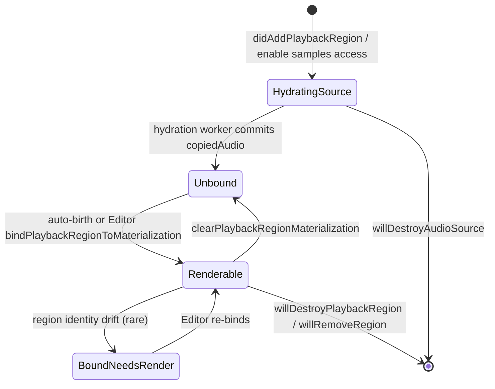

# ara-vst3 模块数据模型

本文档描述 ARA 实体（宿主侧）与 OpenTune 内部数据结构（`SourceSlot` / `RegionSlot` / `PublishedSnapshot` / `MaterializationStore`）的映射关系与版本协议。

---

## 1. ARA 侧实体（JUCE 封装）

```
ARADocument
  └── ARAMusicalContext
  └── ARAAudioSource           (每条"素材源文件"一个)
        └── ARAAudioModification   (对 source 的非破坏性变换层)
              └── ARAPlaybackRegion (宿主 timeline 上的一条 clip 引用)
```

| ARA 实体 | 含义 | 关键只读属性 |
|----------|------|--------------|
| `ARAAudioSource` | 宿主拥有的原始音频资产（文件或内存流） | `getSampleRate()`, `getChannelCount()`, `getSampleCount()`, `getName()` |
| `ARAAudioModification` | 在 source 之上的修改层（如处理参数） | `getAudioSource()` |
| `ARAPlaybackRegion` | 宿主 timeline 上的 region | `getStartInPlaybackTime()`, `getEndInPlaybackTime()`, `getStartInAudioModificationTime()`, `getEndInAudioModificationTime()`, `getAudioModification()` |
| `ARAMusicalContext` | BPM / time signature 上下文 | `didUpdateMusicalContextProperties` 回调中可读 |
| `ARAContentUpdateScopes` | 内容变化范围标记 | `affectSamples()`, `affectNotes()`, … |

`ARA::PlugIn::HostAudioReader` 由插件在 `didEnableAudioSourceSamplesAccess(enable=true)` 之后持有；提供 `readAudioSamples(sampleOffset, numSamples, channelPointers)` 接口从宿主侧拷贝 PCM。

---

## 2. 映射到 OpenTune 内部

```mermaid
flowchart LR
  subgraph Host [宿主 DAW]
    A[ARAAudioSource]
    M[ARAAudioModification]
    R[ARAPlaybackRegion]
    A --> M --> R
  end
  subgraph Session [VST3AraSession]
    SS[SourceSlot]
    RS[RegionSlot]
    SS -.contentRevision.-> SS
    RS -.projectionRevision.-> RS
  end
  subgraph Snapshot [PublishedSnapshot (immutable)]
    PRV[PublishedRegionView]
  end
  subgraph Core [OpenTune Core]
    MS[MaterializationStore]
    RC[RenderCache]
    MAT[Materialization]
  end

  A -->|ensureSourceSlot| SS
  R -->|ensureRegionSlot| RS
  SS -->|buildPublishedRegionViewFromState| PRV
  RS -->|buildPublishedRegionViewFromState| PRV
  RS -->|ensureAraRegionMaterialization| MAT
  MAT -->|managed by| MS
  MS --> RC
  PRV -.appliedProjection.materializationId.-> MAT
```

### 2.1 一一映射规则

| ARA 实体 | OpenTune 侧 | 键 | 备注 |
|----------|------------|-----|------|
| `ARAAudioSource*` | `VST3AraSession::SourceSlot` | 指针值作为 `SourceMap` key | 额外生成 `sourceId` 单调递增 |
| `ARAPlaybackRegion*` | `VST3AraSession::RegionSlot` | 指针值作为 `RegionMap` key | 通过 `RegionIdentity` 聚合 `playbackRegion + audioSource` |
| `(AudioModification, PlaybackRegion)` 对 | `RegionIdentity` + `RegionSlot.identity.audioSource` | 通过 `makeRegionIdentity(playbackRegion)` 派生 | AudioModification 本身不显式持久化为 slot |
| Sampled PCM（来自 HostAudioReader） | `SourceSlot.copiedAudio: shared_ptr<juce::AudioBuffer<float>>` | 绑定到 `contentRevision` | hydrated 成功后 `hydratedContentRevision = contentRevision` |
| region 绑定到的 editable audio | `MaterializationStore` 中的一个 Materialization（`materializationId`） | 通过 `appliedProjection.materializationId` 关联 | 一条 region 只绑一个 materialization；重命名/裁剪会新建 lineage |

---

## 3. `SourceSlot` 生命周期字段

| 字段 | 类型 | 含义 |
|------|------|------|
| `audioSource` | `juce::ARAAudioSource*` | back-pointer，map key |
| `sourceId` | `uint64_t` | 内部单调 ID（从 `nextSourceId_` 分配），1 开始；供 `MaterializationStore` 识别源血缘 |
| `name / sampleRate / numChannels / numSamples` | 基础属性 | 由 `didUpdateAudioSourceProperties` 拷贝 |
| `copiedAudio` | `shared_ptr<juce::AudioBuffer<float>>` | hydration 完成后填充；Renderer 和 Editor 只读 shared_ptr |
| `readerLease` | `unique_ptr<ARA::PlugIn::HostAudioReader>` | 活跃 lease；`sampleAccessEnabled==true` 期间存在 |
| `retiringReaderLease` | `unique_ptr<HostAudioReader>` | lease 失效但 worker 仍在 read 中时保留，防止析构崩溃；worker 完成后 `drainDeferredSourceCleanupLocked` 清理 |
| `contentRevision` | `uint64_t` | 每次 shape/content 变化递增（`nextSourceContentRevision_++`） |
| `hydratedContentRevision` | `uint64_t` | 最近一次成功拷贝的 revision；`hasAudio()` 要求两者相等 |
| `leaseGeneration` | `uint64_t` | 每次 lease 失效/新建递增；worker commit 前校验 `sourceSlot->leaseGeneration == leaseGeneration`，否则丢弃 |
| `sampleAccessEnabled` | `bool` | `didEnableAudioSourceSamplesAccess(true)` 后为 true |
| `hostReadInFlight` | `bool` | 当前一个 chunk 的 `readAudioSamples` 正在执行 |
| `queuedForHydration` | `bool` | 已经入 `hydrationQueue_`，避免重复入队 |
| `readingFromHost` | `bool` | worker 已在处理该 source；与 `hostReadInFlight` 区分（前者覆盖整个 hydration，后者仅 read 系统调用那一刻） |
| `cancelRead` | `bool` | 用户请求放弃当前 hydration（lease 失效 / destroy / disable） |
| `enablePendingHydration` | `bool` | enable 发生在 reading 途中，等 worker 完成后重新入队 |
| `pendingLeaseReset` | `bool` | `retiringReaderLease` 需要在 deferred cleanup 中 reset |
| `pendingRemoval` | `bool` | `willDestroyAudioSource` 已触发，但 worker 还在使用；在 `drainDeferredSourceCleanupLocked` 中延迟 erase |

---

## 4. `RegionSlot` 字段

| 字段 | 类型 | 含义 |
|------|------|------|
| `identity` | `RegionIdentity` | `playbackRegion + audioSource` 对 |
| `appliedProjection` | `AppliedMaterializationProjection` | 当前绑定到哪个 materialization（`materializationId=0` 表示未绑定） |
| `playbackStartSeconds / playbackEndSeconds` | `double` | region 在宿主 timeline 上的位置；从 `playbackRegion->getStartInPlaybackTime()` 取 |
| `sourceWindow` | `SourceWindow` | 在 AudioSource 时间轴上的子窗口：`sourceStartSeconds / sourceEndSeconds / sourceId` |
| `materializationDurationSeconds` | `double` | materialization 音频实际时长；理论上应等于 `playbackEnd - playbackStart`（projection isometric 不变式） |
| `projectionRevision` | `uint64_t` | 每次 region 时间/source window 变化递增（`nextRegionProjectionRevision_++`） |

### `AppliedMaterializationProjection` 的三级版本

```
sourceId (1) --[contentRevision]--> SourceSlot.copiedAudio (revision N)
                                         |
                                         v
materializationId (5) --[appliedMaterializationRevision]--> materialization render
                                         |
                                         v
projection (7) --[appliedProjectionRevision]--> playback time mapping
```

Editor 在 `syncImportedAraClipIfNeeded` 中比较三级 revision：
- `materializationChanged = materializationRevision > appliedMaterializationRevision`
- `projectionChanged = projectionRevision > appliedProjectionRevision`
- `sourceRangeChanged = !nearlyEqualSeconds(...sourceStart/End...)`
- `playbackStartChanged = !nearlyEqualSeconds(...playbackStart...)`

---

## 5. `BindingState` 状态派生

在 `buildPublishedRegionViewFromState` 中由 `regionSlot + sourceSlot` 的静态属性派生（非存储字段）：

```cpp
if (regionSlot.appliedProjection.isValid()
    && regionSlot.appliedProjection.materializationId != 0
    && regionSlot.appliedProjection.appliedRegionIdentity == regionSlot.identity)
{
    Renderable
}
else if (regionSlot.appliedProjection.isValid()
         && regionSlot.appliedProjection.materializationId != 0)
{
    BoundNeedsRender   // materialization exists but identity drifted
}
else if (sourceSlot.hasAudio())
{
    Unbound            // source ready but not yet bound to any materialization
}
else
{
    HydratingSource    // source audio still being copied from host
}
```



**Renderer 约束**：`canRenderPublishedRegionView` 只有在 state 为 `Renderable` 时返回 true。其他状态下 `processBlock` 会 skip 该 region。

---

## 6. `PublishedSnapshot`：RT-safe 只读投影

```cpp
struct PublishedRegionView {
    RegionIdentity regionIdentity;
    uint64_t sourceId;
    AppliedMaterializationProjection appliedProjection;
    shared_ptr<const juce::AudioBuffer<float>> copiedAudio;  // 直接共享 SourceSlot.copiedAudio
    double sampleRate;
    int numChannels;
    int64_t numSamples;
    uint64_t materializationRevision;
    uint64_t projectionRevision;
    double playbackStartSeconds;
    double playbackEndSeconds;
    SourceWindow sourceWindow;
    double materializationDurationSeconds;
    BindingState bindingState;
};

struct PublishedSnapshot {
    uint64_t epoch;                          // nextPublishedEpoch_++
    RegionIdentity preferredRegion;          // 当前聚焦的 region（Editor/UI 用）
    std::vector<PublishedRegionView> publishedRegions;
};

using SnapshotHandle = shared_ptr<const PublishedSnapshot>;
```

### 发布协议

| 方向 | 机制 |
|------|------|
| 生产者（编辑线程）→ snapshot | `std::atomic_store(&publishedSnapshot_, buildPublishedSnapshotLocked())` |
| 消费者（Renderer/UI）← snapshot | `std::atomic_load(&publishedSnapshot_)` 获得 `shared_ptr<const>` |
| 读方生命周期 | 持有 shared_ptr 期间底层数据不会被回收 |
| 写方版本号 | 每次 publish `++nextPublishedEpoch_` |

### 不变式

1. `PublishedRegionView.copiedAudio` 要么 nullptr，要么指向与 SourceSlot 相同的 audio buffer（**不拷贝**）。
2. `publishedRegions` 中的 region 必须同时：`isValid() == true`，且 `findSourceSlotInCollection` 能找到对应 source。
3. `preferredRegion` 若被设置，必须在 `publishedRegions` 中存在；否则 `reconcilePreferredRegionFromState` 会 fallback 到第一个有效 region（或置空）。
4. `materializationDurationSeconds == playbackEndSeconds - playbackStartSeconds`（允许 ±0.001s 容差，违反则 Renderer `jassertfalse`）。

---

## 7. `MaterializationStore` 侧数据（下游，简述）

`MaterializationStore` 是 OpenTune 核心的"可编辑音频真源"容器，ara-vst3 模块通过 `PluginProcessor::ensureAraRegionMaterialization` 为 ARA region 创建 materialization：

| 字段（CreateMaterializationRequest） | 由 ARA 侧提供 |
|------|------|
| `sourceId` | `SourceSlot.sourceId`（或 ARA 派生） |
| `lineageParentMaterializationId` | 0 表示新建；`replaceMaterializationWithNewLineage` 时传旧 ID |
| `sourceWindow` | `RegionSlot.sourceWindow` |
| `audioBuffer` | `SourceSlot.copiedAudio`（或 `prepareImportFromAraRegion` 切出的 slice） |
| `silentGaps` | 由 `prepareImport` 分析得到 |
| `renderCache` | 新建 `make_shared<RenderCache>()`（auto-birth 时 MaterializationStore 内部创建） |

`MaterializationStore::PlaybackReadSource`：Renderer 调用 `getPlaybackReadSource(materializationId, out)` 得到 `{renderCache, audioBuffer}`，随后交给 `processor->readPlaybackAudio()`。

---

## 8. 版本号 / 生成器

| 计数器 | 初值 | 递增时机 |
|--------|------|----------|
| `nextSourceId_` | 1 | `ensureSourceSlot` 首次创建 source slot |
| `nextSourceContentRevision_` | 1 | `didUpdateAudioSourceProperties` 发现 shape 变 / `doUpdateAudioSourceContent(affectSamples)` |
| `nextRegionProjectionRevision_` | 1 | `updateRegionProjectionFromPlaybackRegionLocked` 返回 true |
| `nextPublishedEpoch_` | 1 | 每次 `publishSnapshotLocked` |
| `SourceSlot.leaseGeneration` | 0 | 每次 `invalidateSourceReaderLeaseLocked` 或新建 lease |

---

## 9. 常量与容差

| 常量 | 值 | 出处 |
|------|----|------|
| `kHydrationChunkSamples` | `32768` | `hydrationWorkerLoop` |
| `nearlyEqualSeconds` | `|lhs - rhs| <= 1e-9` | `VST3AraSession.cpp` 匿名命名空间 |
| `nearlyEqualSeconds`（Editor） | `|a - b| <= 1.0 / kRenderSampleRate` | `PluginEditor.cpp` 匿名命名空间 |
| `nearlyEqualAudioSample` | `|a - b| <= 1e-5f` | `PluginEditor.cpp` |
| Projection duration 容差 | `0.001s` | `OpenTunePlaybackRenderer::processBlock` |
| `mappingLogCounter` 上限 | 24 | `OpenTunePlaybackRenderer.cpp` |

---

## 10. 典型数据流：宿主 clip → 可渲染 snapshot

```
1. host: ARAAudioSource 被创建 (文件加载)
   └─ DC::didUpdateAudioSourceProperties
       └─ SourceSlot.name/sr/channels/numSamples set
       └─ contentRevision bumped
       └─ (还没有 copiedAudio, sampleAccessEnabled=false)

2. host: ARAPlaybackRegion 被添加
   └─ DC::didAddPlaybackRegionToAudioModification
       └─ RegionSlot.identity / sourceWindow / playbackStart/End set
       └─ preferredRegion updated
       └─ markSnapshotDirtyLocked (编辑事务中)

3. host: willEnableAudioSourceSamplesAccess(true)
   └─ DC::didEnableAudioSourceSamplesAccess(true)
       └─ SourceSlot.sampleAccessEnabled = true
       └─ 新建 HostAudioReader lease
       └─ enqueueSourceHydrationLocked → hydrationQueue_

4. hydrationWorkerLoop (专用线程)
   └─ 逐 32k samples chunk reader->readAudioSamples
   └─ commit: SourceSlot.copiedAudio 填充, hydratedContentRevision=contentRevision
   └─ markSnapshotDirtyLocked + publishSnapshotLocked (若 editingDepth==0)
   └─ auto-birth: 对所有未绑定且属于此 source 的 region，调 processor->ensureAraRegionMaterialization
   └─ 用返回的 materializationId / materializationDurationSeconds 填充 RegionSlot.appliedProjection

5. host: didEndEditing
   └─ publishSnapshotLocked → PublishedSnapshot 发布, epoch++

6. Renderer (RT 线程): processBlock
   └─ session->loadSnapshot()
   └─ PublishedRegionView.bindingState == Renderable
   └─ 计算 overlap, 通过 MaterializationTimelineProjection 映射时间
   └─ processor->readPlaybackAudio 从 RenderCache mix 到 buffer
```

---

## ⚠️ 待确认

1. **AudioModification 层未显式建模**：当前 session 只维护 source / region 两层；若 host 在同一 source 上创建多个 modification，实际会体现为 `ARAPlaybackRegion.getAudioModification() != getAudioModification()` 但指向同一 source — 是否需要 ModificationSlot 层？（当前是否因为 regionSlot 粒度已经足够而跳过？）
2. **sourceId 与 MaterializationStore 的 sourceId 一致性**：`SourceSlot.sourceId` 由 session 的 `nextSourceId_` 分配，而 `MaterializationStore` 可能有自己的 sourceId 空间（需要交叉检查 core-processor 模块）；当前 `ensureAraRegionMaterialization(sourceId=SourceSlot.sourceId)` 假设二者同一命名空间，若分歧则可能造成 materialization 与 source 失配。
3. **`materializationDurationSeconds` 来源**：Renderer 校验的是 RegionSlot 记录的值 vs `playbackEnd-playbackStart`；但该字段由 `ensureAraRegionMaterialization` 返回后写入，与 `MaterializationStore` 内部音频长度的同步依赖调用方（Editor），非 session 自管 — 若后续 `replaceMaterializationAudioById` 改变了内部音频长度而未回写 session，会触发 `jassertfalse`。
4. **`silentGaps` 的 ARA 语义**：`PreparedImport::silentGaps` 用于跳过无声段落；ARA region 是否允许 host 端已知的 silent gap 信息提前下发？当前似乎都由 `prepareImport` 在 audio 到达后分析。
5. **BindingState 没有直接的 "Error" 态**：hydration 失败（`readAudioSamples` 返回 false）当前表现为 `copiedAudio == nullptr` 且 `hydratedContentRevision != contentRevision`，从外部看与 "HydratingSource" 无法区分；是否考虑加 `HydrationFailed` 显式态？
