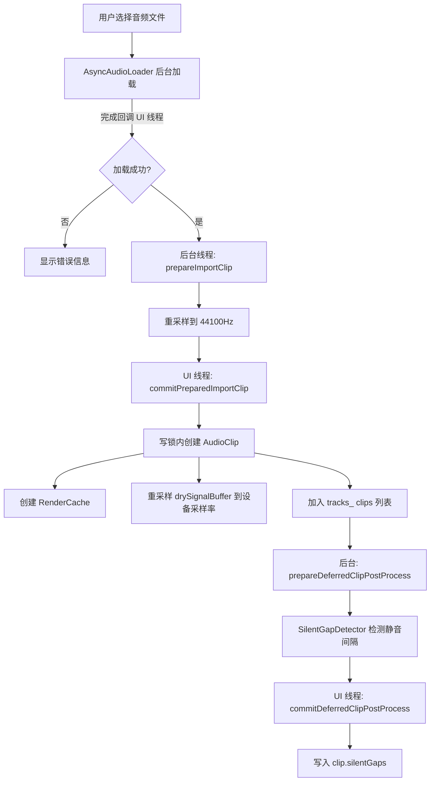
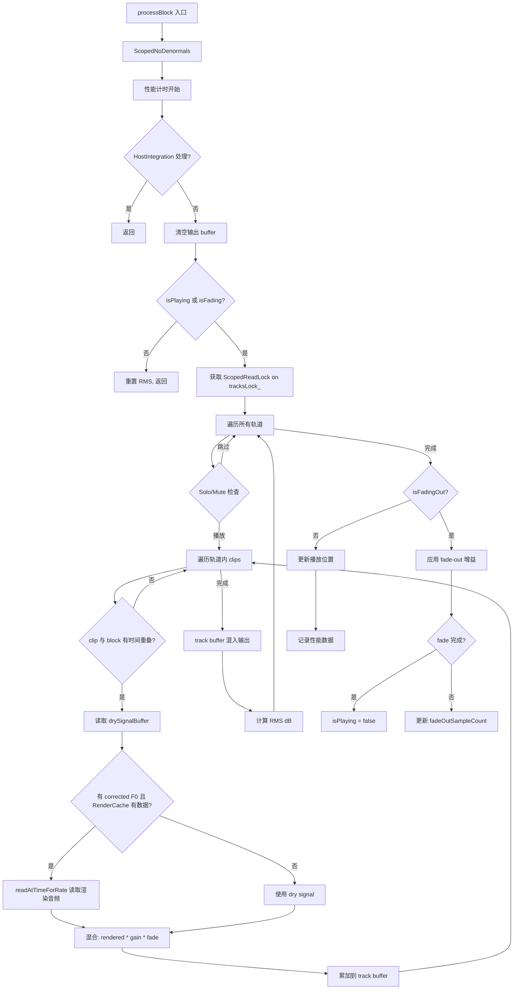
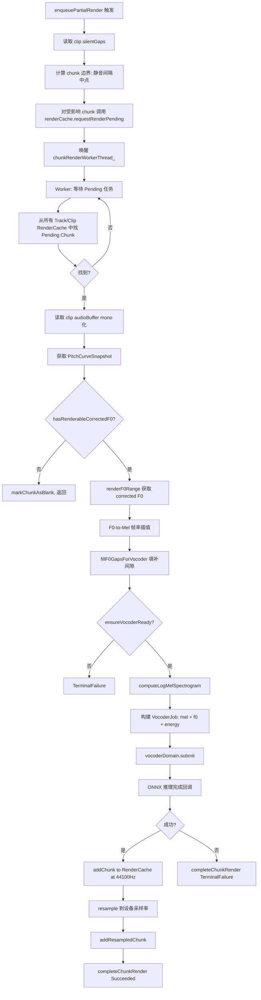
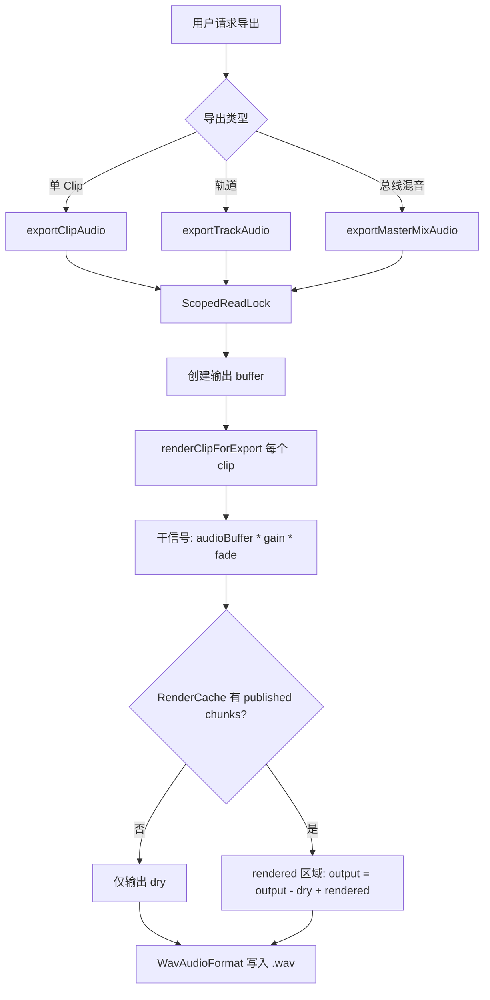

> ⚠️ 基于源码扫描生成，准确性待人工验证

# core-processor — 业务规则与核心流程

---

## 核心业务规则

### 音频存储与采样率

1. **BR-001**: 所有导入的音频统一重采样到 44100Hz 存储（`TimeCoordinate::kRenderSampleRate`），与设备采样率无关。`audioBuffer` 始终为 44100Hz。
2. **BR-002**: `drySignalBuffer_` 是 `audioBuffer` 预重采样到设备采样率的副本，用于实时播放。当设备采样率变化（`prepareToPlay` 检测到）时，自动重建所有 clip 的 `drySignalBuffer_`。
3. **BR-003**: 渲染缓存（`RenderCache`）中的基础音频为 44100Hz，同时存储按设备采样率重采样的副本。设备采样率变化时，清除 resampled cache 但保留 44100Hz 基础数据。

### 多轨管理

4. **BR-004**: 系统支持最多 `MAX_TRACKS = 12` 条轨道，固定数组预分配，不动态创建/销毁。
5. **BR-005**: 每条轨道可包含多个 clip（`std::vector<AudioClip>`），clip 之间可以有不同的起始时间（`startSeconds`），实现多 clip 时间轴排列。
6. **BR-006**: clip ID 由全局 `nextClipId_` 原子计数器生成，确保唯一性。
7. **BR-007**: Solo/Mute 逻辑：如果任何轨道设为 Solo，则只有 Solo 轨道发声；否则所有未 Mute 的轨道发声。全局 `anyTrackSoloed_` 标志在 `setTrackSolo` 时同步更新。

### 两阶段导入协议

8. **BR-008**: 音频导入采用"两阶段"协议：`prepareImportClip`（后台线程，重采样等重计算）→ `commitPreparedImportClip`（UI 线程，写锁内轻量挂载）。
9. **BR-009**: 延迟后处理机制：`silentGaps` 的计算（`SilentGapDetector::detectAllGapsAdaptive`）通过 `prepareDeferredClipPostProcess` + `commitDeferredClipPostProcess` 延迟到波形可见后异步执行。

### 播放与混音

10. **BR-010**: 播放停止时执行 200ms fade-out（`fadeOutTotalSamples_ = sampleRate * 0.2`），避免啪嗒声。fade-out 完成后才真正设置 `isPlaying_ = false`。
11. **BR-011**: 实时播放中，如果 corrected F0 存在且 RenderCache 中有渲染结果，使用渲染后的音频替换 dry signal；否则回退到 dry signal。
12. **BR-012**: `processBlock` 中音频线程 **永不阻塞** — 对 `RenderCache` 使用 `ScopedTryLock`（非阻塞），对 `tracksLock_` 使用 `ScopedReadLock`。
13. **BR-013**: 每个 clip 支持独立的 fade-in/fade-out 持续时间，在播放和导出时均生效。
14. **BR-014**: RMS 电平在 processBlock 中实时计算并通过 `std::atomic<float>` 发布，UI 可无锁读取。

### Chunk 渲染管线

15. **BR-015**: `enqueuePartialRender` 将编辑范围按 silentGaps 分割为自然 chunk（边界取静音间隔中点），对每个受影响的 chunk 请求渲染。
16. **BR-016**: chunk 渲染 worker（单线程 `chunkRenderWorkerThread_`）准备 mel spectrogram + F0 数据后，提交给 `VocoderDomain`（多线程 ONNX 推理）。
17. **BR-017**: F0-to-Mel 插值：从 F0 帧率（100fps）插值到 mel 帧率（~86fps at 44100/512），使用 log-domain 线性插值。
18. **BR-018**: F0 间隙填充（`fillF0GapsForVocoder`）：内部间隙 ≤50 帧用 log-domain 插值填补；边界零值向外查询 PitchCurve 并延伸填充。目的是消除 NSF-HiFiGAN 的相位震荡。
19. **BR-019**: 渲染版本控制：每个 chunk 的 `desiredRevision` 在每次编辑时递增，渲染完成后对比 `targetRevision`，过时则丢弃结果。

### 导出

20. **BR-020**: 导出格式统一为 WAV，44100Hz，32-bit float。单 clip/轨道导出为 mono，总线混音导出为 stereo。
21. **BR-021**: 导出时，corrected 区域的 rendered 音频 **覆盖**（非叠加）dry signal：`output = output - dry + rendered`。
22. **BR-022**: 总线混音导出遵循 Solo/Mute 规则，与实时播放行为一致。

### 序列化

23. **BR-023**: 项目状态序列化为 ValueTree XML（schema version = 2）。存储内容包括：BPM、缩放级别、轨道高度、每个 clip 的 PitchCurve（originalF0 + originalEnergy + correctedSegments，Base64 编码 float 向量）。
24. **BR-024**: 反序列化时通过 `clipId` 匹配已有 clip，仅恢复 PitchCurve 数据。音频 buffer 不存储在状态中（需重新导入）。

### Undo/Redo

25. **BR-025**: 全局 UndoManager（容量 500 步）统一管理所有视图的操作历史。`ClipSnapshot` 机制支持 clip 的完整快照保存与恢复。

### 推理引擎

26. **BR-026**: F0 和 Vocoder 引擎采用懒初始化（`ensureF0Ready` / `ensureVocoderReady`），仅在首次需要时加载 ONNX 模型。初始化使用双重检查锁定（double-checked locking）模式。
27. **BR-027**: 初始化失败后（`f0InitAttempted_ = true` 但 `f0Ready_ = false`）不再重试，直到应用重启。

---

## 核心流程

### 流程 1：音频导入流程

### 流程 2：processBlock 实时播放流程

### 流程 3：Chunk 渲染流程

### 流程 4：导出流程

---

## 关键方法说明

| 方法 | 所在类 | 说明 |
|------|--------|------|
| `processBlock` | OpenTuneAudioProcessor | 音频线程核心循环：多轨混音 + 渲染结果叠加 + fade-out + RMS 计算 |
| `prepareImportClip` | OpenTuneAudioProcessor | 两阶段导入 Phase 1: 重采样到 44100Hz（后台线程） |
| `commitPreparedImportClip` | OpenTuneAudioProcessor | 两阶段导入 Phase 2: 创建 clip 对象（UI 线程，写锁内） |
| `enqueuePartialRender` | OpenTuneAudioProcessor | 按 silentGaps 分 chunk 请求渲染 |
| `chunkRenderWorkerLoop` | OpenTuneAudioProcessor | 渲染 Worker 主循环：mel + F0 准备 → vocoder 提交 |
| `fillF0GapsForVocoder` | 匿名命名空间 | 填补 corrected F0 间隙（内部插值 + 边界延伸），消除 vocoder 相位震荡 |
| `renderClipForExport` | 匿名命名空间模板 | 导出时合成 clip 音频（dry + rendered 覆盖） |
| `computeFadeGain` | 匿名命名空间 | 计算 fade-in/out 线性增益 |
| `buildChunkBoundariesFromSilentGaps` | 静态函数 | 从 silentGaps 构建 chunk 边界数组（取间隔中点） |
| `resampleDrySignal` | OpenTuneAudioProcessor | 将 44100Hz audioBuffer 重采样到设备采样率 |
| `ensureF0Ready` / `ensureVocoderReady` | OpenTuneAudioProcessor | 双重检查锁定懒初始化 ONNX 推理引擎 |
| `getStateInformation` / `setStateInformation` | OpenTuneAudioProcessor | 项目序列化/反序列化（ValueTree XML + Base64） |
| `submit` | F0ExtractionService | 提交异步 F0 提取任务（去重 + lock-free queue） |
| `workerLoop` | F0ExtractionService | Worker 循环：取任务 → 执行 → 校验 token → message 线程 commit |
| `loadAudioFile` | AsyncAudioLoader | 后台线程加载音频文件，validity token 防悬空回调 |

---

## 线程模型与锁策略

| 线程 | 角色 | 关键锁/同步原语 |
|------|------|----------------|
| Audio thread (processBlock) | 实时混音输出 | `ScopedReadLock(tracksLock_)`、`ScopedNoDenormals`、`atomic load` |
| UI / Message thread | 用户交互、状态变更 | `ScopedWriteLock(tracksLock_)`、`atomic store` |
| chunkRenderWorkerThread_ | Mel + F0 准备 | `schedulerMutex_` + `schedulerCv_`、`ScopedReadLock(tracksLock_)` |
| VocoderDomain workers | ONNX 推理 | VocoderDomain 内部管理 |
| F0ExtractionService workers (2) | F0 提取 | `entriesMutex_`、`LockFreeQueue` |
| AsyncAudioLoader thread | 文件加载 | `validityToken_`、`MessageManager::callAsync` |

**关键不变量**：
- 音频线程永不阻塞（`ScopedTryLock` on RenderCache, `ScopedReadLock` on tracksLock_）
- 所有跨线程回调通过 `juce::MessageManager::callAsync` 安全地分发到 UI 线程
- PitchCurve 使用 `std::atomic_store/load` 的 COW 模式实现 lock-free 音频线程读取

---

## ⚠️ 待确认

### [LOW-CONF] 低置信度推断

1. **BR-009 延迟后处理时序**：`prepareDeferredClipPostProcess` 何时触发？源码中未看到调用点（在 PluginEditor 中），需确认触发条件（是波形首次可见还是导入后定时器触发）。
2. **BR-027 初始化重试策略**：`f0InitAttempted_` 设为 true 后永不重试，但用户可能在修复模型文件路径后期望重新初始化。是否有重置机制？
3. **RMS 计算**：processBlock 中 RMS 跨所有声道累加（`trackSampleCount = numSamples * totalNumOutputChannels`），这是否为有意设计？通常 RMS 按声道或按功率计算。

### [EDGE] 边界条件

4. **Clip 分割最小长度**：`splitClipAtSeconds` 要求分割点两侧各至少 100ms（`minLen = 0.1 * sampleRate`），但 `sampleRate` 实际使用的是 `StoredAudioSampleRate`（44100），此约束为 4410 samples。
5. **空轨道导出**：`exportTrackAudio` 在 `track.clips.empty()` 时返回 false 并设置中文错误信息，`exportMasterMixAudio` 在 `totalLen <= 0` 时返回 false 但不设置错误信息。
6. **MAX_TRACKS 溢出**：如果通过外部 API 传入 `trackId >= 12`，所有方法都有范围检查，但返回值不一致（有的返回 false，有的返回默认值）。

### [DEP] 跨模块依赖

7. **PitchCurve / PitchCurveSnapshot**：核心 COW 数据结构，定义在 `Utils/PitchCurve.h`，被 processBlock 和 chunkRenderWorkerLoop 深度依赖。
8. **RenderCache**：渲染结果存储，定义在 `Inference/RenderCache.h`，被 processBlock 读取、被 chunkRenderWorkerLoop 写入。
9. **VocoderDomain / F0InferenceService**：推理层接口，定义在 `Inference/` 目录下，被本模块的懒初始化和渲染流程调用。
10. **SilentGapDetector**：定义在 `Utils/SilentGapDetector.h`，被导入流程和渲染 chunk 分割依赖。
11. **MelSpectrogram**：DSP 模块，定义在 `DSP/MelSpectrogram.h`，被 chunkRenderWorkerLoop 调用。
12. **ResamplingManager**：DSP 模块，定义在 `DSP/ResamplingManager.h`，被导入和干信号重采样调用。

### [BIZ-GAP] 业务空白

13. **Loop 播放**：`loopEnabled_` 原子变量存在但 processBlock 中未使用（无循环跳转逻辑），疑似功能尚未实现。
14. **ARA 支持**：`#if JucePlugin_Enable_ARA` 条件编译分支存在但未在 arch_layers 中涵盖，ARA 相关行为未记录。
15. **音频录制**：`isRecording()` 仅返回宿主状态，本应用无独立录音功能（确认？）。
16. **clip 时间重叠**：多个 clip 的时间范围可以重叠（`startSeconds` 无排他约束），重叠区域为简单累加混音，无交叉淡化处理。是否为有意设计？
