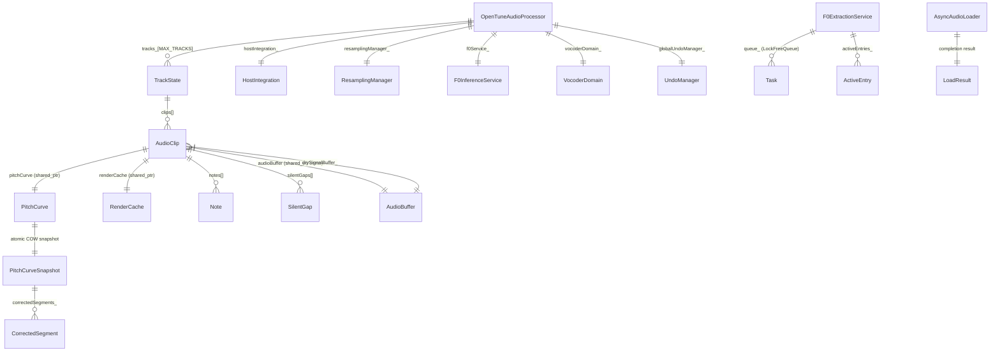

> ⚠️ 基于源码扫描生成，准确性待人工验证

# core-processor — 数据模型

---

## 1. 核心数据关系图



---

## 2. 核心数据结构

### 2.1 TrackState（轨道状态）

**定义位置**：`Source/PluginProcessor.h:208` (private inner struct)

| 字段 | 类型 | 默认值 | 说明 |
|------|------|--------|------|
| clips | `std::vector<AudioClip>` | 空 | 轨道内的音频片段列表 |
| selectedClipIndex | `int` | 0 | 当前选中的 clip 索引 |
| isMuted | `bool` | false | 轨道静音状态 |
| isSolo | `bool` | false | 轨道独奏状态 |
| volume | `float` | 1.0f | 轨道音量（线性增益） |
| name | `juce::String` | "Track N" | 轨道名称 |
| colour | `juce::Colour` | HSV 自动生成 | 轨道颜色 |
| currentRMS | `std::atomic<float>` | -100.0f | 当前 RMS 电平 (dB)，音频线程写入，UI 线程读取 |

### 2.2 AudioClip（音频片段）

**定义位置**：`Source/PluginProcessor.h:209-234` (nested in TrackState)

| 字段 | 类型 | 默认值 | 说明 |
|------|------|--------|------|
| clipId | `uint64_t` | 0 | 全局唯一标识（由 nextClipId_ 原子递增生成） |
| audioBuffer | `shared_ptr<const AudioBuffer<float>>` | null | 固定 44100Hz 存储的原始音频（shared_ptr，地址稳定，不可变） |
| drySignalBuffer_ | `AudioBuffer<float>` | 空 | 预重采样到设备采样率的 dry signal（播放用） |
| startSeconds | `double` | 0.0 | clip 在时间轴上的起始位置（秒） |
| gain | `float` | 1.0f | clip 增益（线性） |
| fadeInDuration | `double` | 0.0 | 淡入持续时间（秒） |
| fadeOutDuration | `double` | 0.0 | 淡出持续时间（秒） |
| name | `juce::String` | 空 | clip 名称（通常为导入文件名） |
| colour | `juce::Colour` | — | clip 颜色（继承轨道颜色） |
| pitchCurve | `shared_ptr<PitchCurve>` | null | 音高曲线（COW 模式，跨线程安全） |
| originalF0State | `OriginalF0State` | NotRequested | F0 提取状态 |
| detectedKey | `DetectedKey` | 默认 | 检测到的音乐调性 |
| renderCache | `shared_ptr<RenderCache>` | null | AI 渲染结果缓存 |
| notes | `std::vector<Note>` | 空 | clip 内的音符数据 |
| silentGaps | `std::vector<SilentGap>` | 空 | 静音间隔检测结果 |

**特殊说明**：AudioClip 实现了完整的拷贝构造/赋值和移动构造/赋值。audioBuffer 使用 shared_ptr<const> 实现共享不可变语义。

### 2.3 PreparedImportClip（导入预处理结果）

**定义位置**：`Source/PluginProcessor.h:128-133`

| 字段 | 类型 | 说明 |
|------|------|------|
| trackId | `int` | 目标轨道 ID |
| clipName | `juce::String` | clip 名称 |
| hostRateBuffer | `AudioBuffer<float>` | 重采样到 44100Hz 后的音频 |
| silentGaps | `std::vector<SilentGap>` | 静音间隔（延迟后处理时为空） |

### 2.4 PreparedClipPostProcess（延迟后处理结果）

**定义位置**：`Source/PluginProcessor.h:135-139`

| 字段 | 类型 | 说明 |
|------|------|------|
| trackId | `int` | 轨道 ID |
| clipId | `uint64_t` | clip 唯一标识 |
| silentGaps | `std::vector<SilentGap>` | 静音间隔检测结果 |

### 2.5 PerfProbeSnapshot（性能探测快照）

**定义位置**：`Source/PluginProcessor.h:72-78`

| 字段 | 类型 | 说明 |
|------|------|------|
| audioCallbackP99Ms | `double` | 音频回调 P99 延迟 (ms) |
| cacheMissRate | `double` | 渲染缓存未命中率 |
| renderQueueDepth | `int` | 渲染队列深度 |
| cacheChecks | `uint64_t` | 缓存检查总次数 |
| cacheMisses | `uint64_t` | 缓存未命中总次数 |

### 2.6 F0ExtractionService::Result（F0 提取结果）

**定义位置**：`Source/Services/F0ExtractionService.h:27-39`

| 字段 | 类型 | 说明 |
|------|------|------|
| success | `bool` | 是否成功 |
| trackId | `int` | 轨道 ID |
| clipIndexHint | `int` | clip 索引提示（可能过时） |
| clipId | `uint64_t` | clip 唯一标识 |
| requestKey | `uint64_t` | 请求键 |
| hopSize | `int` | hop size（采样数） |
| f0SampleRate | `int` | F0 采样率 |
| f0 | `std::vector<float>` | F0 值序列（Hz） |
| energy | `std::vector<float>` | 能量值序列 |
| modelName | `const char*` | 使用的模型名称 |
| errorMessage | `std::string` | 错误信息 |

### 2.7 F0ExtractionService::Task（内部任务）

**定义位置**：`Source/Services/F0ExtractionService.h:62-67` (private)

| 字段 | 类型 | 说明 |
|------|------|------|
| requestKey | `uint64_t` | 唯一请求键 |
| token | `uint64_t` | 取消令牌（与 ActiveEntry 配对） |
| execute | `ExecuteFn` | 执行函数 |
| commit | `CommitFn` | 提交回调 |

### 2.8 AsyncAudioLoader::LoadResult（加载结果）

**定义位置**：`Source/Audio/AsyncAudioLoader.h:30-36`

| 字段 | 类型 | 说明 |
|------|------|------|
| success | `bool` | 是否成功 |
| errorMessage | `juce::String` | 错误信息 |
| audioBuffer | `AudioBuffer<float>` | 音频缓冲区 |
| sampleRate | `double` | 采样率 |

---

## 3. 枚举类型

### 3.1 F0ExtractionService::SubmitResult

**定义位置**：`Source/Services/F0ExtractionService.h:44-49`

```cpp
enum class SubmitResult : uint8_t {
    Accepted,          // 任务已接受
    AlreadyInProgress, // 相同 requestKey 的任务正在执行
    QueueFull,         // 队列已满
    InvalidTask        // 无效任务（参数错误或服务已关闭）
};
```

### 3.2 OriginalF0State（引用自 PitchCurve 模块）

```cpp
enum class OriginalF0State {
    NotRequested, // 未请求 F0 提取
    Extracting,   // 正在提取中
    Ready,        // F0 数据就绪
    Failed        // 提取失败
};
```

---

## 4. 关键常量

**定义位置**：`Source/PluginProcessor.h:46-53`

| 常量 | 值 | 说明 |
|------|-----|------|
| `AudioConstants::DefaultSampleRate` | 44100.0 | 默认采样率 |
| `AudioConstants::StoredAudioSampleRate` | 44100.0 | 音频存储固定采样率 |
| `AudioConstants::MaxTracks` | 8 | 最大轨道数（常量命名空间版本） |
| `AudioConstants::RenderLookaheadSeconds` | 5 | 渲染前瞻时间（秒） |
| `AudioConstants::RenderTimeoutMs` | 30000 | 渲染超时（毫秒） |
| `AudioConstants::RenderPollIntervalMs` | 20 | 渲染轮询间隔（毫秒） |
| `MAX_TRACKS` (class member) | 12 | 类内最大轨道数 |
| `kExportSampleRateHz` | 44100.0 | 导出采样率 |
| `kExportNumChannels` | 1 | 单 clip/轨道导出声道数 |
| `kExportMasterNumChannels` | 2 | 总线混音导出声道数 |
| `kExportBitsPerSample` | 32 | 导出位深 (32-bit float) |
| `PerfHistogramBins` | 201 | 性能直方图档位数 |
| `PerfHistogramStepMs` | 0.1 | 每档步长（毫秒） |

**注意**：`AudioConstants::MaxTracks = 8` 与 `MAX_TRACKS = 12` 存在不一致，实际使用 `MAX_TRACKS = 12`。

---

## 5. 类型别名

| 别名 | 原始类型 | 说明 |
|------|---------|------|
| `ExecuteFn` | `std::function<Result()>` | F0 提取执行函数类型 |
| `CommitFn` | `std::function<void(Result&&)>` | F0 提取提交回调类型 |
| `ProgressCallback` | `std::function<void(float, const juce::String&)>` | 加载进度回调 |
| `CompletionCallback` | `std::function<void(LoadResult)>` | 加载完成回调 |
| `ClipSnapshot` | `OpenTune::ClipSnapshot` | clip 快照类型别名 |

---

## 6. 所有权与生命周期

```
OpenTuneAudioProcessor (唯一实例，由 JUCE 框架管理)
├── tracks_[12]                  (固定数组，对象内嵌)
│   └── clips[]                  (vector，动态增删)
│       ├── audioBuffer          (shared_ptr<const> → 不可变共享)
│       ├── pitchCurve           (shared_ptr → COW)
│       └── renderCache          (shared_ptr → 可被多线程引用)
├── hostIntegration_             (unique_ptr → 独占)
├── resamplingManager_           (unique_ptr → 独占)
├── f0Service_                   (unique_ptr → 独占)
├── vocoderDomain_               (unique_ptr → 独占)
├── globalUndoManager_           (对象内嵌)
├── chunkRenderWorkerThread_     (std::thread → 生命周期与 processor 绑定)
└── positionAtomic_              (shared_ptr<atomic<double>> → 可共享给 UI)
```

---

## ⚠️ 待确认

1. **[LOW-CONF]** `AudioConstants::MaxTracks = 8` 与 `MAX_TRACKS = 12` 不一致。`AudioConstants::MaxTracks` 似乎未被实际使用，但可能在其他模块中被引用，需确认是否为历史遗留。
2. **[EDGE]** `AudioClip::drySignalBuffer_` 是非 const `AudioBuffer<float>`，在采样率变化时被重新生成，但 processBlock 在 ScopedReadLock 下读取 — 如果 prepareToPlay 同时持有 WriteLock 重建 drySignalBuffer_，是否存在竞争？需确认 JUCE 的 prepareToPlay/processBlock 互斥语义。
3. **[DEP]** `PitchCurve`、`PitchCurveSnapshot`、`CorrectedSegment`、`Note`、`SilentGap`、`RenderCache`、`ClipSnapshot`、`DetectedKey` 等跨模块类型未在本模块定义，需参考 `utils` 和 `inference` 模块的数据模型文档。
4. **[BIZ-GAP]** `F0ExtractionService` 中 `ExecuteFn` 的具体实现（RMVPE 推理调用）不在本模块源文件中，实际提取逻辑在调用方（PluginEditor/F0InferenceService）。
