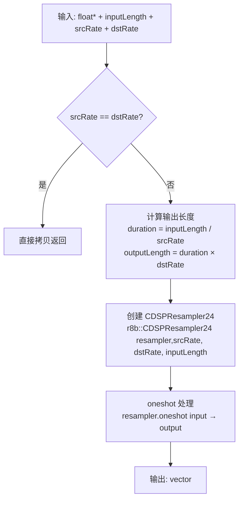
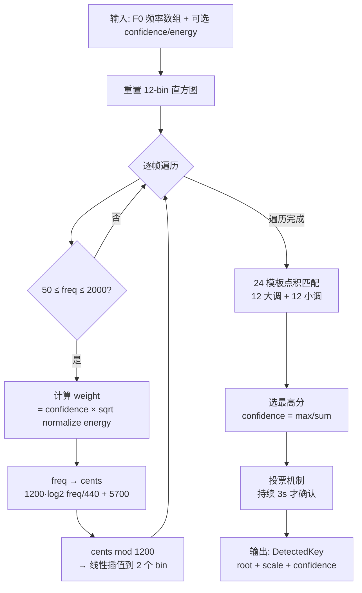

# DSP 模块 — 业务逻辑文档

## 模块定位

DSP 模块是 OpenTune 音频管线的**信号处理基础层**，为上层推理和渲染提供三项核心能力：

1. **Mel 对数频谱计算** — 将时域音频转换为 NSF-HiFiGAN vocoder 所需的频谱表示
2. **音频重采样** — 在不同采样率间高质量转换（44100↔16000↔设备采样率）
3. **调式自动检测** — 从 F0 数据推断乐曲的主音和调式，支撑 AutoTune 音阶量化

---

## 核心业务规则

### R1: Mel 频谱参数（硬编码契约）

vocoder 管线要求以下固定参数组合，这些值贯穿整个渲染链路：

| 参数 | 值 | 约束来源 |
|------|----|----------|
| 采样率 | 44100 Hz | `TimeCoordinate::kRenderSampleRate`，全局统一 |
| FFT 窗口 | 2048 | 须为 2 的幂 |
| 窗口函数 | Hann | JUCE `WindowingFunction::hann` |
| 窗口长度 | 2048 | 等于 nFft |
| Hop 长度 | 512 | 帧率 = 44100/512 ≈ 86.13 fps |
| Mel bin 数 | 128 | 与 NSF-HiFiGAN 输入张量 `[1,128,frames]` 对应 |
| 频率范围 | 40 ~ 16000 Hz | fMin=40 覆盖最低人声；fMax=16000 为 Nyquist 安全边界 |
| Log epsilon | 1e-5 | 防止 log(0)，等效于 `log(max(mel, 1e-5))` |

**帧率关系**: Mel 帧率 (≈86 fps) ≠ F0 帧率 (100 fps)，渲染链路中需通过 `ResamplingManager::resampleToTargetLength` 进行 F0 帧率对齐。

### R2: 重采样精度规则

- 所有重采样使用 r8brain `CDSPResampler24`（24-bit 精度），质量等级固定。
- oneshot 模式：每次创建新 resampler 实例，处理完即销毁，无状态残留。
- 延迟补偿：oneshot 模式内部自动处理延迟对齐，`getLatencySamples()` 返回 0。
- 输出长度精确计算：`duration(s) = inputLength / srcRate`，`outputLength = duration × dstRate`（通过 `TimeCoordinate` 工具确保一致性）。
- 短路条件：`srcRate == dstRate` 直接拷贝（整数比较）或 `|srcRate - dstRate| < 0.01`（浮点比较）。

### R3: 调式检测规则

- **算法**: Krumhansl-Schmuckler key-finding algorithm（Krumhansl, 1990）。
- **频率有效范围**: 50 ~ 2000 Hz（滤除次谐波噪声和极高泛音）。
- **加权策略**:
  - confidence 权重：直接乘以投票值，限制在 [0, 1]。
  - energy 权重：归一化后取 `sqrt` 压缩动态范围，防止个别高能量帧垄断统计。
- **Pitch Class 分配**: 线性插值到相邻两个半音 bin（不是硬量化），保留微分音信息。
- **投票确认机制**: 候选调式需持续稳定 3 秒（默认 `votingDuration_ = 3.0f`）才被确认，防止瞬态波动。
- **匹配度量**: 12 维直方图与模板的点积（非 Pearson 相关），置信度 = `maxScore / sumAllScores`。

---

## 核心流程

### 流程 1: Mel 对数频谱计算

```mermaid
flowchart TD
    A[输入: 单声道 PCM float, 44100 Hz] --> B[反射填充<br/>两端各 nFft/2 = 1024 样本]
    B --> C{逐帧处理<br/>hop = 512}
    C --> D[提取窗口: fftBuffer ← paddedAudio]
    D --> E[Hann 窗口加权]
    E --> F[JUCE FFT<br/>performFrequencyOnlyForwardTransform]
    F --> G[Mel 滤波器点积<br/>SIMD 加速 dotProduct × 128 bins]
    G --> H[Epsilon Clamp<br/>max(mel, 1e-5)]
    H --> I[向量化 log<br/>SIMD vectorLog]
    I --> J[写入输出<br/>列优先 output[mel × frames + frame]]
    C -->|下一帧| C
    J --> K[输出: float[128 × numFrames]]
```

**性能关键路径**: Mel 滤波器点积循环（128 次 1025 维点积/帧）通过 `SimdAccelerator` 加速。`vectorLog` 也通过 SIMD 批量计算。

### 流程 2: 音频重采样



**使用场景映射**:

| 调用方 | 方法 | src → dst | 用途 |
|--------|------|-----------|------|
| `F0ExtractionService` | `downsampleForInference` | 44100 → 16000 | RMVPE 输入 |
| `RenderingManager` | `upsampleForHost` | 44100 → 设备采样率 | 播放输出 |
| Chunk 渲染 | `resampleToTargetLength` | 100fps → ~86fps | F0 帧率对齐 |
| 通用 | `resample` | 任意 → 任意 | 灵活转换 |

### 流程 3: 调式检测



---

## 关键方法说明

### MelSpectrogramProcessor::compute()

**文件**: `Source/DSP/MelSpectrogram.cpp:154`

核心 Mel 频谱计算方法。关键实现细节：

1. **反射填充** (`reflectIndex`): 边界处理采用镜像反射策略，等效于 `numpy.pad(mode='reflect')`，避免截断伪影。
2. **FFT**: 使用 `juce::dsp::FFT::performFrequencyOnlyForwardTransform`，直接输出幅度谱（非功率谱），结果存于 `fftBuffer_` 的前 `nFft/2+1` 个元素。
3. **Mel 滤波器应用**: 对每个帧的幅度谱与 128 个三角滤波器做点积。点积运算委托给 `SimdAccelerator::dotProduct()`，根据平台使用 AVX2/NEON/vDSP 加速。
4. **对数变换**: Epsilon clamp 后批量 `vectorLog`，SIMD 加速。
5. **输出布局**: 列优先 `[mel_bin][frame]`，即 `output[m * numFrames + f]`。这与 ONNX 张量 `[1, nMels, frames]` 的内存布局一致。

### ResamplingManager::resampleToTargetLength()

**文件**: `Source/DSP/ResamplingManager.cpp:31`

将任意长度数组重采样到精确的目标长度。实现技巧：将 `input.size()` 和 `targetLength` 直接作为伪采样率传入 `CDSPResampler24`，利用 r8brain 的精确长度 oneshot 模式。主要用于 F0 曲线帧率对齐（100fps → ~86fps）。

### ScaleInference::processF0Data() 加权版

**文件**: `Source/DSP/ScaleInference.cpp:39`

核心统计方法。实现要点：

1. **能量权重压缩**: `sqrt(energy / maxEnergy)` — 平方根压缩将 [0,1] 范围内的能量拉向均匀分布，削弱高能量帧的主导性。
2. **线性插值 bin 分配**: 频率 100 cents 以内的微分音偏移被按比例分配到相邻两个 Pitch Class bin，比硬量化更平滑。
3. **每次重置语义**: 适合处理完整 clip 的一次性分析；流式累积应使用 `updateWithNewF0()`。

### ScaleInference::computeScore()

**文件**: `Source/DSP/ScaleInference.cpp:179`

简单点积评分：`score = Σ histogram[i] × template[i]`。这是 Krumhansl-Schmuckler 算法的标准实现（部分文献使用 Pearson 相关，此处用点积更高效且对非归一化直方图也能工作）。

---

## 线程模型

| 组件 | 运行线程 | 并发安全机制 |
|------|----------|--------------|
| `MelSpectrogramProcessor` | `chunkRenderWorkerThread_` / `RenderingManager` worker | **每线程独立实例**，无共享状态 |
| `computeLogMelSpectrogram` | 任意线程 | `thread_local` 处理器实例 |
| `ResamplingManager` | 调用者线程（worker） | 无内部状态，每次 oneshot 创建新 resampler |
| `ScaleInference` | UI 线程 / `PianoRollCorrectionWorker` | 非线程安全，须由调用者保护 |

---

## 与上下游的关系

```
┌─────────────────────────────────────────────────────────────────┐
│ 上游                                                            │
│  clip.audioBuffer (44100 Hz)  ←  PluginProcessor import        │
│  F0 array (100 fps)           ←  F0ExtractionService/RMVPE     │
│  energy array (100 fps)       ←  F0ExtractionService            │
└──────────────┬────────────────┬────────────────┬────────────────┘
               │                │                │
    ┌──────────▼──────────┐  ┌──▼──────────┐  ┌──▼──────────────┐
    │ MelSpectrogramProcessor│  │ Resampling  │  │ ScaleInference │
    │ 44100Hz → 128-mel log│  │ Manager     │  │ F0 → Key+Scale │
    └──────────┬──────────┘  └──┬──────────┘  └──┬──────────────┘
               │                │                │
┌──────────────▼────────────────▼────────────────▼────────────────┐
│ 下游                                                            │
│  ChunkInputs.mel   → RenderingManager → HiFiGAN vocoder        │
│  resampled F0      → ChunkInputs.f0                             │
│  resampled audio   → drySignalBuffer_ (设备采样率)               │
│  DetectedKey       → ScaleSnapConfig → NoteGenerator            │
└─────────────────────────────────────────────────────────────────┘
```

---

## ⚠️ 待确认

1. **Mel 帧率与 F0 帧率的精确对齐精度** — `resampleToTargetLength` 将 F0 从 100fps 插值到 ~86fps，r8brain 的插值质量对 F0 曲线（频率量纲）是否足够？是否应在 log 域插值？
2. **ScaleInference 点积 vs Pearson 相关** — 当前使用点积评分，对直方图绝对值敏感。若音频很短导致直方图整体量级小，是否影响置信度判断？是否需要归一化？
3. **thread_local MelSpectrogramProcessor 生命周期** — 线程退出时 processor 自动析构，但若线程池复用线程，旧配置的 processor 可能残留。`hash()` 机制应能处理此情况，但值得确认。
4. **能量权重 sqrt 压缩的系数选择** — `sqrt` 是经验选择还是有 psychoacoustic 依据？是否需要可配置？
