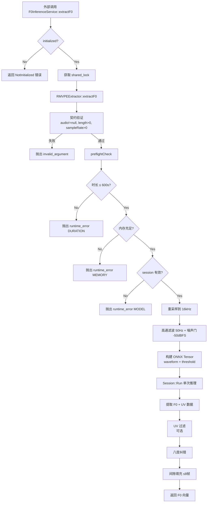
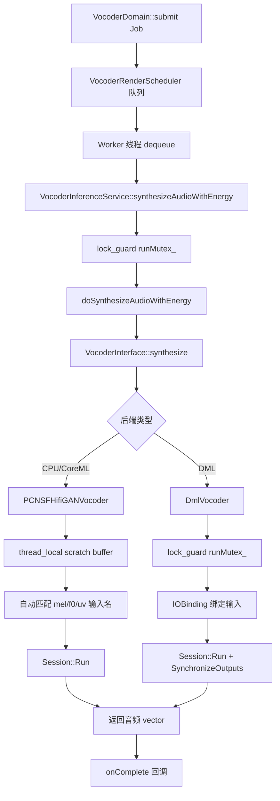
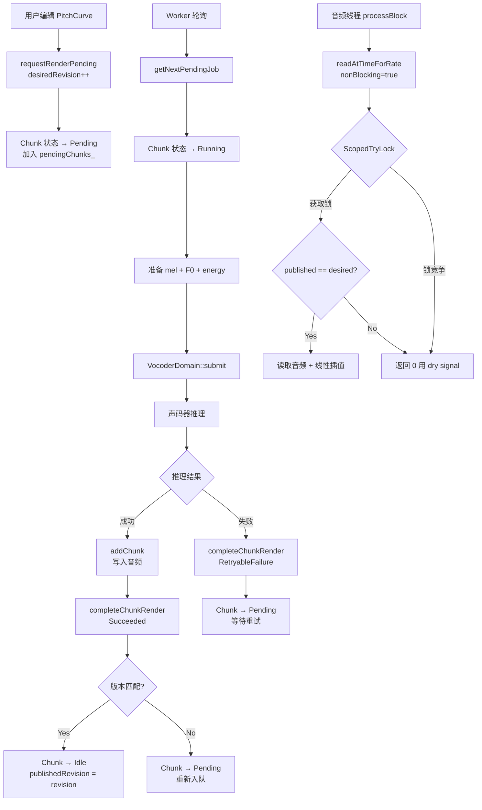

# Inference 模块 — 业务知识

> 模块类型：**类型 A — 业务逻辑模块**
> 业务域：AI 模型推理层（ONNX Runtime、F0 提取、声码器、渲染管线）

---

## 1. 核心业务规则

### 1.1 RMVPE F0 提取规格

| 规格 | 值 | 说明 |
|------|----|------|
| 模型格式 | ONNX | ONNX Runtime 1.17.3 |
| 输入采样率 | 16,000 Hz | 内部自动重采样 |
| Hop Size | 160 samples | = 10 ms 帧间隔 |
| 帧率 | 100 fps | = 16000 / 160 |
| 输入 Tensor | `waveform [1, N]` + `threshold [1]` | N = 16kHz 下的采样数 |
| 输出 Tensor | `f0 [1, F]` + `uv [1, F]` | F = 帧数 |
| 默认置信度阈值 | 0.5 | UV 检测阈值（`enableUvCheck_` 默认关闭） |
| F0 有效范围 | 50 ~ 1100 Hz | 可通过 API 调整 |
| 预处理 | 50 Hz 高通滤波（48 dB/oct）+ 噪声门（-50 dBFS） | 滤波后再推理 |
| 后处理 | 八度纠错 + 间隙填充（≤8 帧 = 80ms） | 提高连续性 |
| 最大时长 | 600 秒（10 分钟） | 硬限制，超过直接拒绝 |
| 推理模式 | 单次全长推理 | 无分块、无拼接 |

### 1.2 资源预检查（Preflight）规则

推理前的三阶段检查，任一失败即拒绝推理（fail-fast）：

```
Step 1: 时长门限 → audioDuration > 600s → REJECT (DURATION)
Step 2: 内存预算 →
  DirectML 模式: GPU VRAM 可用量 < 256MB 或 估算需求 > (VRAM - 512MB) → REJECT (MEMORY)
  CPU/CoreML 模式: 估算需求 > (系统内存 - 512MB) → REJECT (MEMORY)
Step 3: 模型会话 → session_ == null → REJECT (MODEL)
```

**内存估算公式**:
```
requiredMB = (inputBytes + outputBytes + inputBytes × 6.0 + 200MB_model) / 1024²
inputBytes = audioSamples16k × 4
outputBytes = (audioSamples16k / 160) × 4 × 2
```

### 1.3 声码器合成规格

| 规格 | 值 | 说明 |
|------|----|------|
| 模型文件 | `hifigan.onnx` | PC-NSF-HiFiGAN |
| 输入 | mel `[1, 128, F]` + f0 `[1, F]` + uv `[1, F]` | F = 帧数 |
| mel 频带数 | 128 | 可从模型自动检测 |
| Hop Size | 512 samples @ 44100 Hz | ≈ 11.6 ms |
| 输出采样率 | 44,100 Hz | 固定 |
| 输出长度 | F × 512 samples | 精确 |
| UV 生成规则 | `f0[i] > 0 ? 1.0 : 0.0` | 从 F0 自动推导 |
| mel 转置 | 自动检测 | shape[2]==128 时自动转置为 `[1, F, 128]` |

### 1.4 后端选择策略

```
平台判断:
├── Windows + AccelerationDetector 选择 DirectML
│   ├── 尝试创建 DmlVocoder (DML2 API)
│   │   ├── 成功 → DML 后端
│   │   └── 失败 → 回退 CPU
│   └── PCNSFHifiGANVocoder (CPU)
├── macOS
│   ├── 尝试 CoreML EP (MLProgram + CPUAndGPU)
│   │   ├── 成功 → CoreML 后端
│   │   └── 失败 → 回退 CPU
│   └── PCNSFHifiGANVocoder (CPU)
└── 其他 → PCNSFHifiGANVocoder (CPU)
```

F0 提取和声码器分别有独立的后端选择流程。

### 1.5 渲染缓存失效与版本协议

缓存失效通过 **双版本号协议** 实现：

| 版本 | 更新时机 | 说明 |
|------|----------|------|
| `desiredRevision` | 每次 `requestRenderPending()` 调用时 +1 | 用户编辑产生的目标版本 |
| `publishedRevision` | `addChunk()` 成功时设为 `targetRevision` | 已渲染并发布的版本 |

**缓存命中条件**（`readAtTimeForRate`）:
```
publishedRevision == desiredRevision && audio 非空
```

**写入验证**（`addChunk`）:
```
targetRevision == chunk.desiredRevision → 接受
targetRevision != chunk.desiredRevision → 拒绝（revision-mismatch）
```

### 1.6 全局内存限制

| 限制 | 值 | 说明 |
|------|----|------|
| 全局缓存上限 | 1,536 MB (1.5 GB) | `kDefaultGlobalCacheLimitBytes` |
| 驱逐策略 | 写入时触发，驱逐最早（map 首个非当前）Chunk | 仅驱逐一个 Chunk |
| 全局追踪 | `static std::atomic<size_t>` | 跨所有 RenderCache 实例共享 |

---

## 2. 核心流程

### 2.1 F0 提取管线



### 2.2 声码器合成管线



### 2.3 渲染缓存调度流程



---

## 3. 关键方法说明

### 3.1 RMVPEExtractor::fixOctaveErrors

**位置**: `RMVPEExtractor.cpp:228`

检测连续有声帧之间的突然八度跳变（频率比 0.45 ~ 0.55），将低八度帧乘以 2 校正。仅向上修正，不处理高八度错误。

### 3.2 RMVPEExtractor::fillF0Gaps

**位置**: `RMVPEExtractor.cpp:247`

对 ≤ `maxGapFrames`（默认 8 帧 = 80ms）的无声间隙，在 log2 空间中线性插值填充。保持短间隙的频率连续性。

### 3.3 RMVPEExtractor::estimateMemoryRequiredMB

**位置**: `RMVPEExtractor.cpp:39`

```
inputBytes = audioSamples16k × sizeof(float)
numFrames = ceil(audioSamples16k / 160)
outputBytes = numFrames × sizeof(float) × 2
intermediateBytes = inputBytes × 6.0
modelBytes = 200MB
totalMB = (inputBytes + outputBytes + intermediateBytes + modelBytes) / 1024²
```

### 3.4 RenderCache::addChunk（LRU 驱逐）

**位置**: `RenderCache.cpp:28`

写入时检查全局内存是否超限。超限时驱逐 `chunks_` map 中第一个非当前写入的 Chunk（按 startSeconds 排序的最早 Chunk）。仅驱逐一个。

### 3.5 RenderCache::readAtTimeForRate（音频线程读取）

**位置**: `RenderCache.cpp:149`

1. `nonBlocking=true` 时使用 `ScopedTryLock`，锁竞争直接返回 0（不阻塞音频线程）
2. 通过 `upper_bound` 定位包含目标时间的 Chunk
3. 检查 `publishedRevision == desiredRevision`（缓存一致性）
4. 支持按目标采样率选择 `audio`（44100）或 `resampledAudio[rate]`
5. 非整数偏移使用线性插值

### 3.6 VocoderRenderScheduler::workerThread

**位置**: `VocoderRenderScheduler.cpp:70`

无限循环工作线程：
1. `condition_variable::wait` 等待任务或关闭信号
2. 取出队首任务
3. 调用 `service_->synthesizeAudioWithEnergy()`
4. 通过 `onComplete` 回调返回结果
5. 收到关闭信号时退出循环

### 3.7 VocoderDomain 生命周期保证

**位置**: `VocoderDomain.cpp:8`

```
初始化顺序: InferenceService → RenderScheduler
关闭顺序:   RenderScheduler → InferenceService (逆序)
```

调度器持有 InferenceService 的非拥有指针。VocoderDomain 通过聚合两者的所有权，消除悬空指针风险。

---

## 4. 线程安全策略

| 组件 | 同步原语 | 策略 |
|------|----------|------|
| F0InferenceService | `std::shared_mutex` | 读锁允许并发 extractF0；写锁用于模型切换 |
| VocoderInferenceService | `std::mutex` | 序列化所有 synthesize 调用 |
| VocoderRenderScheduler | `std::mutex` + `condition_variable` | 保护任务队列，单线程消费 |
| DmlVocoder | `std::mutex runMutex_` | DML 会话要求串行 Run() |
| PCNSFHifiGANVocoder | `thread_local` scratch | 无锁，每线程独立缓冲区 |
| RenderCache | `juce::SpinLock` | 音频线程用 `ScopedTryLock`（非阻塞） |
| 初始化状态 | `std::atomic<bool>` | `memory_order_acquire/release` |

---

## 5. 错误处理策略

| 层级 | 策略 | 说明 |
|------|------|------|
| IF0Extractor 接口 | 返回空 vector | 接口契约（实际实现可能抛异常） |
| RMVPEExtractor | 抛出异常 | `invalid_argument`、`logic_error`、`runtime_error` |
| F0InferenceService | `Result<T>` 包装 | 捕获所有异常，转为 `ErrorCode` |
| VocoderInterface | 抛出 `runtime_error` | 输入校验失败、推理失败 |
| VocoderInferenceService | `Result<T>` 包装 | 捕获所有异常 |
| VocoderRenderScheduler | `onComplete(false, ...)` | 错误通过回调传递 |
| RenderCache | 返回 bool/int | 失败返回 false/0，无异常 |
| 工厂类 | `Result<T>` / 结构化结果 | `F0ExtractorResult`、`VocoderCreationResult` |

---

## ⚠️ 待确认

### 隐含业务规则

1. **RMVPE `enableUvCheck_` 默认为 `false`**：代码中 UV 检查默认关闭（`RMVPEExtractor.h:119`），即 F0 值直接使用模型输出不做 UV 过滤。待确认这是否为生产配置还是调试遗留。

2. **噪声门 -50dBFS 阈值**：`RMVPEExtractor.cpp:384` 使用固定阈值 0.00316（-50dBFS），无法配置。待确认是否需要用户可调。

3. **DmlVocoder 仅 Windows 编译**：整个 `DmlVocoder.cpp` 被 `#ifdef _WIN32` 包裹。但 `DmlVocoder.h` 和 `DmlConfig.h` 在所有平台都可见。待确认非 Windows 平台是否应隐藏这些头文件。

### 潜在风险

4. **RenderCache 驱逐仅驱逐一个 Chunk**：当写入一个大 Chunk 导致超限时，仅驱逐一个最早的 Chunk。如果单个 Chunk 不够大，可能仍然超限。待确认是否需要循环驱逐直到满足限制。

5. **`addChunk` 在 `desiredRevision == 0` 时自动赋值**：`RenderCache.cpp:43`，如果 Chunk 的 `desiredRevision` 为 0（从未被 `requestRenderPending` 触发），`addChunk` 会自动将 `desiredRevision` 设为 `targetRevision`。待确认这个路径是否为正常流程还是防御性编程。

### 性能关注点

6. **PCNSFHifiGANVocoder `thread_local` scratch buffer**：使用 `thread_local` 避免分配但也意味着内存不会随线程销毁自动释放（取决于线程生命周期）。在长时间运行且帧数变化大时可能导致内存碎片。

7. **RMVPEExtractor 单次全长推理**：10 分钟 @ 16kHz = 960 万采样，直接喂入模型。对于 GPU 内存受限的情况，待确认是否需要分块推理策略。
