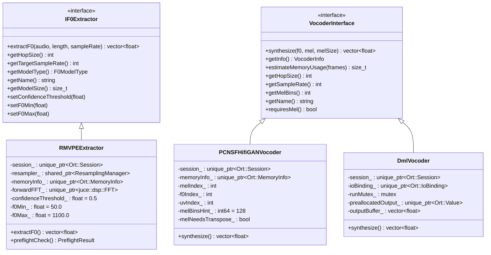
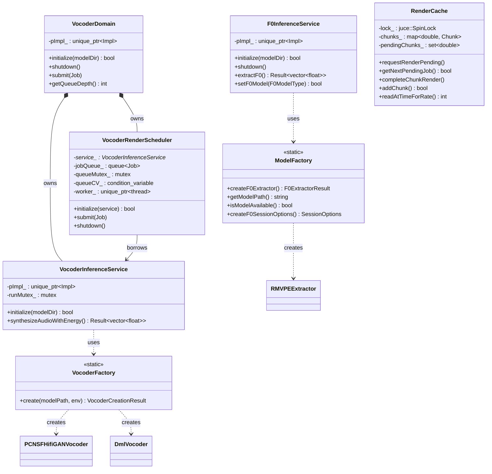
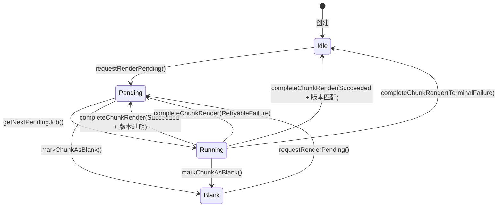

# Inference 模块 — 数据模型

---

## 1. 类继承关系



## 2. 服务与领域层关系



## 3. 核心数据结构

### 3.1 F0ModelType（枚举）

**文件**: `IF0Extractor.h:9`

```cpp
enum class F0ModelType {
    RMVPE = 0    // Robust Multi-scale Vocal Pitch Estimator (361MB)
};
```

### 3.2 F0ModelInfo

**文件**: `IF0Extractor.h:13`

| 字段 | 类型 | 说明 |
|------|------|------|
| `type` | `F0ModelType` | 模型类型 |
| `name` | `std::string` | 内部名称 |
| `displayName` | `std::string` | 显示名称 |
| `modelSizeBytes` | `size_t` | 模型文件大小 |
| `isAvailable` | `bool` | 是否可用 |

### 3.3 PreflightResult

**文件**: `RMVPEExtractor.h:34`

| 字段 | 类型 | 说明 |
|------|------|------|
| `success` | `bool` | 预检查是否通过 |
| `errorMessage` | `std::string` | 错误描述 |
| `errorCategory` | `std::string` | 错误分类："MEMORY"/"DURATION"/"MODEL"/"SYSTEM" |
| `estimatedMemoryMB` | `size_t` | 估算内存需求（MB） |
| `availableMemoryMB` | `size_t` | 可用内存（MB） |
| `audioDurationSec` | `double` | 音频时长（秒） |

### 3.4 VocoderInfo

**文件**: `VocoderInterface.h:9`

| 字段 | 类型 | 默认值 | 说明 |
|------|------|--------|------|
| `name` | `std::string` | — | 声码器名称 |
| `backend` | `std::string` | — | 后端名称（"CPU"/"DirectML"/"CoreML"） |
| `hopSize` | `int` | 512 | 帧跳跃采样数 |
| `sampleRate` | `int` | 44100 | 输出采样率 |
| `melBins` | `int` | 128 | mel 频带数 |

### 3.5 DmlConfig

**文件**: `DmlConfig.h:5`

| 字段 | 类型 | 默认值 | 说明 |
|------|------|--------|------|
| `deviceId` | `int` | 0 | DirectML 设备 ID |
| `performancePreference` | `int` | 1 | 0=Default, 1=HighPerformance, 2=MinimumPower |
| `deviceFilter` | `int` | 1 | 1=Gpu（OrtDmlDeviceFilter::Gpu） |

### 3.6 VocoderBackend（枚举）

**文件**: `VocoderFactory.h:12`

```cpp
enum class VocoderBackend {
    CPU,
    DML,
    CoreML
};
```

### 3.7 VocoderCreationResult

**文件**: `VocoderFactory.h:18`

| 字段 | 类型 | 说明 |
|------|------|------|
| `vocoder` | `std::unique_ptr<VocoderInterface>` | 声码器实例（成功时非空） |
| `backend` | `VocoderBackend` | 使用的后端 |
| `errorMessage` | `std::string` | 错误信息（失败时非空） |

### 3.8 VocoderRenderScheduler::Job / VocoderDomain::Job

**文件**: `VocoderRenderScheduler.h:28` / `VocoderDomain.h:29`

| 字段 | 类型 | 说明 |
|------|------|------|
| `f0` | `std::vector<float>` | F0 曲线 |
| `energy` | `std::vector<float>` | 能量曲线 |
| `mel` | `std::vector<float>` | mel 频谱数据 |
| `onComplete` | `std::function<void(bool, const juce::String&, const std::vector<float>&)>` | 完成回调 |

### 3.9 RenderCache::Chunk

**文件**: `RenderCache.h:28`

| 字段 | 类型 | 说明 |
|------|------|------|
| `startSeconds` | `double` | Chunk 起始时间 |
| `endSeconds` | `double` | Chunk 结束时间 |
| `audio` | `std::vector<float>` | 渲染音频（44100 Hz） |
| `resampledAudio` | `std::unordered_map<int, std::vector<float>>` | 按目标采样率缓存的重采样版本 |
| `status` | `Status` | 调度状态 |
| `desiredRevision` | `uint64_t` | 目标版本（每次编辑递增） |
| `publishedRevision` | `uint64_t` | 已发布版本 |

### 3.10 RenderCache::Chunk::Status（枚举）

```cpp
enum class Status : uint8_t {
    Idle,     // 无待处理渲染需求
    Pending,  // 有待渲染需求，等待 Worker 拉取
    Running,  // 正在渲染中
    Blank     // 空白区域（无有效F0），无需渲染
};
```

### 3.11 RenderCache::PendingJob

**文件**: `RenderCache.h:51`

| 字段 | 类型 | 说明 |
|------|------|------|
| `startSeconds` | `double` | Chunk 起始时间 |
| `endSeconds` | `double` | Chunk 结束时间 |
| `targetRevision` | `uint64_t` | 目标版本号 |

### 3.12 RenderCache::CompletionResult（枚举）

```cpp
enum class CompletionResult : uint8_t {
    Succeeded,         // 已成功产出 revision 对应结果
    RetryableFailure,  // 未执行成功且可重试
    TerminalFailure    // 终态失败（不重试）
};
```

### 3.13 RenderCache::GlobalMemoryStats

| 字段 | 类型 | 说明 |
|------|------|------|
| `cacheLimitBytes` | `size_t` | 全局缓存上限 |
| `cacheCurrentBytes` | `size_t` | 当前缓存使用量 |
| `cachePeakBytes` | `size_t` | 历史峰值 |

### 3.14 RenderCache::ChunkStats

| 字段 | 类型 | 说明 |
|------|------|------|
| `idle` | `int` | Idle 状态 Chunk 数 |
| `pending` | `int` | Pending 状态 Chunk 数 |
| `running` | `int` | Running 状态 Chunk 数 |
| `blank` | `int` | Blank 状态 Chunk 数 |

### 3.15 ErrorCode（枚举，跨模块）

**文件**: `Source/Utils/Error.h:11`

推理模块使用的错误码：

| 错误码 | 值 | 说明 |
|--------|----|------|
| `ModelNotFound` | 100 | 模型文件不存在 |
| `ModelLoadFailed` | 101 | 模型加载失败 |
| `ModelInferenceFailed` | 102 | 推理执行失败 |
| `InvalidModelType` | 103 | 无效模型类型 |
| `SessionCreationFailed` | 104 | ONNX 会话创建失败 |
| `NotInitialized` | 200 | 服务未初始化 |

### 3.16 Result\<T\>（泛型结果类型）

**文件**: `Source/Utils/Error.h:102`

```cpp
template<typename T>
class Result {
    std::variant<T, Error> data_;
    // ...
    static Result success(T value);
    static Result failure(ErrorCode code, const std::string& context = "");
    bool ok() const;
    const T& value() const&;
    const Error& error() const&;
    T valueOr(T defaultValue) const&;
    auto map(F&& f) const&;
    auto andThen(F&& f) const&;
};
```

## 4. Chunk 状态机



## 5. 关键常量

| 常量 | 值 | 位置 | 说明 |
|------|----|------|------|
| `kMaxAudioDurationSec` | 600.0 | `RMVPEExtractor.h:125` | F0 提取最大音频时长（10 分钟） |
| `kMemoryOverheadFactor` | 6.0 | `RMVPEExtractor.h:126` | 内存开销倍数 |
| `kMinReservedMemoryMB` | 512 | `RMVPEExtractor.h:127` | 系统保留内存下限 |
| `kMinGpuMemoryMB` | 256 | `RMVPEExtractor.h:128` | GPU 最小内存要求 |
| `kModelMemoryMB` | 200 | `RMVPEExtractor.h:129` | 模型本身内存占用 |
| `kMaxGapFramesDefault` | 8 | `RMVPEExtractor.h:130` | F0 间隙填充最大帧数（80ms） |
| `kDefaultGlobalCacheLimitBytes` | 1536 MB | `RenderCache.h:19` | 全局渲染缓存上限 |
| `kRenderSampleRate` | 44100.0 | `TimeCoordinate.h:15` | 统一渲染采样率 |
| `kNoiseGateThreshold` | 0.00316... | `RMVPEExtractor.cpp:384` | -50 dBFS 噪声门阈值 |

---

## ⚠️ 待确认

1. **`VocoderDomain::Job` 与 `VocoderRenderScheduler::Job` 结构重复**：两个 Job 结构完全相同但独立定义。待确认是否可统一为一个定义。

2. **`RenderCache` 的 `pendingChunks_` 与 `chunks_` 的 Status 字段存在冗余**：Pending 状态同时在 `pendingChunks_` 集合和 `Chunk::status` 中维护。待确认是否存在不一致风险。

3. **`PCNSFScratchBuffers` / `DmlScratchBuffers` 为匿名 struct**：这些 `thread_local` scratch buffer 结构定义在 `.cpp` 中，但功能几乎一致。待确认是否应抽取为共享辅助类。
