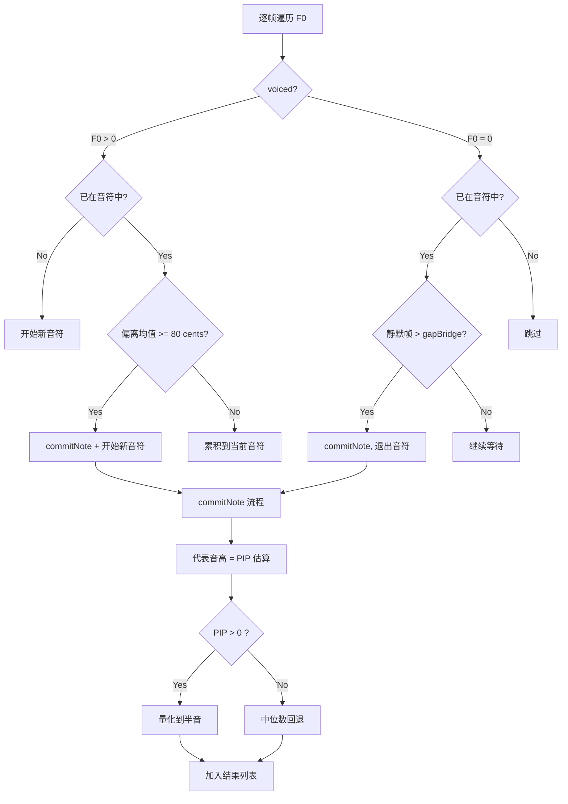
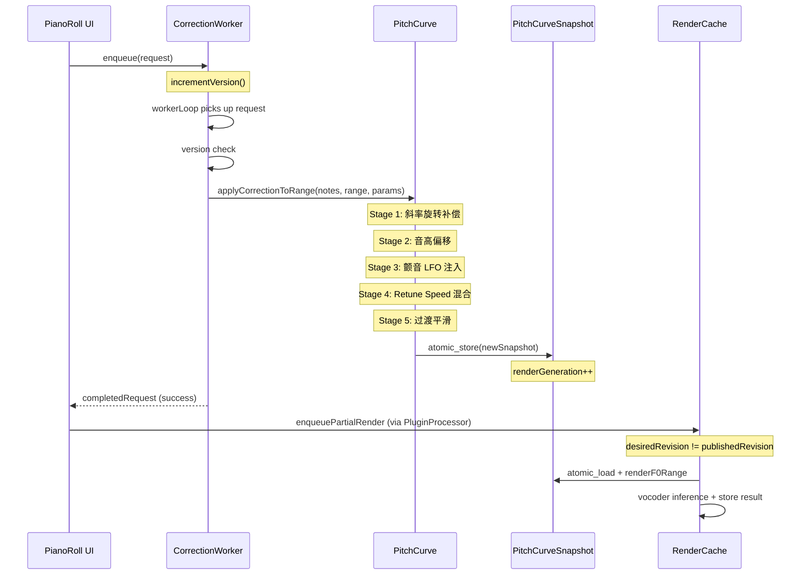
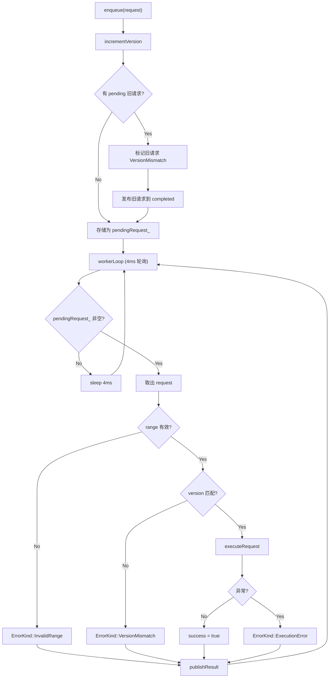

# pitch-correction -- Business Logic

> 这是 OpenTune 最核心的算法模块。音高修正流程为纯数学/DSP 运算，不涉及 AI 模型推理。
> AI 模型仅在两端使用: RMVPE (F0 提取输入) 和 NSF-HiFiGAN (合成输出)。

---

## 1. 核心业务规则

### 1.1 COW (Copy-on-Write) 不可变快照机制

`PitchCurve` 是音高修正的中央数据枢纽，连接编辑与渲染。

**规则**:
- 每次修改（无论是设置原始 F0、应用修正、还是清除修正）都创建一个**全新的不可变快照** `PitchCurveSnapshot`
- 新快照通过 `std::atomic_store` 原子发布
- 读取方通过 `std::atomic_load` 获取快照引用，**完全 lock-free**
- 音频线程 (`processBlock`) **永不阻塞**: 只执行 atomic_load，获取到的快照在整个处理周期内保持一致
- `renderGeneration_` 单调递增计数器，每次修正编辑 +1，驱动 `RenderCache` 失效判断

**关键不变量**:
- `PitchCurveSnapshot` 所有成员均为 `const`，构造后不可修改
- `correctedSegments_` 始终按 `startFrame` 升序排列
- 快照发布后的旧快照由 `shared_ptr` 引用计数自动回收

### 1.2 音高修正五阶段流程

入口: `PitchCurve::applyCorrectionToRange` (`PitchCurve.cpp:459`)

对请求范围内的每个 F0 帧，若命中某个音符，依序执行:

#### Stage 1 -- 斜率旋转补偿 (`PitchCurve.cpp:530-566`)

**目的**: 补偿自然音高漂移（如乐句末尾的升调惯性），使修正输出听感水平。

**算法**:
1. 收集音符范围内所有有声帧的 F0，转换为 MIDI 值
2. 分成前段和后段（各 `max(3, N/5)` 帧），取各段 **中位数** MIDI 值
3. 计算斜率: `slope = (lateMidi - earlyMidi) / (lateTime - earlyTime)` (半音/秒)
4. 转换为角度: `angle = atan(slope / 7.0)`（7.0 半音/秒归一化到 45 度）
5. **判定**: 仅当绝对角度在 `[10°, 30°]` 时应用（忽略微小漂移和极端偏移）
6. 以音符时间中心为原点，对每帧执行 2D 坐标旋转:
   ```
   x = time - timeCenterSeconds
   y = freqToMidi(f0) - anchorMidi
   yRotated = x * sin(-angle) + y * cos(-angle)
   baseF0 = midiToFreq(anchorMidi + yRotated)
   ```

**硬编码参数**:
- `slopeAngleMinDeg = 10.0°`
- `slopeAngleMaxDeg = 30.0°`
- `slopeAt45DegSemitonesPerSecond = 7.0`

#### Stage 2 -- 音高偏移 (`PitchCurve.cpp:628-632`)

**目的**: 将旋转补偿后的 F0 平移到目标音高区域，**保留全部原始细节**（颤音、滑音、微变化）。

```
offsetSemitones = freqToMidi(targetPitch) - freqToMidi(anchorPitch)
shiftRatio = 2^(offsetSemitones / 12)
shiftedF0 = baseF0 * shiftRatio
```

- `anchorPitch`: 优先使用 `note.originalPitch`（RMVPE 原始检测值），回退到 `note.pitch`
- `targetPitch`: `note.getAdjustedPitch()` = `pitch * 2^(pitchOffset / 12)`

#### Stage 3 -- 颤音 LFO 注入 (`PitchCurve.cpp:606-615`)

**目的**: 向目标平直音高添加人工颤音效果。

```
depthSemitones = (vibratoDepth / 100) * 1.0
lfoValue = depthSemitones * sin(2 * pi * vibratoRate * timeInNote)
targetF0 *= 2^(lfoValue / 12)
```

- `vibratoRate`: 振荡频率 (Hz)，典型值 5--7.5 Hz
- `vibratoDepth`: 振幅百分比，100 = 1 半音峰值
- **参数覆盖**: 音符级参数 (`note.vibratoDepth/Rate >= 0`) 优先于全局参数

#### Stage 4 -- Retune Speed 混合 (`PitchUtils::mixRetune`)

**目的**: 在保留细节的偏移 F0 和完全平直的目标 F0 之间进行对数空间插值。

```
logResult = log2(shiftedF0) + (log2(targetF0) - log2(shiftedF0)) * retuneSpeed
result = 2^logResult
```

| retuneSpeed | 效果 |
|---|---|
| `0.0` | 输出 = shiftedF0（完全保留原始细节，仅平移） |
| `0.5` | 半细节半平直 |
| `1.0` | 输出 = targetF0（完全平直 "auto-tune" 效果） |

**对数空间原因**: 人耳音高感知是对数关系（八度 = 2 倍频率）。

**参数覆盖**: 音符级 `note.retuneSpeed >= 0` 优先于全局参数。

#### Stage 5 -- 过渡平滑 (`PitchCurve.cpp:76-196`)

**目的**: 防止修正段边界处的音高突变。

- 常量: `kUnifiedTransitionFrames = 10`（约 100ms @ 100fps）
- 在修正段两侧各插入过渡段
- **左过渡** (渐入): 从原始 F0 渐变到修正段起始 F0
- **右过渡** (渐出): 从修正段结束 F0 渐变回原始 F0
- 插值公式 (对数空间):
  ```
  w = (i + 1) / (len + 1)    // 权重 0→1 (左) 或 1→0 (右)
  result = 2^(log2(orig) + (log2(boundary) - log2(orig)) * w)
  ```
- **跳过条件**: 目标过渡区域存在其他修正段重叠 / 包含静默帧 (F0 <= 0) / 超出数组边界

### 1.3 每音符独立段创建

`applyCorrectionToRange` 不创建覆盖整个请求范围的单一段，而是**为每个音符独立创建 CorrectedSegment**:
- Source 类型: `NoteBased`
- 好处: 最小化 undo/redo 时的重渲染范围
- 每段携带该音符的 retune/vibrato 参数（`note.xxx >= 0 ? note.xxx : global`）

### 1.4 NoteGenerator 音符分割算法

入口: `NoteGenerator::generate` (`NoteGenerator.cpp:123`)

从原始 F0 曲线自动分割生成音符序列:



**分割规则**:
1. 有声帧 (F0 > 0) 累积到当前音符，并维护运行均值
2. 当新帧偏离运行均值 >= `transitionThresholdCents` (80 cents) 时，提交当前音符并开始新音符
3. 静默间隙 <= `gapBridgeMs` (10ms) 时桥接（不分割）
4. 超过桥接阈值的静默中断音符
5. 音符时长 < `minDurationMs` (100ms) 时丢弃
6. 音符尾部延伸 `tailExtendMs` (15ms) 补偿截断

**代表音高计算**:
1. 优先: `SimdPerceptualPitchEstimator::estimatePIP` (VNC + SSA + Energy 加权)
2. 回退: F0 中位数
3. 量化: 四舍五入到最近半音 (`round(freqToMidi(hz))` -> `midiToFreq`)

### 1.5 PIP (Perceptual Intentional Pitch) 感知音高估算

`SimdPerceptualPitchEstimator::estimatePIP`:

**目的**: 估算人耳感知的"意图音高"，滤除颤音波动影响。

**算法**:
1. **VNC (Vibrato-Neutral Center)**: 150ms 居中滑动均值，平滑掉颤音周期（典型 ~200ms）
2. **SSA (Stable-State Analysis)**: Tukey 窗 (15% 余弦渐变边缘)，降低音符起攻/释放过渡帧的权重
3. **Energy 加权**: 响度越大的帧权重越高
4. **公式**: `PIP = Sum(VNC * SSA * Energy) / Sum(SSA * Energy)`
5. **回退**: 当权重总和 < 1e-7 (接近静默) 时返回 F0 中位数

**性能说明**: 滑动均值实现为 O(N*Win)（非最优），但每个音符仅 50--500 帧、窗口 ~15 帧，实际约 7500 次操作，可忽略。

### 1.6 HandDraw 修正 (音符绑定)

用户直接绘制 F0 曲线:
- 绘制数据被 `clipDrawDataToNotes()` 裁剪到音符边界（上层 PianoRollToolHandler 执行）
- 音符外的数据被丢弃
- 每个重叠音符独立创建 `CorrectedSegment`（`Source::HandDraw`）
- 不执行斜率旋转或音高偏移
- 仍然插入过渡平滑段

### 1.7 LineAnchor 修正 (音符绑定)

用户放置锚点，系统在 log2 空间插值:
- 插值曲线同样被裁剪到音符边界
- `Source::LineAnchor` 段在 `renderF0Range` 中有**特殊处理**: 当 `retuneSpeed >= 0` 时，实时将插值目标与原始 F0 按 `mixRetune` 混合
- 当 `retuneSpeed < 0` 时直接使用插值值

### 1.8 修正段管理规则

- **清除并保留**: `clearSegmentsInRangePreserveOutside` 在清除目标范围时，将跨边界的段裁剪而非完全删除
- **插入排序**: 所有段按 `startFrame` 升序排列，使用二分查找定位
- **代数递增**: 每次修改 correctedSegments 都递增 `renderGeneration`，驱动 `RenderCache` 失效

---

## 2. 核心流程

### 2.1 音高修正完整流程



### 2.2 PianoRollCorrectionWorker 调度流程



**关键设计**: 新请求覆盖旧 pending 请求（最新优先），确保用户快速拖拽时只处理最新状态。

---

## 3. 关键方法说明

### 3.1 `PitchCurve::applyCorrectionToRange`

`Source/Utils/PitchCurve.cpp:459-683`

- **入口**: 接收音符列表 + 帧范围 + 全局修正参数
- **前置条件**: `originalF0` 非空, `startFrame < endFrame`, `hopSize > 0`, `sampleRate > 0`
- **核心逻辑**: 遍历每帧，通过 `relevantNoteIndices` 查找命中音符，执行五阶段修正
- **输出**: 为每个相关音符创建独立的 `CorrectedSegment`，包含过渡段
- **副作用**: 通过 `atomic_store` 发布新快照，`renderGeneration` 递增

### 3.2 `NoteGenerator::generate`

`Source/Utils/NoteGenerator.cpp:123-255`

- **入口**: F0 数组 + energy 数组 + 帧范围 + 采样率参数 + 分割策略
- **前置条件**: `f0 != nullptr`, `f0Count > 0`, `hopSize > 0`
- **核心逻辑**: 有限状态机遍历帧序列，维护 "在音符内/外" 状态
- **输出**: 按 `startTime` 排序的 `vector<Note>`，保证非重叠
- **后处理**: 排序 -> 裁剪重叠 -> 删除零时长音符

### 3.3 `SimdPerceptualPitchEstimator::estimatePIP`

`Source/Utils/SimdPerceptualPitchEstimator.h:22-83`

- **入口**: F0 指针 + energy 指针 + 帧数 + hop 时间
- **前置条件**: `numSamples > 0`, 指针非空, `hopSizeTime > 0`
- **核心逻辑**: VNC 滑动均值 -> SSA Tukey 窗加权 -> Energy 加权求和
- **回退**: 权重和接近 0 时返回 F0 中位数

### 3.4 `PitchCurveSnapshot::renderF0Range`

`Source/Utils/PitchCurve.cpp:220-293`

- **入口**: 帧范围 + 回调函数
- **核心逻辑**: 使用 `lower_bound` 二分定位起始修正段，依次遍历，间隙回调原始 F0
- **LineAnchor 特殊处理**: `retuneSpeed >= 0` 时实时计算 `mixRetune`
- **线程安全**: 快照不可变，可在任意线程安全调用

---

## 4. 待确认

### 算法参数

- [ ] **斜率旋转角度阈值** `[10°, 30°]` 是否经过系统性 A/B 测试确定？是否计划提供用户可调节的接口？
- [ ] **transitionThresholdCents = 80** 这个分割阈值是否适用于所有音乐风格（如 rap/说唱 vs 抒情歌曲）？是否计划暴露为用户参数？

### 遗漏功能

- [ ] **getPerceptualOffset (Fletcher-Munson 校正)**: AGENTS.md 中记录了此方法，但当前 `SimdPerceptualPitchEstimator.h` 源码中不存在。是否已移至 `RenderingManager` 或其他文件？若已移除需更新 AGENTS.md。
- [ ] **ScaleSnapConfig 调式吸附**: `snapMidi` 已实现但 `NoteGenerator::generate` 未调用。调式吸附是在哪个层级执行的？（推测在 UI 层 PianoRollComponent 或 AutoTune 流程中）

### 线程安全

- [ ] `PitchCurve` 的 setter 方法（如 `setOriginalF0`, `applyCorrectionToRange`）虽然通过 `atomic_store` 发布新快照，但 setter 本身不是原子操作（读旧快照 -> 创建新快照 -> 发布）。若两个线程同时调用 setter，可能导致 lost update。当前是否严格保证所有 setter 仅在 message thread 调用？
- [ ] `PianoRollCorrectionWorker` 的 `completedRequest_` 在 worker 线程写入、主线程读取，使用 `std::mutex` 保护。这是否意味着主线程 `takeCompleted` 可能短暂阻塞？是否有性能影响？

### 极端输入

- [ ] `applyCorrectionToRange` 对全部 unvoiced (F0 = 0) 的音符范围会产生什么输出？（当前: 输出 0.0f，但仍创建 CorrectedSegment。这是否为期望行为？）
- [ ] `NoteGenerator::generate` 输入中如果 `energy` 数组长度与 `f0` 不一致，`energyPtr` 会被设为 `nullptr`，导致 PIP 回退到中位数。是否需要日志警告？
