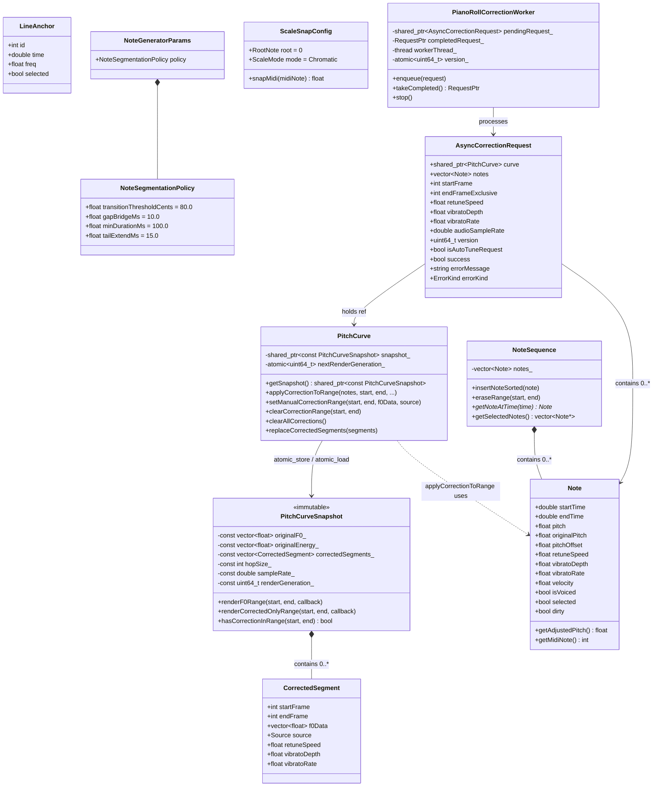
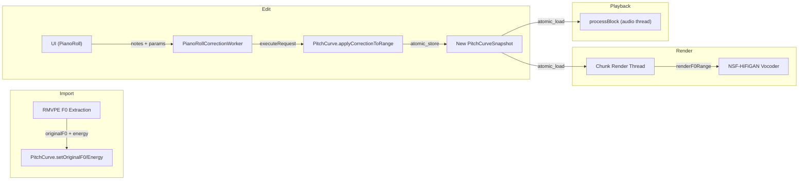

# pitch-correction -- Data Model

---

## 1. 核心数据结构关系

---

## 2. 数据结构详解

### 2.1 CorrectedSegment

| 字段 | 类型 | 默认值 | 说明 |
|---|---|---|---|
| `startFrame` | `int` | - | 起始帧 (含) |
| `endFrame` | `int` | - | 结束帧 (不含) |
| `f0Data` | `vector<float>` | - | 修正后 F0 值 (Hz)，长度 = `endFrame - startFrame` |
| `source` | `Source` enum | `None` | 修正来源类型 |
| `retuneSpeed` | `float` | `-1.0f` | 段级 retune speed (-1 表示使用全局值) |
| `vibratoDepth` | `float` | `-1.0f` | 段级颤音深度 |
| `vibratoRate` | `float` | `-1.0f` | 段级颤音速率 |

**Source 枚举**:

| 值 | 含义 |
|---|---|
| `None` (0) | 未指定 |
| `NoteBased` (1) | 基于音符的五阶段修正 |
| `HandDraw` (2) | 手绘 F0 |
| `LineAnchor` (3) | 锚点插值（特殊: 渲染时可与原始 F0 按 retuneSpeed 混合） |

### 2.2 PitchCurveSnapshot

所有成员为 `const`，构造后完全不可变 (immutable)。

| 字段 | 类型 | 说明 |
|---|---|---|
| `originalF0_` | `const vector<float>` | RMVPE 提取的原始 F0 (Hz, 100fps) |
| `originalEnergy_` | `const vector<float>` | 逐帧 RMS 能量，与 F0 对齐 |
| `correctedSegments_` | `const vector<CorrectedSegment>` | 按 `startFrame` 排序的修正段 |
| `hopSize_` | `const int` | 帧步长 (samples)，默认 512 |
| `sampleRate_` | `const double` | F0 提取采样率，默认 16000.0 |
| `renderGeneration_` | `const uint64_t` | 渲染代数，每次修正编辑递增 |

**COW 机制**: `PitchCurve` 持有 `shared_ptr<const PitchCurveSnapshot>`，通过 `std::atomic_store` 发布新快照。音频线程通过 `std::atomic_load` 读取，完全 lock-free。

### 2.3 Note

| 字段 | 类型 | 默认值 | 说明 |
|---|---|---|---|
| `startTime` | `double` | `0.0` | 起始时间 (秒) |
| `endTime` | `double` | `0.0` | 结束时间 (秒) |
| `pitch` | `float` | `0.0f` | 量化后基准音高 (Hz) |
| `originalPitch` | `float` | `0.0f` | RMVPE 原始检测音高 (Hz，未量化) |
| `pitchOffset` | `float` | `0.0f` | 用户拖拽产生的音高偏移 (半音) |
| `retuneSpeed` | `float` | `-1.0f` | 音符级 retune speed (-1 = 使用全局) |
| `vibratoDepth` | `float` | `-1.0f` | 音符级颤音深度 (-1 = 使用全局) |
| `vibratoRate` | `float` | `-1.0f` | 音符级颤音速率 (-1 = 使用全局) |
| `velocity` | `float` | `1.0f` | 力度 |
| `isVoiced` | `bool` | `true` | 是否为有声段 |
| `selected` | `bool` | `false` | UI 选中状态 |
| `dirty` | `bool` | `false` | 脏标记，触发增量重渲染 |

**参数覆盖约定**: `-1.0f` 表示 "使用全局/默认值"。`applyCorrectionToRange` 中优先使用音符级参数，否则回退到函数参数级值。

### 2.4 NoteSequence

- **容器**: 内部 `vector<Note> notes_`
- **不变量**: 始终按 `startTime` 排序、无重叠。`normalizeNonOverlapping()` 在每次插入后强制维护
- **边界裁剪**: `eraseRange` 跨边界的音符被裁剪而非删除

### 2.5 NoteSegmentationPolicy

| 参数 | 默认值 | 单位 | 说明 |
|---|---|---|---|
| `transitionThresholdCents` | `80.0` | cents | 音高偏离累计均值超过此阈值时分割新音符 |
| `gapBridgeMs` | `10.0` | ms | 小于此时长的静默间隙被桥接 (不分割) |
| `minDurationMs` | `100.0` | ms | 低于此时长的音符被丢弃 |
| `tailExtendMs` | `15.0` | ms | 音符尾部延伸 (补偿截断) |

### 2.6 ScaleSnapConfig

| 字段 | 默认值 | 说明 |
|---|---|---|
| `root` | `0` (C) | 根音 MIDI class (0=C, 1=C#, ...) |
| `mode` | `Chromatic` | 调式: `Chromatic`(12音), `Major`(7音), `Minor`(7音) |

**调式音级表**:
- Major: `{0, 2, 4, 5, 7, 9, 11}`
- Minor: `{0, 2, 3, 5, 7, 8, 10}`
- Chromatic: `{0, 1, 2, ..., 11}`

### 2.7 AsyncCorrectionRequest

| 字段 | 类型 | 说明 |
|---|---|---|
| `curve` | `shared_ptr<PitchCurve>` | 目标 PitchCurve |
| `notes` | `vector<Note>` | 待修正音符列表 |
| `startFrame` | `int` | 帧范围起始 |
| `endFrameExclusive` | `int` | 帧范围结束 (不含) |
| `retuneSpeed` | `float` | 默认 1.0 |
| `vibratoDepth` | `float` | 默认 0.0 |
| `vibratoRate` | `float` | 默认 5.0 |
| `audioSampleRate` | `double` | 默认 44100.0 |
| `version` | `uint64_t` | 由 worker `incrementVersion` 自动分配 |
| `isAutoTuneRequest` | `bool` | 是否为自动修音请求 |
| `success` | `bool` | 执行结果 |
| `errorMessage` | `string` | 错误信息 |
| `errorKind` | `ErrorKind` | 错误分类 |

**ErrorKind 枚举**:

| 值 | 含义 |
|---|---|
| `None` | 无错误 |
| `InvalidRange` | `endFrameExclusive <= startFrame` |
| `VersionMismatch` | 请求版本与 worker 当前版本不匹配 (被新请求取代) |
| `ExecutionError` | 执行过程中捕获异常 |

---

## 3. 数据流向

---

## 4. 待确认 (Confirm)

### 数据一致性

- [ ] `originalF0_` 和 `originalEnergy_` 是否总是等长？`setOriginalF0` 会在尺寸不匹配时用 0 填充 energy，但 `setOriginalEnergy` 也会反向调整 F0 尺寸 -- 这是否可能导致原始 F0 数据被意外扩展为 0？
- [ ] `Note.dirty` 标记仅用于增量渲染触发还是有其他用途？是否需要在 undo/redo 后重置？

### 参数范围

- [ ] `retuneSpeed` 实际有效范围是 `[0.0, 1.0]`，但 `mixRetune` 内部 clamp。`CorrectedSegment` 和 `Note` 中是否有其他代码路径会传入 `> 1.0` 的值？
- [ ] `vibratoDepth` 文档描述 "100 = 1 semitone peak"，但代码中 `(vibratoDepth / 100.0f) * 1.0f` 表明单位是百分比。是否有 UI 端的取值范围约束？
