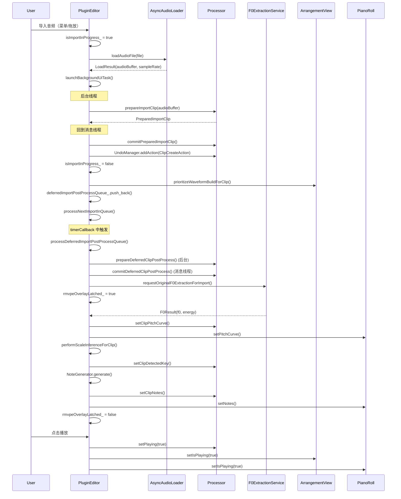
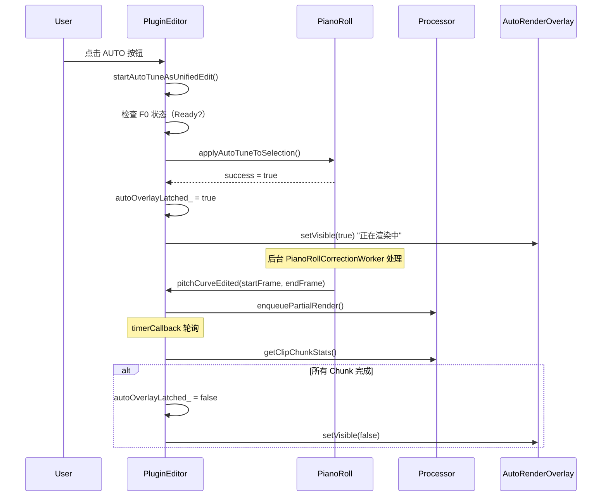

# ui-main 业务文档

## 核心业务规则

### BR-1: Mediator 模式

`OpenTuneAudioProcessorEditor` 是所有 UI 子组件的中心 Mediator。所有子组件通过 Listener 接口向 Editor 通知事件，Editor 负责：
- 将用户操作转发给 `OpenTuneAudioProcessor`（数据层）
- 在组件之间同步状态（如 TrackPanel 选中轨道 → PianoRoll 切换上下文）
- 管理异步任务生命周期（导入、F0 提取、导出）
- 维护 Undo/Redo 历史

**所有跨组件通信必须经过 PluginEditor，子组件之间不直接通信。**

### BR-2: 窗口布局规则

布局采用 **三区域 + 双可折叠侧面板** 架构：

```
┌──────────────────────────────────────────┐
│             TopBar (Transport + Menu)     │
├────────┬─────────────────────┬───────────┤
│ Track  │                     │ Parameter │
│ Panel  │   Central Area      │  Panel    │
│ (可折叠)│ (Arrangement/Piano) │ (可折叠)   │
└────────┴─────────────────────┴───────────┘
```

- TopBar 固定高度（MenuBar 25px + TransportBar 64px）
- 左侧 TrackPanel 宽 180px，可通过 TopBar 按钮折叠
- 右侧 ParameterPanel 宽 240px，可通过 TopBar 按钮折叠
- 中央区域填满剩余空间，显示 ArrangementView 或 PianoRoll
- 所有面板使用 12px 阴影边距 + 6px 间隙
- 窗口可缩放，限制 1000×700 ~ 3000×2000

### BR-3: 双视图模式

| 视图 | 组件 | 功能 |
|------|------|------|
| Workspace（默认） | ArrangementViewComponent | 多轨道 Clip 编排 |
| PianoRoll | PianoRollComponent | 音高编辑 |

切换方式：
- TransportBar 视图切换按钮
- ESC 键（PianoRoll → Workspace，Workspace → PianoRoll）
- 双击 Clip → 进入 PianoRoll

两个视图共享同一个 bounds 区域，通过 `setVisible()` 互斥显示。

### BR-4: 导入流程规则

1. **单文件导入**：直接导入到当前活动轨道
2. **多文件导入**：弹窗询问导入模式
   - "顺序导入到当前轨道"：同一轨道多个 Clip
   - "分别导入到多个轨道"：自动扩展可见轨道数量
3. **拖放导入**：弹窗选择目标轨道
4. **并发保护**：`isImportInProgress_` 锁，后续请求入队
5. **导入上限**：最多同时 12 个文件
6. **两阶段导入**：
   - 后台线程执行 `prepareImportClip()`（重采样等 CPU 密集操作）
   - 消息线程执行 `commitPreparedImportClip()`（写锁 + 状态更新）
7. **导入后处理**：延迟到 timerCallback 中异步执行（dry signal 准备 + F0 提取）

### BR-5: 导出流程规则

- 三种导出类型：SelectedClip / Track / Bus
- 导出在独立 `std::thread` 中执行，使用 `exportInProgress_` 原子标记防止并发
- 导出格式固定为 WAV
- 完成/失败均在消息线程通知用户

### BR-6: 调式管理

调式优先级解析链（`resolveScaleForClip`）：
1. Clip 级检测结果（`clipKey.confidence > 0`）
2. 默认值（C Major, confidence=1.0）

调式变更流程：
- 用户手动更改 → 写入 Clip 级存储 + 创建 Undo Action
- F0 提取完成后自动推断 → 仅无现有检测时写入
- 程序化设置时 `suppressScaleChangedCallback_` 防止递归

### BR-7: Undo/Redo 规则

| 操作 | UndoAction 类型 | 触发条件 |
|------|----------------|----------|
| 导入音频 | ClipCreateAction | Clip 创建成功 |
| 调式变更 | ClipScaleKeyChangeAction | 用户手动变更 |
| 轨道静音 | TrackMuteAction | 状态变化 |
| 轨道 Solo | TrackSoloAction | 状态变化 |
| 轨道音量 | TrackVolumeAction | 变化超过 0.01 阈值 |
| 音高编辑 | CorrectedSegmentsChangeAction | PianoRoll 编辑 |

快捷键防抖：120ms 内的重复 Undo/Redo 被忽略。

Undo/Redo 后统一调用 `refreshAfterUndoRedo()` + 带范围追踪的 `refreshAfterUndoRedoWithRange()` 精确刷新。

### BR-8: 心跳同步机制

`timerCallback()` 是整个 UI 的核心同步引擎，运行在消息线程：

1. **推理状态检测** → 动态调整心跳频率（30Hz / 10Hz）
2. **参数面板同步** → 选中音符参数 ↔ 全局参数
3. **子组件心跳** → `arrangementView_.onHeartbeatTick()` / `pianoRoll_.onHeartbeatTick()`
4. **延迟导入后处理** → `processDeferredImportPostProcessQueue()`
5. **BPM/拍号同步** → Processor → TransportBar + PianoRoll
6. **音频缓冲区同步** → 检测变化后更新 PianoRoll
7. **播放位置同步** → Processor → TransportBar
8. **渲染状态同步** → Chunk 状态 → Overlay 显示/隐藏
9. **播放状态同步** → Processor → TransportBar + PianoRoll + ArrangementView
10. **电平表更新** → Processor RMS → TrackPanel（次要刷新）

### BR-9: 主题系统

支持 3 种主题：
- **BlueBreeze**（默认）：蓝灰色调
- **DarkBlueGrey**：深色蓝灰
- **Aurora**：极光主题（使用独立 AuroraLookAndFeel）

主题切换影响所有组件，通过 `UIColors::applyTheme()` + 各组件 `applyTheme()` 实现。

### BR-10: 国际化

支持 5 种语言：English、中文、日本語、Русский、Español。

通过 `LocalizationManager` 单例管理，`LOC()` 宏获取翻译文本。语言变更触发 `languageChanged()` 回调，刷新所有 UI 文本。

macOS 上菜单栏使用系统原生菜单（`setMacMainMenu`），需要 `menuItemsChanged()` 重建。

---

## 核心流程

### 用户导入音频到播放的完整 UI 流程



### AUTO 修音流程



---

## 关键方法说明

### syncPianoRollFromClipSelection

**位置**: `PluginEditor.cpp:1028`

Clip 选择变化时，统一同步 PianoRoll 全部状态：
1. `setCurrentClipContext(trackId, clipId)` — 绑定上下文
2. `setTrackTimeOffset()` — 时间偏移
3. `setAudioBuffer()` — 音频数据
4. `setPitchCurve()` — F0 曲线
5. `setNotes()` — 音符序列
6. `applyResolvedScaleForClip()` — 调式

### themeChanged

**位置**: `PluginEditor.cpp:1810`

主题切换的完整流程：
1. `Theme::setActiveTheme()` — 设置全局主题
2. `UIColors::applyTheme()` — 更新颜色常量
3. 切换 LookAndFeel（Aurora 使用独立 LAF）
4. 逐组件调用 `applyTheme()` + `repaint()`
5. 同步播放头颜色
6. `sendLookAndFeelChange()` — 通知所有子组件

### timerCallback

**位置**: `PluginEditor.cpp:818`

30Hz 主循环，是 UI 层最核心的方法。详见 BR-8。

### importAudioFileToTrack

**位置**: `PluginEditor.cpp:1302`

两阶段导入的入口。如果 `isImportInProgress_`，请求入队。否则：
1. `asyncAudioLoader_.loadAudioFile()` — 异步加载
2. `launchBackgroundUiTask()` → `prepareImportClip()` — 后台预处理
3. `MessageManager::callAsync()` → `commitPreparedImportClip()` — 消息线程提交
4. 创建 `ClipCreateAction` Undo
5. 同步 PianoRoll + ArrangementView
6. 触发延迟后处理

---

## ⚠️ 待确认

1. **PluginEditor 作为 God Object**: 当前 PluginEditor 实现了 7 个 Listener 接口（~2800 行代码），职责过重。是否计划拆分为子 Controller？
2. **TrackPanel 与 ArrangementView 常量重复**: `TRACK_PANEL_WIDTH` 在命名空间级别定义（120），而 PluginEditor 布局常量中也有 `TRACK_PANEL_WIDTH = 180`，两个值不同且名称相同。
3. **导出线程管理**: `exportWorker_` 使用裸 `std::thread` + `joinable()` 检查。是否考虑迁移到 `std::async` 或 JUCE Thread 以统一风格？
4. **PianoRollComponent 未在 arch_layers 中**: PianoRoll 是 ui-main 的核心组件之一，但未包含在本模块定义中。它的 Spec 在何处维护？
5. **macOS 系统菜单**: `setMacMainMenu(&menuBar_)` 在构造函数中调用，析构时必须先 `setMacMainMenu(nullptr)` 再销毁 `menuBar_`。这一生命周期约束缺乏显式文档。
6. **Clip 拖放的轨道选择 UI**: `promptTrackSelectionForDroppedFile()` 对每条可见轨道生成一个按钮。当可见轨道数较多（12 条）时，弹窗可能溢出。
7. **OptionsDialogComponent 内存管理**: `new OptionsDialogComponent()` 的所有权通过 `LaunchOptions.content.setOwned()` 转移。但内部的 `new AudioSettingsPanel(holder)` 使用 `addTab(..., true)` 交给 TabbedComponent 管理。这一所有权链是否有泄漏风险？
