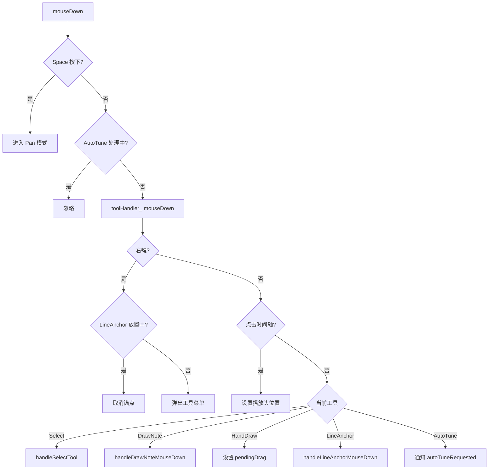
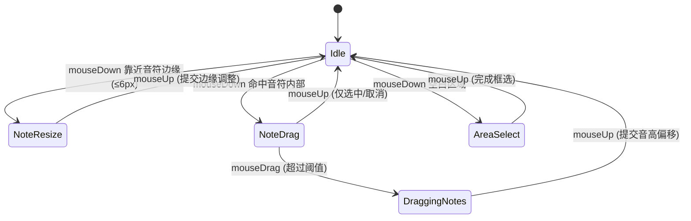
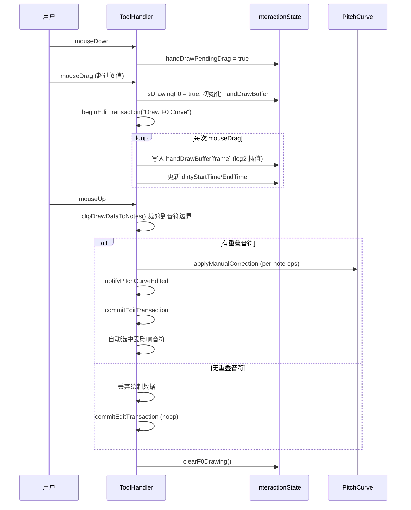
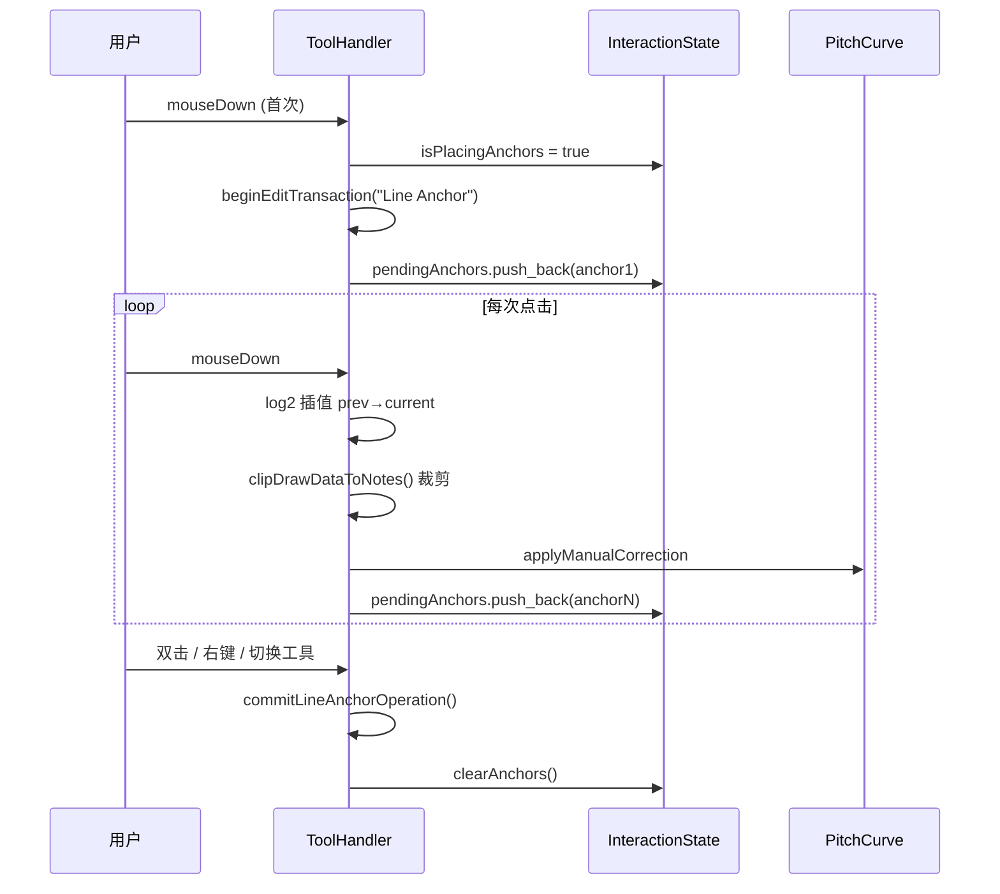
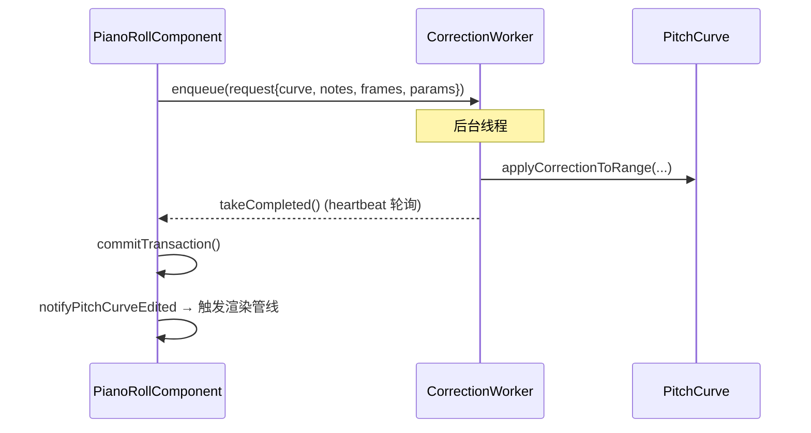

# 业务逻辑文档 — ui-piano-roll

## 1. 模块职责

钢琴卷帘编辑器（Piano Roll）是 OpenTune 的核心交互组件，负责：
- 可视化音高曲线（原始 F0 / 校正后 F0）和波形
- 提供多工具编辑体系（选择、音符绘制、手绘 F0、线段锚点、AutoTune）
- 管理音符选择模型和编辑操作的撤销/重做
- 驱动异步音高修正（通过 `PianoRollCorrectionWorker`）

## 2. 核心业务规则

### 2.1 工具体系

| 工具 | 快捷键 | 鼠标形态 | 核心行为 |
|------|--------|----------|----------|
| Select | `3` | 箭头/十字移动/左右调整 | 点选、Ctrl 多选、Shift 范围选、框选、拖拽移动、边缘调整 |
| DrawNote | `2` | 十字准星 | 拖拽创建矩形音符；点击已有音符可选中；音高自动对齐半音 |
| HandDraw | `5`(⚠️) | 十字准星 | 按住拖拽自由绘制 F0 曲线；数据裁剪到音符边界；结束后自动选中受影响音符 |
| LineAnchor | `4` | 十字准星 | 逐次点击放置锚点；锚点间 log2 插值；右键/双击提交；数据裁剪到音符边界 |
| AutoTune | `6` | 手指 | 点击触发 → 通知上层执行自动调音生成 |

> ⚠️ **待确认**：HandDraw 工具快捷键在代码中 `'5'` 是否已注册。当前 `keyPressed` 中仅注册了 `'2'`(DrawNote), `'3'`(Select), `'4'`(LineAnchor), `'6'`(AutoTune)，未见 `'5'` 的快捷键绑定。

### 2.2 工具切换规则

1. **切换时清除选择**：切换到不同工具时，自动取消所有音符选中（`Note.selected = false`）
2. **LineAnchor 挂起锚点**：从 LineAnchor 切换到其他工具时，自动提交（`commitEditTransaction`）并清除待定锚点
3. **右键菜单**：任何工具模式下右键弹出工具切换菜单（Select / Draw Note / Line Anchor / Hand Draw）
4. **LineAnchor 右键特殊**：若正在放置锚点时右键，取消当前锚点操作而非弹菜单

### 2.3 统一选择模型

**核心原则**：所有选择状态通过 `Note.selected` 字段流转，无并行选择机制。

- `SelectionState` 仅存储瞬态框选拖拽坐标
- 选中音符后，`updateF0SelectionFromNotes()` 推导出 F0 帧范围 → 用于渲染高亮
- **取消选择的触发点**：
  - Escape 键（仅当有选中音符时）
  - 点击空白区域（无 Ctrl）
  - 工具切换
  - `setPitchCurve` 重设曲线

### 2.4 音符操作规则

#### 创建（DrawNote 工具）
1. mouseDown → 记录起点，进入 pendingDrag 状态
2. 超过 `dragThreshold_(5px)` → 开始实际绘制
3. 音高自动对齐到最近半音：`round(freqToMidi(clickFreq))` → `midiToFreq`
4. 实时更新临时音符的 startTime/endTime
5. mouseUp → 最小时长 0.02s；分割与新音符重叠的已有音符；通过 `recalculatePIP` 计算 PIP 并设置 pitchOffset
6. 触发 `enqueueNoteBasedCorrection` 异步修正

#### 移动（Select 工具拖拽）
1. 点击选中音符 → 记录所有选中音符的初始 `pitchOffset`
2. 若选中区域有 F0 修正 → 快照渲染后的 F0 数据到 `initialManualTargets`
3. 拖拽 → 按半音粒度调整 pitchOffset（`round` 对齐）
4. 同步按 `shiftFactor = 2^(deltaSemitones/12)` 移动 F0 修正数据
5. 结束 → 通知 `noteOffsetChanged`，触发异步重算

#### 调整边缘（Select 工具边缘拖拽）
1. 鼠标靠近音符左/右边缘 ≤6px → 进入 resize 模式
2. 拖拽 → 更新 startTime 或 endTime，最小时长 0.02s
3. 结束 → 计算受影响帧范围（含调整前后的合并范围），触发异步修正

#### 删除（Delete 键 / `1` 键）
1. 收集选中音符的时间范围
2. `clearCorrectionRange` 清除对应帧范围的修正段
3. 从 notes 列表中移除选中音符
4. 比较删除前后的修正段摘要（CorrectionDigest），仅修正变化时通知 `pitchCurveEdited`

### 2.5 HandDraw / LineAnchor 裁剪规则

**核心规则**：HandDraw 和 LineAnchor 绘制的 F0 数据**必须裁剪到音符边界**。

```
clipDrawDataToNotes(drawStartFrame, drawEndFrame, drawnF0, source, retuneSpeed)
  → 对每个音符，计算与绘制范围的帧重叠
  → 提取重叠部分的 F0 子序列
  → 生成 ManualCorrectionOp
  → 音符外的数据被丢弃
```

结束后自动选中受影响的音符。

### 2.6 AutoTune 规则

1. **前提条件**：必须先选中音符（否则弹对话框提示）
2. 支持 ScaleSnap：若 scaleType ≠ 3(Chromatic)，先把选中音符的 pitch 对齐到音阶
3. 为选中音符设置 retuneSpeed / vibratoDepth / vibratoRate
4. 计算选中音符的帧范围 → `enqueueNoteBasedCorrectionAsync`
5. 使用 `correctionInFlight_` 原子标志防止重复提交

### 2.7 撤销/重做

**事务机制**：
1. `beginTransaction(description)` — 快照当前音符列表 + CorrectedSegments
2. 执行编辑操作（任意数量的音符/修正变更）
3. `commitTransaction()` — 比较前后快照，生成 UndoAction

**Action 类型**：
- `NotesChangeAction`：音符列表变更
- `CorrectedSegmentsChangeAction`：F0 修正段变更
- `CompoundUndoAction`：音符+修正段的原子组合

**比较优化**：
- 音符比较：逐字段浮点近似（epsilon=1e-6）
- 修正段比较：基于 fingerprint set 的 diff，定位实际受影响帧范围

### 2.8 缩放与滚动

| 操作 | 修饰键 | 行为 |
|------|--------|------|
| 滚轮 | 无 | 垂直滚动 |
| 滚轮 | Alt | 水平滚动 |
| 滚轮 | Ctrl | 水平缩放（锚点=鼠标位置） |
| 滚轮 | Shift | 垂直缩放（锚点=鼠标位置） |
| Space+拖拽 | — | 自由平移 |

**缩放范围**：
- 水平 `zoomLevel_`: [0.02, 10.0]
- 垂直 `pixelsPerSemitone_`: [5.0, 60.0]

**自动滚动（播放时）**：
- `Continuous` 模式：播放头居中，平滑插值（0.2 lerp 系数）
- `Page` 模式：播放头到达边缘时翻页

### 2.9 时间单位

- **Seconds**：标尺显示 `m:ss`，网格按 1/5/10/30/60 秒自适应密度
- **Bars**：标尺显示 `bar.beat`，网格按 1/4/8/16/32 拍自适应密度

### 2.10 重绘节流

`requestInteractiveRepaint()` 限制到 ~60fps：
- 若距上次重绘 ≥ 16.67ms → 立即通过 `FrameScheduler` 提交
- 否则 → 合并脏区域，延迟到下一个 heartbeat tick 处理

## 3. 核心流程

### 3.1 鼠标事件处理流程



### 3.2 Select 工具状态机



### 3.3 HandDraw 工具流程



### 3.4 LineAnchor 工具流程



### 3.5 异步修正流程



## 4. 关键方法说明

### 4.1 `PianoRollComponent::buildToolHandlerContext()`
**位置**: `PianoRollComponent.cpp:81`
构建 ~60 个 lambda 回调桥接 PianoRollComponent 内部状态到 ToolHandler。是 ToolHandler 与 Component 之间的唯一耦合点。

### 4.2 `PianoRollToolHandler::clipDrawDataToNotes()`
**位置**: `PianoRollToolHandler.cpp:1490`
HandDraw/LineAnchor 的核心裁剪函数。遍历所有音符，计算帧范围重叠，提取子序列。O(notes × drawFrames)。

### 4.3 `PianoRollToolHandler::handleSelectTool()`
**位置**: `PianoRollToolHandler.cpp:402`
Select 工具的 mouseDown 分发器。按优先级检测：边缘调整 → 音符点击 → 空白框选。支持 Ctrl 切换选中、Shift 范围选中。

### 4.4 `PianoRollUndoSupport::commitTransaction()`
**位置**: `PianoRollUndoSupport.cpp:117`
比较 before/after 快照，通过 fingerprint diff 定位修正段变更范围，最小化 undo 数据。

### 4.5 `PianoRollComponent::recalculatePIP()`
**位置**: `PianoRollComponent.cpp:1671`
基于原始 F0 的中位数估算 PIP（Perceptual Intentional Pitch）。用于音符创建/移动时设置 `originalPitch` 和 `pitchOffset`。

### 4.6 `PianoRollComponent::onHeartbeatTick()`
**位置**: `PianoRollComponent.cpp:1076`
外部定时器驱动的更新入口。职责：
1. 消费异步修正结果
2. 处理延迟重绘
3. 渲染动画刷新
4. 增量构建波形 mipmap

### 4.7 `PianoRollComponent::onScrollVBlankCallback()`
**位置**: `PianoRollComponent.cpp:1134`
VBlank 同步的滚动更新。播放时根据 ScrollMode 执行平滑跟踪或翻页。

## 5. 渲染管线

### 5.1 `paint()` 调用顺序

```
1. buildRenderContext()                    — 快照所有参数
2. drawShadow + background               — 背景/圆角
3. drawTimeRuler                          — 时间标尺
4. [clip to content area]
   4a. drawGridLines                      — 网格线
   4b. drawWaveform                       — 波形（mipmap）
   4c. drawLanes                          — 黑白键泳道
   4d. drawNotes                          — 音符矩形
   4e. highlight overlapping notes        — HandDraw/LineAnchor 重叠高亮
   4f. drawF0Curve (original)             — 原始 F0（薄线 0.55α）
   4g. drawSelectedOriginalF0Curve        — 选中音符区域原始 F0（加粗 0.85α）
   4h. drawF0Curve (corrected)            — 校正后 F0（厚线 1.0α）
   4i. drawHandDrawPreview                — 手绘实时预览
   4j. drawLineAnchorPreview              — 锚点+连线预览
5. drawPianoKeys                          — 琴键（含音阶标记）
6. drawSelectionBox                       — 框选矩形
7. drawRenderingProgress                  — 渲染进度旋转器
```

### 5.2 F0 曲线渲染优化

- 仅渲染可见帧范围（`iStart` / `iEnd` 基于视口计算 + 10 帧 margin）
- 分段渲染，短段 fade-in/out（3 帧渐变）
- 选中区域使用红色高亮线（`0xFFE74C3C`）

### 5.3 波形渲染

使用 `WaveformMipmap` 多级降采样，`selectBestLevelIndex(pixelsPerSecond)` 选择合适层级。

## 6. ⚠️ 待确认事项

### 6.1 默认值类

| 项目 | 当前值 | 疑点 |
|------|--------|------|
| `hopSize_` 初始值 | 512 | AGENTS.md 记载 RMVPE hop=160@16kHz，实际由 `setPitchCurve` 覆盖 |
| `f0SampleRate_` 初始值 | 16000.0 | 同上，实际由运行时覆盖 |
| HandDraw 快捷键 `5` | 未在 keyPressed 中注册 | Select(`3`), DrawNote(`2`), LineAnchor(`4`), AutoTune(`6`) 均已注册 |

### 6.2 边界条件类

| 场景 | 现状 | 风险 |
|------|------|------|
| `getCurrentClipNotes()` 无有效 clip 时 | 返回 static empty vector 引用 | 若上层写入会导致未定义行为 |
| `hasSelectionRange()` 使用 `const_cast` | 绕过 const 调用非 const `getCurrentClipNotes()` | 设计债务，不影响运行时正确性 |
| LineAnchor `currFrame <= prevFrame` 时 | 强制 `currFrame = prevFrame + 1` | 回退放置锚点时可能产生 1 帧微段 |

### 6.3 并发与线程安全类

| 项目 | 现状 | 说明 |
|------|------|------|
| `correctionWorker_` 结果消费 | `onHeartbeatTick` 轮询 `takeCompleted()` | 依赖外部定时器频率，结果延迟取决于 tick 间隔 |
| `correctionInFlight_` | `std::atomic<bool>` acq/rel | AutoTune 防重入标志，正确使用 |
| `clipContextGeneration_` | `std::atomic<uint64_t>` release | 使进行中请求失效，但 worker 侧检查逻辑未在此模块内（在 CorrectionWorker 内） |

### 6.4 扩展性类

| 项目 | 说明 |
|------|------|
| `ToolbarIcons` 中有 `getCutIcon()` / `getEraseIcon()` | 对应工具（Cut/Erase）在 `ToolId` 中未定义，可能为未来预留 |
| `PianoRollComponent::Listener::trackTimeOffsetChanged` | 已声明但未见调用 |
