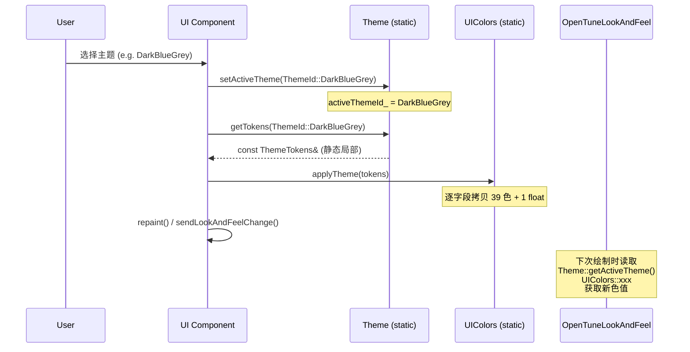
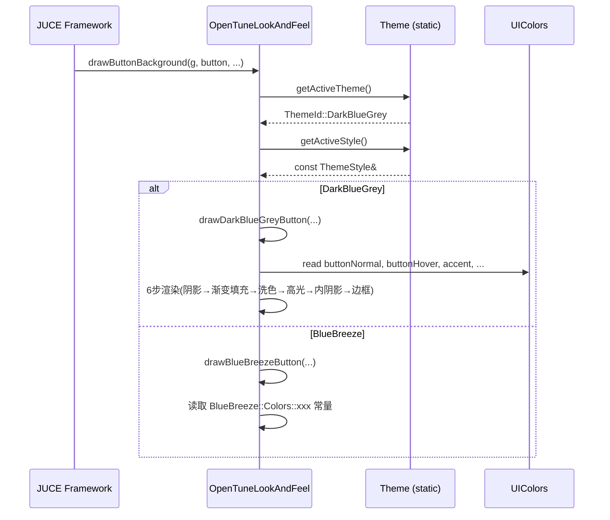

# ui-theme 设计规约

> 本模块为基础设施模块（Infrastructure），不包含业务流程。本文档以"设计规约"方向记录主题系统的架构设计、Token 体系层级、主题切换机制和 LookAndFeel 覆写策略。

## 1. Token 体系层级

主题系统采用三层 Token 架构：

```
Layer 1 — 基础色 (Raw Colors)
  ↓ 定义在各主题命名空间 (BlueBreeze::Colors, DarkBlueGrey::Colors, Aurora::Colors)
  ↓ 纯色值常量 (juce::uint32)，无语义含义
  ↓ 例: BlueBreeze::Colors::AccentBlue = 0xFF60A5FA

Layer 2 — 语义色 Token (ThemeTokens)
  ↓ 定义在 ThemeTokens 结构体
  ↓ 将基础色映射为语义角色 (accent, backgroundDark, textPrimary, noteBlock...)
  ↓ 每套主题一个 ThemeTokens 实例 (静态局部变量)
  ↓ 例: tokens.accent = Colour(BlueBreeze::Colors::ActiveWhite)

Layer 3 — 全局运行时缓存 (UIColors)
  ↓ static inline 字段，与 ThemeTokens 同名
  ↓ applyTheme() 将 ThemeTokens 拷贝到 UIColors
  ↓ 所有 UI 组件直接读取 UIColors::xxx
  ↓ 例: UIColors::accent → 被所有绘制代码引用
```

**设计意图**: Layer 1 隔离色值定义，Layer 2 提供语义抽象，Layer 3 提供零成本全局访问。新增主题只需添加一组 Layer 1 色值并构建 Layer 2 映射。

### Token 覆盖范围

| 类别 | Token 数 | 覆盖 |
|------|---------|------|
| 品牌/强调 | 4 | 主色 + 亮/暗变体 |
| 背景 | 3 | 三级灰阶 |
| 渐变 | 2 | 面板渐变首尾 |
| 控件 | 4 | 边框 + 按钮三态 |
| 3D 效果 | 3 | 倒角亮/暗 + 发光 |
| 文本 | 4 | 主/次/禁用/高亮 |
| 钢琴卷帘 | 4 | 背景 + C 轨道 + 普通轨道 + 网格 |
| 音高曲线 | 3 | 原始/矫正 F0 + 影子 |
| 音符 | 4 | 填充/边框/选中/悬停 |
| 播放控制 | 3 | 播放头 + 时间线 + 拍子 |
| 工具 | 3 | 激活/未激活/按钮未激活 |
| 状态指示 | 3 | 处理中/就绪/错误 |
| 波形 | 2 | 填充/轮廓 |
| 旋钮 | 2 | 主体/指示器 |
| 其他 | 2 | 音阶高亮 + 圆角 |
| **合计** | **40** | |

---

## 2. 主题继承关系

```
juce::LookAndFeel_V4
    │
    ├── OpenTuneLookAndFeel          (通用基类, 内部按 ThemeId switch-case 派发)
    │       │ 构造函数加载 HONOR Sans CN 字体
    │       │ 覆写 ~20 个 JUCE 虚方法
    │       │ 内含 BlueBreeze/DarkBlueGrey 绘制逻辑
    │       └── (Aurora 部分回退到 LookAndFeel_V4 默认)
    │
    ├── BlueBreezeLookAndFeel        (独立, 完整覆写)
    ├── DarkBlueGreyLookAndFeel      (独立, 完整覆写)
    └── AuroraLookAndFeel            (独立, 完整覆写, 含 drawNeonGlow)
```

**双轨体系现状**:
1. `OpenTuneLookAndFeel` 是"一体式"方案，一个类内部按 `Theme::getActiveTheme()` 分支绘制。适合全局统一设置一个 LookAndFeel 实例。
2. 三个独立 `XxxLookAndFeel` 类是"分离式"方案，每个主题有完全独立的实现。适合按组件/区域设置不同 LookAndFeel。

两套体系的绘制逻辑存在大量重复代码（如按钮、滑块、旋钮绘制）。

---

## 3. LookAndFeel 覆写策略

### 3.1 覆写覆盖面

| JUCE 控件类型 | 覆写方法 | 三套主题全覆盖？ |
|-------------|---------|:---:|
| Button background | `drawButtonBackground` | Yes |
| Toggle button | `drawToggleButton` | Yes |
| Tick box | `drawTickBox` | BlueBreeze only (OpenTuneLookAndFeel) |
| Rotary slider | `drawRotarySlider` | Yes |
| Linear slider | `drawLinearSlider` | Yes (Vertical); Horizontal partial |
| Label (value field) | `drawLabel` | BlueBreeze + DarkBlueGrey (OpenTuneLookAndFeel) |
| TextEditor bg | `fillTextEditorBackground` | Yes |
| TextEditor outline | `drawTextEditorOutline` | Yes |
| ComboBox | `drawComboBox` | Yes |
| PopupMenu bg | `drawPopupMenuBackground` | Yes |
| PopupMenu item | `drawPopupMenuItem` | Yes |
| MenuBar bg | `drawMenuBarBackground` | DarkBlueGrey + BlueBreeze (OpenTuneLookAndFeel) |
| MenuBar item | `drawMenuBarItem` | DarkBlueGrey (OpenTuneLookAndFeel) |
| DocumentWindow title | `drawDocumentWindowTitleBar` | OpenTuneLookAndFeel only |
| Scrollbar | `drawScrollbar` | OpenTuneLookAndFeel only |
| Fonts (7 methods) | `getXxxFont` | Yes |

### 3.2 各主题视觉设计语言

| 维度 | BlueBreeze | DarkBlueGrey | Aurora |
|------|-----------|-------------|--------|
| 整体调性 | 浅色、柔和、Soothe2 风 | 深蓝灰、清爽线条 | 暗色霓虹、玻璃质感 |
| 按钮激活态 | 纯白填充 + 阴影 | 蓝色填充 + 阴影 | 霓虹描边 + 发光 |
| 按钮非激活态 | 透明 + 细描边 | 深色填充 + 渐变 + 细边框 | 玻璃渐变 + 半透明边框 |
| 旋钮风格 | 钢琴漆（7步绘制：渐变体+高光弧+金属边+银白指针） | 拟物金属（9步绘制：阴影+轨道+金属环+主体+半月高光+中心帽+指示针） | 霓虹环（动态色彩弧+发光点+虚线背景轨道） |
| 滑块 Thumb | 白色胶囊 + 柔阴影 | 渐变胶囊 + 高光线 + 握持纹理 | 白色胶囊 + 霓虹发光 |
| 阴影策略 | 有色阴影（`#5A6A75`），非纯黑 | 冷色环境阴影（`#050A12`），三级分层 | JUCE DropShadow 标准 |
| 发光效果 | 无 | 无 | 三层霓虹发光（内芯+柔光+大气散射） |
| 色彩动态 | 静态 | 静态 | 旋钮弧线颜色随值渐变 Blue→Green→Orange→Red |

---

## 4. 关键设计时序

### 4.1 主题切换流程



### 4.2 绘制时序（以按钮为例）



---

## 5. 关键方法说明

### 5.1 UIColors::applyTheme()

**位置**: `UIColors.h:106-169`

主题切换核心。逐字段将 `ThemeTokens` 的 40 个值赋值到 `UIColors` 的 `static inline` 字段。这是一个 O(1) 操作（固定 40 次赋值）。

**约束**: 必须在 UI 线程调用。无锁保护。

### 5.2 UIColors::drawShadow()

**位置**: `UIColors.h:172-219`

三级阴影系统：
- **Ambient** (L1): alpha=0.28, radius=14, offset=(0,3) — 面板贴底
- **Float** (L2): alpha=0.34, radius=20, offset=(0,6) — 悬浮控件
- **Pop** (L3): alpha=0.45, radius=26, offset=(0,10) — 弹窗/菜单

仅 DarkBlueGrey 主题使用冷色基色 (`#050A12`) 阴影。其他主题使用标准黑色阴影。

### 5.3 OpenTuneLookAndFeel::drawDarkBlueGreyButton()

**位置**: `OpenTuneLookAndFeel.h:291-374`

六步渲染流程：
1. 冷色环境阴影（非按下态）
2. 背景填充（轻渐变制造体积感）
3. 轻洗色（仅选中态，accent 10% alpha 叠加）
4. 顶部高光线（textPrimary 8% alpha）
5. 按下态内阴影（bevelDark 26% alpha 描边）
6. 边框（选中态 accent 85%，默认态 panelBorder 55%/70%）

### 5.4 AuroraLookAndFeel::drawNeonGlow()

**位置**: `AuroraLookAndFeel.cpp:8-32`

三层发光效果：
1. **内芯**: color @ 80% alpha, strokeWidth=1.5
2. **中柔光**: DropShadow radius=8*intensity, alpha=40%
3. **外大气散射**: DropShadow radius=16*intensity, alpha=20%

`intensity` 参数控制整体强度，hover 态通常 1.0，普通态 0.6。

### 5.5 BlueBreezeLookAndFeel::drawRotarySlider()

**位置**: `BlueBreezeLookAndFeel.cpp:20-171`

七步钢琴漆旋钮绘制：
1. 凸起阴影（拖动时更大）
2. 旋钮主体（黑色渐变，含中间光泽点）
3. 顶部高光弧（椭圆弧模拟钢琴漆反光）
4. 边缘金属光泽（外边缘 + 内边缘高光）
5. 短刻度指针（银白渐变 + 阴影 + 顶端圆点）
6. 悬停/拖动外发光效果
7. 中心值文本（非拖动时显示）

---

## 6. 字体策略

- **全局默认字体**: HONOR Sans CN Medium（二进制嵌入，`OpenTuneLookAndFeel` 构造时设置）
- **UI 字体**: 最小 16px（Regular），通过 `UIColors::getUIFont()` 工厂
- **标题字体**: 最小 18px（Semibold），通过 `UIColors::getHeaderFont()`
- **标签字体**: 最小 14px（Regular），通过 `UIColors::getLabelFont()`
- **等宽字体**: 系统默认等宽（Bold），通过 `UIColors::getMonoFont()`
- **按钮字体约定**: 通过 `properties["fontHeight"]` 实现跨按钮统一字号

---

## 7. 待确认事项

1. **双轨 LookAndFeel 体系整合方向**: `OpenTuneLookAndFeel`（一体式）与三个独立 `XxxLookAndFeel`（分离式）并存，代码重复度高。需确认是否计划统一为一种方案，以及当前产品使用的是哪种方案。

2. **Aurora 主题在 OpenTuneLookAndFeel 中的覆盖不完整**: `drawButtonBackground` 中 Aurora 回退到 BlueBreeze 逻辑；`drawRotarySlider` 中 Aurora 走默认弧线路径（非霓虹效果）。独立 `AuroraLookAndFeel` 中有完整实现。如果使用 `OpenTuneLookAndFeel`，Aurora 效果会降级。

3. **UIColors 初始值 vs 默认主题**: `UIColors` 硬编码初始值对应旧版色系（偏 DarkBlueGrey），而 `Theme::activeThemeId_` 默认为 `Aurora`。启动时如果未调用 `applyTheme()`，视觉会不一致。

4. **主题切换是否触发全局 repaint**: 源码中 `applyTheme()` 仅修改静态字段，不会自动触发组件重绘。调用方需自行调用 `repaint()` 或 `sendLookAndFeelChange()`。当前切换链路的完整性需确认。

5. **ThemeTokens.cornerRadius 与 ThemeStyle.panelRadius 的关系**: 两个数据结构中都有圆角定义，职责边界不清晰。`cornerRadius` 被赋值到 `UIColors::cornerRadius`，但绘制代码多数使用 `ThemeStyle` 中的圆角值。
