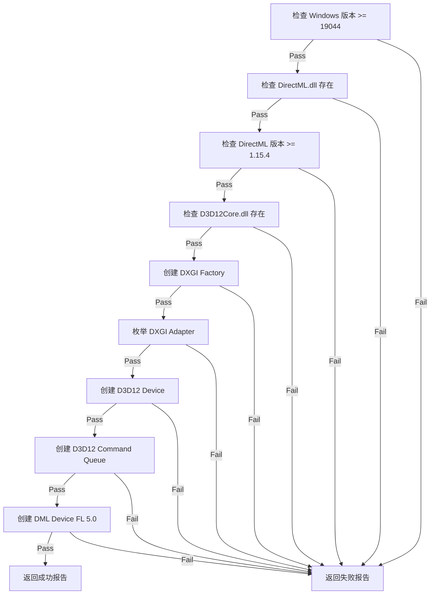
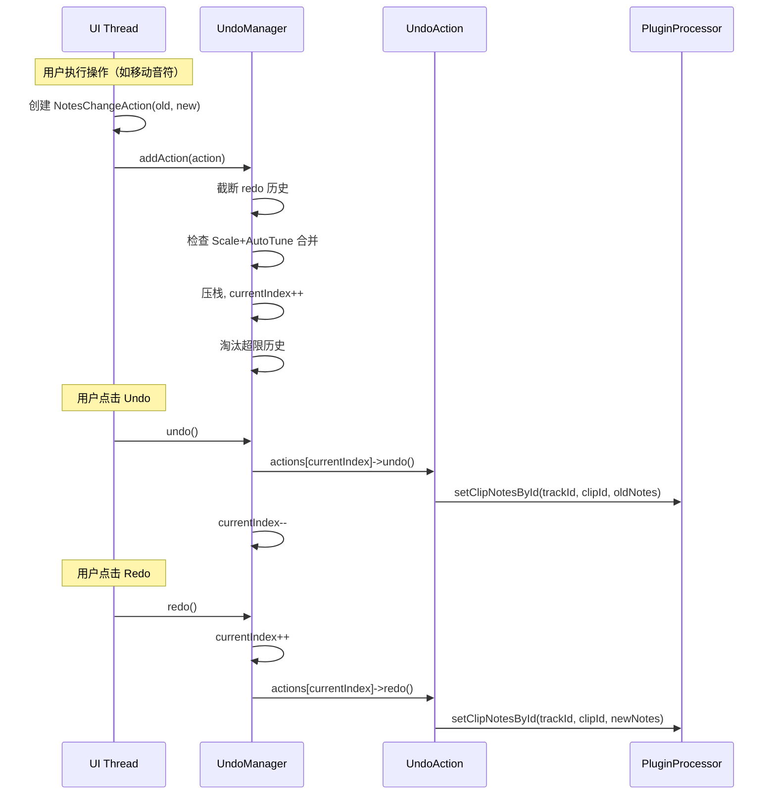
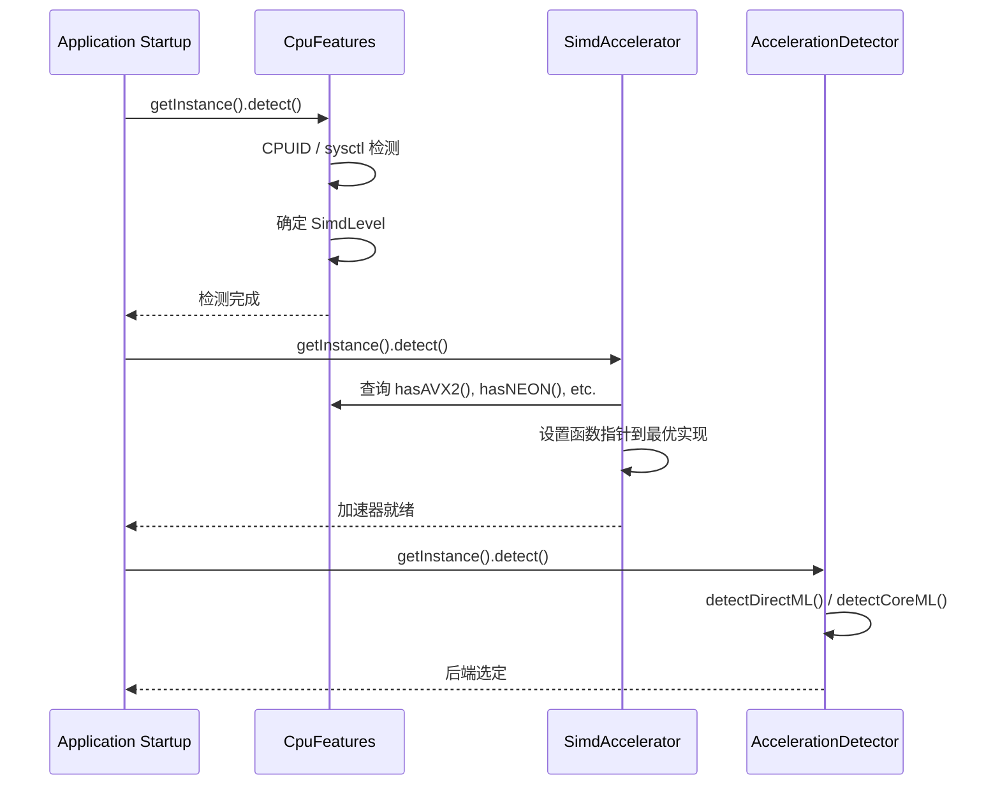

# utils -- 基础设施规约

> **本文档基于源码扫描自动生成，标注 `[待确认]` 处需人工复核。**

---

## 1. 模块定位

`utils` 模块是 OpenTune 的基础设施层，为上层模块（Inference、DSP、UI、PluginProcessor）提供：

- **日志系统** — 统一的分级日志输出
- **撤销/重做框架** — Command 模式的可逆操作体系
- **锁无关数据结构** — 用于音频线程与 UI 线程间的无锁通信
- **SIMD 加速** — 运行时检测并分派最优向量化实现
- **GPU 加速检测** — DirectML / CoreML 后端自动选择
- **CPU 线程预算** — ONNX Runtime 线程数控制
- **平台适配** — Windows DLL 加载策略、D3D12 Agility SDK
- **配置管理** — 快捷键、缩放灵敏度、音高控制、鼠标轨迹等用户偏好
- **本地化** — 5 语言 UI 翻译
- **错误处理** — 结构化错误码 + Rust-style Result 类型

---

## 2. 基础设施规约

### 2.1 日志系统规约

**策略**:
- 4 级日志：Debug → Info → Warning → Error
- 默认级别 `Info`，低于当前级别的日志被静默丢弃
- 日志文件存储在 `./Logs/` 目录，文件名带日期戳 (`OpenTune_YYYY-MM-DD.log`)
- 线程安全：所有操作通过 `juce::CriticalSection` 保护
- 懒初始化：首次 `log()` 调用自动触发 `initialize()`
- `shutdown()` 需显式调用以关闭文件句柄

**性能日志**: `[PERF]` 标签输出操作耗时，配套 RAII 计时器 `PerfTimer`。
> **注意**: `PerfTimer` 当前被硬编码禁用（析构函数提前 return）。

### 2.2 撤销/重做系统规约

**设计模式**: Command Pattern + Memento (快照)

**核心契约**:
- 每个 `UndoAction` 子类必须实现 `undo()` / `redo()` / `getDescription()` / `getClipId()`
- `UndoManager` 维护线性历史栈（`vector<unique_ptr<UndoAction>>`），最大 100 条
- 执行 `addAction` 后，当前位置之后的历史被截断（不可重做已丢弃的操作）
- 超过 `maxHistorySize` 时从头部淘汰最旧的 Action

**特殊合并逻辑**: 当连续执行 "Scale/Key Change" 后紧跟 "Auto Tune" 操作时，自动合并为 `CompoundUndoAction("Scale + Auto Tune")`，使两步操作作为原子单元被撤销。

**快照策略**:
- `NotesChangeAction`: 存储 old/new `vector<Note>` 完整拷贝
- `CorrectedSegmentsChangeAction`: 存储 `SegmentSnapshot` + `std::function` 应用器闭包
- `ClipDeleteAction`: 存储完整 `ClipSnapshot`（含音频缓冲区）以支持恢复
- `ClipCreateAction`: 延迟捕获——仅在首次 `undo()` 时创建快照

**静态影响范围追踪**: `CorrectedSegmentsChangeAction` 通过 `static inline` 变量 `lastAffectedStartFrame_` / `lastAffectedEndFrame_` 记录最近一次 undo/redo 影响的帧范围，供 UI 层触发精确重渲染。

### 2.3 锁无关队列规约

**实现**: 基于 Vyukov 的有界 MPMC 队列算法（sequence + CAS）。

**保证**:
- 线程安全：多生产者多消费者（MPMC）
- 无锁：仅使用 `compare_exchange_weak` 和 `atomic load/store`
- 有界：固定容量（构造时指定，必须为 2 的幂）
- 无阻塞：`try_enqueue` / `try_dequeue` 不阻塞，队列满/空时立即返回 `false`
- 缓存行对齐：`enqueuePos_` 和 `dequeuePos_` 分别 `alignas(64)` 避免 false sharing

**内存序**:
- 入队写数据后 `release` 发布
- 出队读数据前 `acquire` 获取
- 位置推进使用 `relaxed`（CAS 自身提供原子性）

**限制**:
- `size()` 返回近似值（两次非原子读取之间可能发生变化）
- `clear()` 非原子操作（逐个出队直到空）

### 2.4 SIMD 检测与加速路径规约

**两层检测架构**:

1. **CpuFeatures** — 硬件能力检测
   - 单例，启动时调用 `detect()` 一次
   - x86: 通过 `juce::SystemStats` + `__cpuid` 检测 SSE2/SSE4.1/AVX/AVX2/FMA/AVX-512
   - ARM64: 直接标记 NEON 支持
   - 检测物理/逻辑核心数和 CPU 品牌

2. **SimdAccelerator** — 运行时分派
   - 单例，依赖 `CpuFeatures` 结果
   - 通过函数指针动态分派到最优实现
   - **分派优先级**:
     - macOS: 始终使用 `Accelerate` 框架 (vDSP/vForce)
     - 非 macOS ARM64: NEON 手写实现
     - x86: AVX-512 > AVX2/AVX > SSE2 > Scalar
   - Debug 模式下自动验证 Accelerate 实现与 Scalar 实现的数值一致性

**提供的 SIMD 加速操作**:
- 算术：sumOfSquares, dotProduct, multiply, add, multiplyAdd, absMax, findMinMax
- 数学：vectorLog, vectorExp, vectorSqrt, complexMagnitude
- 消费者：SilentGapDetector（RMS 计算）、MelSpectrogram（滤波器组矩阵乘）

### 2.5 GPU 加速检测规约

**AccelerationDetector 选择策略**:
```
macOS → CoreML (系统框架，始终可用)
Windows → DirectML (需满足全部条件):
  1. 存在 DirectX 12 兼容 GPU
  2. onnxruntime.dll >= 12MB (DML 版本) 或存在 onnxruntime_providers_dml.dll
  3. GPU 有效显存 >= 512MB
  4. DmlRuntimeVerifier 验证通过
  不满足 → CPU 回退
其他平台 → CPU
```

**GPU 选择策略**:
- 枚举所有 DXGI 适配器，排除软件渲染器
- 排序：独立显卡优先 → 显存大小降序
- 集成显卡有效显存计算：
  - 专用显存 < 256MB: 使用共享内存/4
  - 专用显存 >= 256MB: 专用 + 共享/8
- 推荐显存限制 = 有效显存 * 60%，范围 [512MB, 8GB]

### 2.6 DML 运行时验证流程

`DmlRuntimeVerifier::verify()` 执行 8 阶段逐步验证：



每个失败阶段都生成 `DmlDiagnosticIssue`，包含 stage、HRESULT、detail 和 remediation（修复建议）。

### 2.7 CPU 线程预算规约

**公式**: `totalBudget = max(4, floor(hardwareThreads * 0.6))`

**配置差异**:

| 参数 | GPU 模式 | CPU 模式 |
|---|---|---|
| `onnxIntra` | 2 | 0 |
| `onnxInter` | 1 | 1 |
| `onnxSequential` | true | true |
| `allowSpinning` | false | false |

预算在初始化时固定，不随播放状态动态变化。

### 2.8 平台适配规约 (Windows)

**三层 DLL 加载策略**:

1. **WindowsDllSearchPath** (最早执行 — 全局静态构造)
   - 在 CRT 初始化时自动执行
   - 调用 `SetDefaultDllDirectories` + `AddDllDirectory` 将模块目录加入搜索路径

2. **OnnxRuntimeDelayLoadHook** (延迟加载拦截)
   - 注册 MSVC `__pfnDliNotifyHook2` 钩子
   - 拦截 `onnxruntime.dll` 的延迟加载请求
   - 搜索顺序：模块目录 → Program Files/OpenTune → ProgramData/OpenTune

3. **D3D12AgilityBootstrap** (D3D12 运行时选择)
   - 导出 `D3D12SDKVersion` 和 `D3D12SDKPath = ".\\D3D12\\"`
   - 使 D3D12 运行时从应用目录下的 `D3D12/` 子目录加载 Agility SDK

---

## 3. 关键设计时序

### 3.1 撤销/重做执行流程



### 3.2 SIMD 加速初始化流程



---

## 4. 关键方法说明

### 4.1 SilentGapDetector::detectAllGaps

**用途**: 在音频导入时预计算静息处，作为后续渲染 chunk 的天然分割边界。

**算法**:
1. 多声道混合为单声道
2. 高通滤波 60Hz（4 阶 Butterworth IIR）去除直流偏移
3. 低通滤波 3kHz（4 阶 Butterworth IIR）提取低频带
4. SIMD 加速预平方 + 前缀和，实现 O(1) 窗口 RMS 查询
5. 2ms 滑动窗口状态机检测：
   - **严格规则**: 总电平 <= -40dBFS → 静息
   - **放宽规则**: 总电平 <= -30dBFS 且低频带 < -40dBFS → 静息
6. 连续静息段 >= 100ms 才记录为 `SilentGap`

**性能特点**: 前缀和避免了每窗重复 sumOfSquares 调用，总体 O(N) 复杂度。

### 4.2 CpuBudgetManager::buildConfig

**用途**: 为 ONNX Runtime 推理配置最优线程参数。

**设计决策**:
- GPU 模式下 `onnxIntra=2`：ONNX Runtime 仍需少量 CPU 线程做数据预处理
- CPU 模式下 `onnxIntra=0`：让 ONNX Runtime 使用默认线程数
- `allowSpinning=false`：避免 CPU 空转消耗能源，降低在笔记本上的功耗
- `onnxSequential=true`：避免 ONNX 内部并行执行器的开销

### 4.3 AccelerationDetector::detectDirectML

**集成显卡识别逻辑**:
- Intel: vendorId=0x8086，排除 Arc 系列 (deviceId 0x5690-0x56C0)，专用显存 < 512MB 视为集成
- AMD: vendorId=0x1002，专用显存 < 1GB 且有共享内存视为集成
- 集成显卡有效显存计算考虑共享系统内存的贡献

---

## 5. 模块间依赖关系

```
utils (本模块)
  ↑ 被依赖方
  │
  ├── PluginProcessor ── 使用 UndoManager, ClipSnapshot, SilentGapDetector, TimeCoordinate
  ├── PianoRollComponent ── 使用 KeyShortcutConfig, ZoomSensitivityConfig, MouseTrailConfig
  ├── MainControlPanel ── 使用 PitchControlConfig, PresetManager, LocalizationManager
  ├── InferenceManager ── 使用 ModelPathResolver, AccelerationDetector, CpuBudgetManager
  ├── MelSpectrogram ── 使用 SimdAccelerator
  ├── F0ExtractionService ── 使用 AppLogger
  └── RenderingManager ── 使用 SimdAccelerator, AppLogger
```

---

## [待确认]

1. **PerfTimer 禁用意图**: 析构函数中硬编码 `return;`，性能日志完全无法输出。是否应提供编译期开关（如 `#ifdef OPENTUNE_PERF_LOG`）？
2. **PresetManager 功能完整性**: `captureCurrentState` 和 `applyPreset` 仅处理 `zoomLevel` 和 `bpm`，PresetData 中定义的 `retuneSpeed`、`scaleRoot`、`vibratoDepth` 等参数未被捕获/应用。是否为 WIP？
3. **UndoManager 线程安全**: `UndoManager` 无内置锁，所有操作假定在 message thread 执行。如果从其他线程调用 `addAction` 需要外部同步。
4. **LocalizationManager 默认语言**: 硬编码为 `Language::Chinese`。是否应根据系统语言自动检测？
5. **LockFreeQueue 泛型约束**: 未对 `T` 要求 trivially copyable / movable。对于含有复杂析构函数的类型，`clear()` 中的逐个出队是否存在潜在问题？
