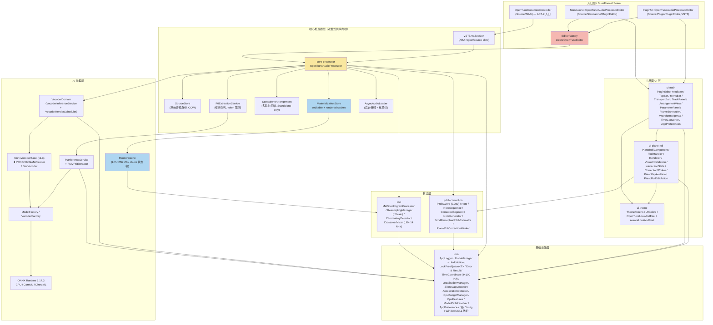
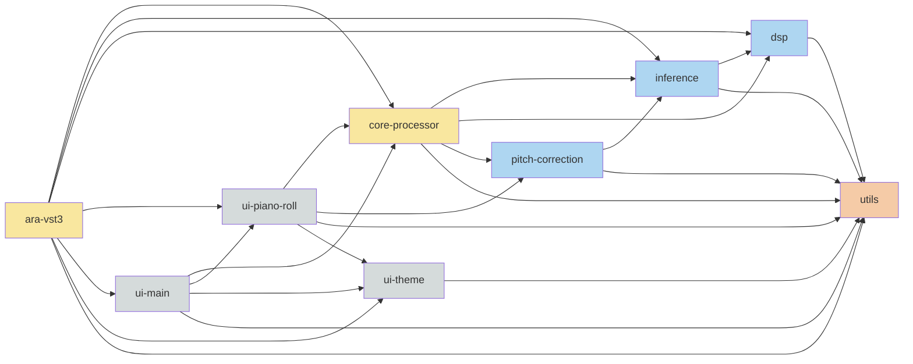
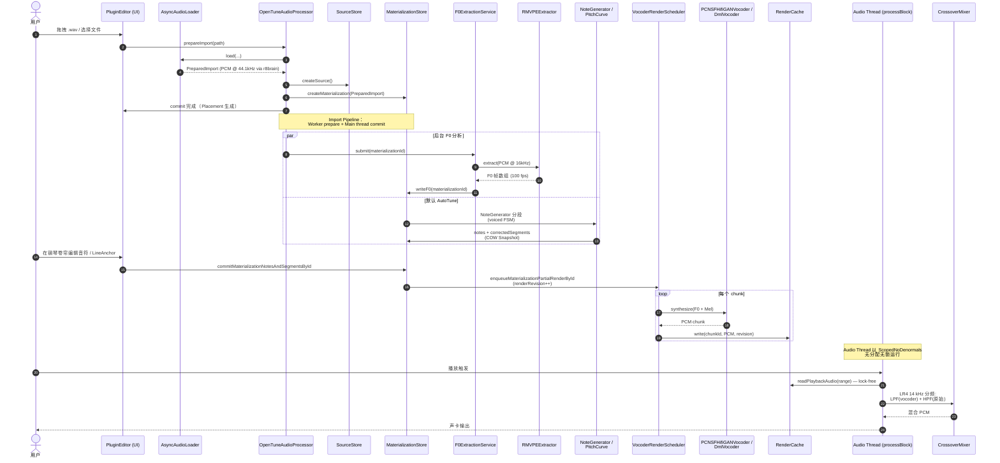

# OpenTune 系统架构

## 架构概述

OpenTune 是一款基于 C++17 + JUCE + ONNX Runtime 的桌面 AI 修音应用。其核心架构具备三大关键特征：

1. **Dual-Format Seam（双格式缝合线）**：同一套 `OpenTuneAudioProcessor` 内核同时驱动 **Standalone 应用** 和 **VST3+ARA 插件** 两种运行形态，通过 `EditorFactory` 将 UI 层分流、通过 `StandaloneArrangement`（Standalone）与 `VST3AraSession + PlaybackRegion`（ARA）分别承载多轨时间轴，但共享 `SourceStore` + `MaterializationStore` + `ResamplingManager` + `RenderCache` 等关键子系统。

2. **Materialization Pipeline（物化渲染管线）**：将"编辑态"（notes / corrected pitch curve / detectedKey）与"已渲染 PCM 缓存"彻底分离 — 用户编辑只更新 `MaterializationStore` 的可编辑载荷（COW Snapshot），后台 worker 基于版本号增量地把 chunk 级别的结果回填进 `RenderCache`，音频线程 `processBlock` 仅做无锁读。

3. **AI 推理双端点（F0 + Vocoder）**：基于 ONNX Runtime 同时加载 **RMVPE**（F0 提取，16 kHz 输入）与 **PC-NSF-HiFiGAN**（声码器，44.1 kHz 输出），通过 `ModelFactory` / `VocoderFactory` 在 **CPU / macOS CoreML / Windows DirectML** 三种后端中选择并热切换（`resetInferenceBackend`）。

## 分层架构图

**分层说明**

| 层 | 主要职责 | 关键模块 |
|---|---|---|
| 入口层 | Dual-Format Seam；由 `EditorFactory` 决定创建哪个 Editor；ARA DocumentController 作为 ARA SDK 入口 | Plugin/、Standalone/、ARA/ |
| 主界面 UI | Mediator 模式的 PluginEditor、钢琴卷帘、主题三大件 | ui-main、ui-piano-roll、ui-theme |
| 核心处理器 | 双格式共享的音频处理器内核；Source/Materialization/Arrangement 三条真值线；Import pipeline；Chunk render 调度；processBlock 实时混音 | core-processor、ara-vst3 |
| 算法层 | F0/notes/segments 修正数学；Mel/重采样/分频/Chroma 调性 | pitch-correction、dsp |
| AI 推理层 | ONNX Runtime 封装的 F0 + 声码器双端点；chunk 渲染调度；LRU 缓存 | inference |
| 基础设施 | 日志、撤销、无锁队列、错误模型、时间坐标、偏好、本地化、GPU 检测、DLL 加载防护等 | utils |

## 模块依赖关系图

从各模块 `cross_module_refs` 字段聚合，去除自环，合并重复边。

**关键依赖特征**

- `utils` 位于最底层，**无入向依赖**，是单向汇聚点（所有模块均依赖它）。
- `core-processor` 作为双格式共享内核，被 `ara-vst3` 与 UI 层同时消费。
- `ara-vst3` 聚合了最多横向依赖（跨 UI + Core + Inference + DSP），因为 DocumentController 承担 ARA↔OpenTune 全套适配。
- `inference` 仅依赖 `dsp` 与 `utils`，不反向调用 `core-processor`（推理服务可独立测试）。

## 关键时序图 — 音频导入到修正播放主链路

覆盖：用户拖拽音频 → 后台解码 → F0 提取 → 自动修正 → 声码器渲染 → 回放混音。

**关键不变式**
- 用户编辑仅写入 `MaterializationStore`，不直接触碰 PCM 缓存。
- `renderRevision` 单调递增，`RenderCache` chunk 状态机据此判断是否需重渲染。
- `processBlock` 内**禁止分配 / 加锁 / 系统调用**；读 snapshot 通过 `std::atomic_load(shared_ptr<const Snapshot>)` 实现。

## 关键技术决策

| 决策点 | 选型 | 原因 / 权衡 |
|---|---|---|
| UI / 应用框架 | **JUCE (C++17)** | 提供 AudioProcessor 抽象、跨平台 DSP/UI/Plugin 封装、内置 VST3 + ARA 接入；相比 Qt，对音频插件生态的一等公民支持。Qt 的 Plugin Host 集成成本高。 |
| AI 推理 | **ONNX Runtime 1.17.3 + 多后端** | CPU 兜底 + macOS CoreML + Windows DirectML。通过 `ModelFactory` / `VocoderFactory` 按平台 + 用户偏好选择后端；`AccelerationDetector` 负责 GPU 枚举与 DML 适配器打分；`resetInferenceBackend(forceCpu)` 允许运行时切换。 |
| F0 / 声码器模型 | **RMVPE（F0, 16 kHz 100fps）+ PC-NSF-HiFiGAN（声码器, 44.1 kHz）** | RMVPE 对嘈杂人声鲁棒；PC-NSF-HiFiGAN 通过 F0 驱动的 Source-Filter 结构保持原始音色，改变音高。 |
| 双格式统一 | **Dual-Format Seam（共享 AudioProcessor）** | Standalone 与 VST3+ARA 共享 `OpenTuneAudioProcessor` + `SourceStore` + `MaterializationStore` + `ResamplingManager`；只在 Editor 工厂、多轨时间轴模型（`StandaloneArrangement` vs ARA Host）处分流。避免双码库维护。 |
| 编辑态 ↔ 渲染态分离 | **Materialization Pipeline** | 用户编辑只改 editable 载荷（notes / correctedSegments / detectedKey），后台按 `renderRevision` 增量生成 PCM 进 `RenderCache`。编辑响应性与渲染吞吐解耦。 |
| 不可变快照 | **COW Snapshot（`shared_ptr<const Snapshot>` + `std::atomic_load/store`）** | 写线程 clone → 改 → publish；读线程 lock-free。`PitchCurve` / `MaterializationSnapshot` / `PlaybackSnapshot` / `PublishedSnapshot` 等均采用此模式。 |
| 重采样 | **r8brain-free-src CDSPResampler24** | 24-bit polyphase；oneshot 模式用于导入一次性转换。导入阶段重采样到内部 `kRenderSampleRate = 44100 Hz`（单一真值）。 |
| 频段混合 | **LR4 4 阶 Linkwitz-Riley 14 kHz 分频** | vocoder 输出低频 + 原始音频高频。LR4 满足 magnitude-flat 叠加，保留空气感，避免声码器高频伪影。 |
| 调性检测 | **Chroma + K-S / Temperley 双 profile + Pearson** | v1.3 替代 ScaleInference（F0 直方图 → 点积）；改为从 PCM → STFT → pitch class 累加 → 双 profile Pearson 集成。鲁棒性更好。 |
| 线程模型 | **Audio / Message / Worker 三角色 + 版本号取消** | Audio Thread 禁锁；Worker 单槽版本号取消（`AsyncCorrectionRequest` / render job）；Message Thread 做 UI/命令调度。跨线程通信用 COW snapshot + `LockFreeQueue<T>` + `std::atomic`。 |
| Chunk 级渲染 | **基于静音段驱动的 chunk 边界 + LRU 缓存 + 版本协议** | `SilentGapDetector` 在静音处切分；`RenderCache` 以 chunk 为粒度状态机（Clean / Dirty / Rendering / Ready），`renderRevision` 决定是否需刷新；LRU 驱逐上限 **256 MB**。 |
| 撤销系统 | **UndoManager + UndoAction 抽象基类（v1.3）** | 单一线性栈取代 12 种具体子类。`PlacementActions`（Split/Merge/Delete/Move/GainChange）与 `PianoRollEditAction` 均为 UndoAction 子类。 |
| 钢琴卷帘渲染 | **Mediator + VisualInvalidation decider + 波形 Mipmap 6 级 LOD** | `PianoRollComponent` 作 Mediator；`PianoRollVisualInvalidation::makeVisualFlushDecision` 纯函数决策脏矩形；`WaveformMipmap` int8 压缩，大波形零抖动。 |
| 帧调度 | **FrameScheduler + VBlank 同步** | Playhead / 动画用 VBlank；主 Timer 30 Hz（visible）/ 10 Hz（隐藏）；节流减少 CPU。 |
| 错误处理 | **不抛异常 + `Result<T>` + `Error` 结构化错误码** | 仅在 ONNX Runtime / JUCE 外部 API 边界 catch；向上传播 Result。音频线程遇到资源不可用 → 降级为干信号旁路。 |
| 偏好存储 | **AppPreferences 双层（Shared + Standalone）+ InterProcessLock + 即时 XML 落盘** | Shared 跨 VST3 与 Standalone；Standalone 仅 Standalone 用。XML 文件 + InterProcessLock 支持多实例并发安全。 |
| 音频文件格式 | **JUCE 注册 + 条件编译 WAV / AIFF / FLAC / Ogg / CoreAudio / MP3 / WMF** | 平台原生解码器按编译期开关注册；导入统一走 `AsyncAudioLoader`。 |
| 配置模型路径 | **ModelPathResolver（bundle / installed / user-override 三级搜索）** | 支持 dev 目录、安装目录与用户覆盖；macOS bundle 与 Windows 安装目录差异被抽象。 |

## 数据流真值线

三条不可变真值线贯穿整个应用：

| 真值线 | 持有者 | 内容 | 生命周期 |
|---|---|---|---|
| **Source 真值** | `SourceStore` | 原始导入音频 PCM（44.1 kHz 重采样后） + Source 身份 | 导入至关闭工程；retire/revive 支持 Undo |
| **Editable 真值** | `MaterializationStore` | notes / correctedSegments / pitchCurve / detectedKey / renderRevision / RenderCache | 随编辑而演化；chunk 级增量 |
| **Placement / Mix 真值** | Standalone：`StandaloneArrangement`；ARA：`VST3AraSession + ARAPlaybackRegion` | 时间轴上的摆放、增益、区域绑定 | 随用户摆放演化；Undo 覆盖 |

三条真值线通过 `PlaybackSnapshot` + `PlaybackReadSource` + `PlaybackReadRequest` 组合后被 `processBlock` 在音频线程消费。

## 相关文档

- `glossary.md` — 全局术语表（含冲突标注）
- `cross-cutting/caching.md` — 缓存与失效策略
- `cross-cutting/error-handling.md` — 错误模型与降级策略
- `cross-cutting/threading.md` — 线程角色与同步原语
- 各模块文档见 `modules/{module}/` — overview / api / data-model / business
