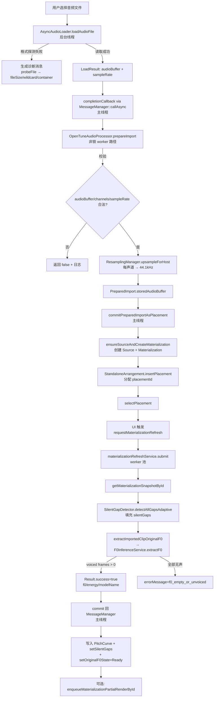
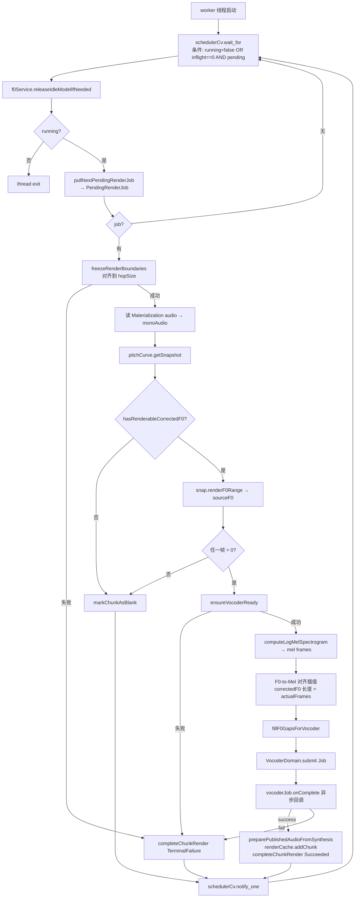
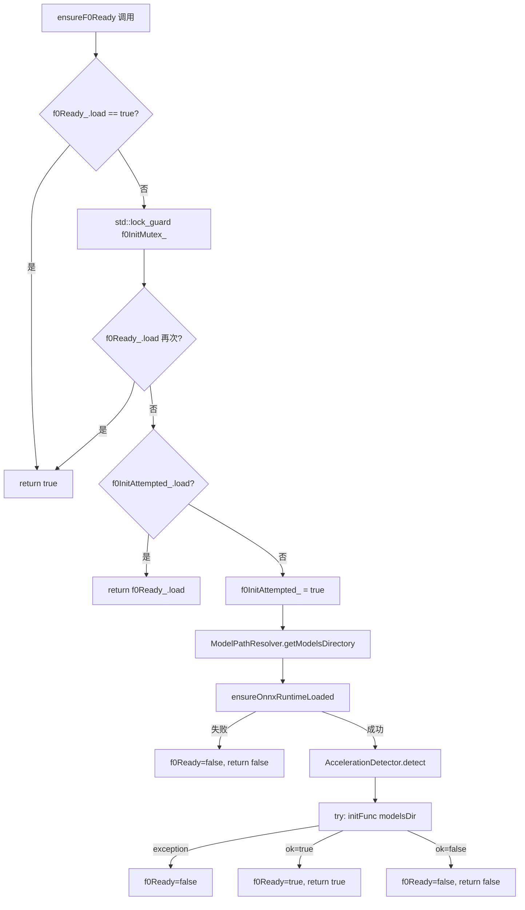
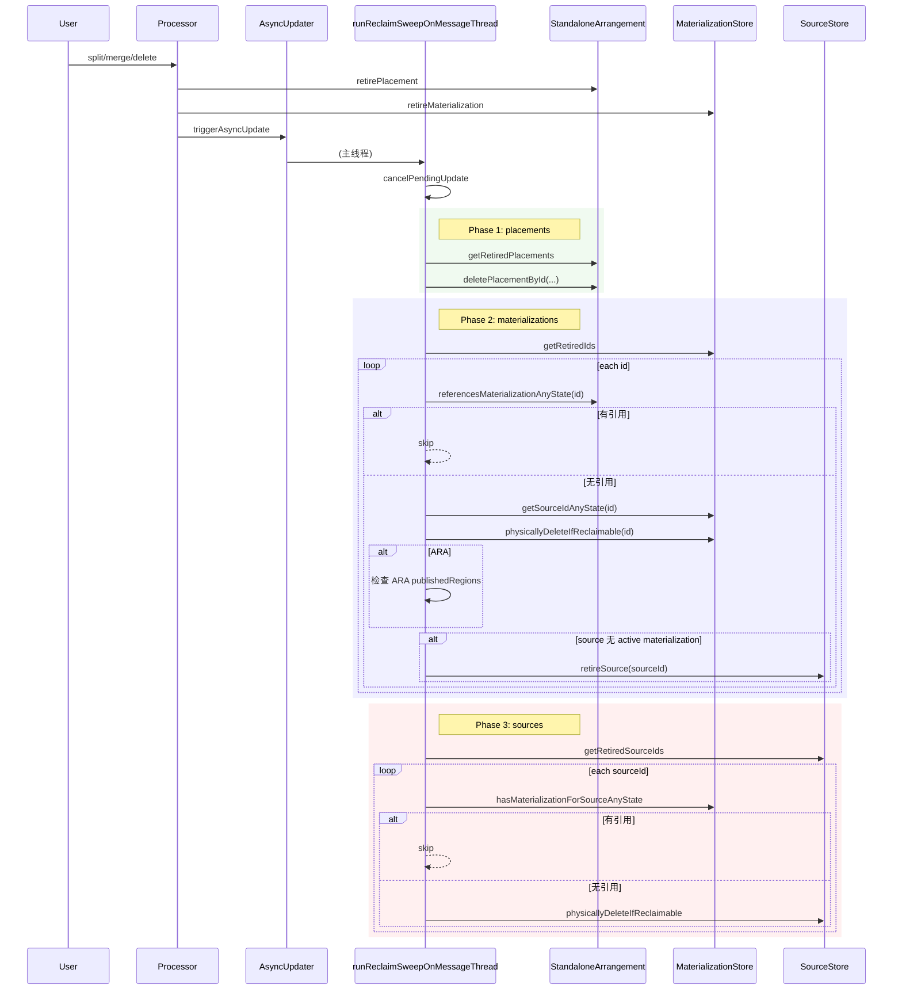
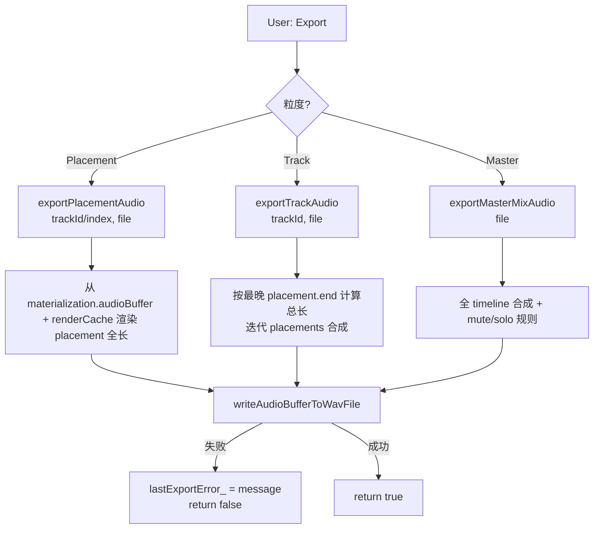

# Core-Processor 模块 — 业务流程与规则

本文档描述核心音频处理器的业务流程、状态机、关键算法和跨模块协作。

---

## 1. 音频导入 → F0 提取 → Materialization 刷新（完整 pipeline）

这是 OpenTune 最核心的业务流程之一，跨越 UI 线程、worker 线程、音频线程三类上下文。



### 关键规则

- **存储采样率统一**：`prepareImport` 把任何输入重采样到 `TimeCoordinate::kRenderSampleRate = 44100`。若输入已经是 44.1k (`|in - target| < 1.0`)，直接 move。
- **silentGaps 延迟计算**：`prepareImport` 中 `silentGaps.clear()`，真正的静音段检测延后到 `requestMaterializationRefresh` 的 worker 线程。
- **请求去重**：`F0ExtractionService::submit` 对同 `requestKey=materializationId` 返回 `AlreadyInProgress`；`requestMaterializationRefresh` 首先 `cancel(materializationId)` 再 submit。
- **Commit 必在主线程**：F0 worker 通过 `juce::MessageManager::callAsync` 封送 commit，避免竞态。
- **Lifetime guard**：`materializationRefreshAliveFlag_` 是 `shared_ptr<atomic<bool>>`，析构设 false；worker 读 false 后跳过。

### 错误码（Result::errorMessage）

| 值 | 触发位置 | 含义 |
|----|----------|------|
| `processor_destroyed` | refresh worker | 进程析构 |
| `content_snapshot_failed` | refresh worker | materialization 已被删除 |
| `clip_snapshot_failed` | extractImportedClipOriginalF0 | audioBuffer == null |
| `invalid_audio_buffer` | 同上 | 0 samples / 0 channels |
| `inference_not_ready` | extractImportedClipOriginalF0 | ensureF0Ready 失败 |
| `f0_empty_or_unvoiced` | 同上 | 无有声帧 |
| `execute_exception` | F0ExtractionService workerLoop | 未知异常 |

---

## 2. processBlock 主链路（实时音频线程）

```mermaid
flowchart TD
    PB[processBlock entry] --> NODEN[ScopedNoDenormals]
    NODEN --> ARA{ARA bound?}
    ARA -- 是 --> HPH[updateHostTransportSnapshot]
    HPH --> APB[processBlockForARA]
    APB --> PKA[PianoKeyAudition.mixIntoBuffer]
    APB --> RET_ARA[return]
    ARA -- 否 --> CLR[buffer.clear 所有通道]
    CLR --> STATE{isPlaying && !fading?}
    STATE -- 全停 --> PK2[PianoKeyAudition.mixIntoBuffer\nRMS=-100dB]
    STATE -- 是 --> LOAD[loadPlaybackSnapshot\nSpinLock 取 shared_ptr]
    LOAD --> LOOP1[遍历 MAX_TRACKS=12]
    LOOP1 --> SOLO{anySoloed?}
    SOLO -- 有 --> SKIP1{!track.isSolo?}
    SOLO -- 无 --> SKIP2{track.isMuted?}
    SKIP1 -- 跳过 --> NEXT_TRACK
    SKIP2 -- 跳过 --> NEXT_TRACK
    SKIP1 -- 否 --> CLR2[trackMixScratch.clear]
    SKIP2 -- 否 --> CLR2
    CLR2 --> LOOP2[遍历 track.placements]
    LOOP2 --> PRS[getPlaybackReadSource by materializationId]
    PRS --> RANGE{placement 与 block 有重叠?}
    RANGE -- 否 --> NEXT_PLACE
    RANGE -- 是 --> RPA[readPlaybackAudio → clipReadScratch]
    RPA --> FADE[per-sample gain + fadeIn/Out]
    FADE --> MIX[加到 trackMixScratch]
    MIX --> NEXT_PLACE[下一个 placement]
    NEXT_PLACE --> LOOP2_END{完?}
    LOOP2_END -- 否 --> LOOP2
    LOOP2_END -- 是 --> RMS[计算 track RMS → setTrackRmsDb]
    RMS --> ADD[加到 output buffer]
    ADD --> NEXT_TRACK[下一个 track]
    NEXT_TRACK --> LOOP1_END{完?}
    LOOP1_END -- 否 --> LOOP1
    LOOP1_END -- 是 --> FOUT{isFadingOut?}
    FOUT -- 是 --> FAPP[apply fade-out gain\n超过 total → isPlaying=false]
    FOUT -- 否 --> SKIP
    FAPP --> PKA2[PianoKeyAudition.mixIntoBuffer]
    SKIP --> PKA2
    PKA2 --> POS[positionAtomic_.store(blockEndSeconds)]
    POS --> END[return]
```

### 关键规则

- **音频线程零分配**：所有 scratch buffer 在 `prepareToPlay` 预分配；`readPlaybackAudio` 内 `thread_local dryScratch` 在首次调用后复用。
- **Solo 优先于 Mute**：若任一 track solo，则只有 solo track 发声，其他全部静音。
- **Fade-out on Stop**：`setPlaying(false)` 触发 200ms fade-out；fade 完成后 `isPlaying_.store(false)`。
- **Host Transport 同步**：ARA/VST3 路径每 processBlock 更新 `hostTransportSnapshot_`（SpinLock），UI 通过 `getHostTransportSnapshot()` 获取。
- **Position 更新**：Standalone 模式下 `positionAtomic_` 每 block 末尾递增；ARA 模式以 host 为准。

### 读取路径（readPlaybackAudio）

```mermaid
flowchart LR
    REQ[PlaybackReadRequest] --> CHK{canRead?}
    CHK -- 否 --> RET0[return 0]
    CHK -- 是 --> DRY[Linear interp 44.1kHz buffer → targetSampleRate\n写 destination 为 dry signal]
    DRY --> RC{renderCache != null?}
    RC -- 否 --> RET_DRY[return availableSamples]
    RC -- 是 --> SAVE{mixer != null?}
    SAVE -- 是 --> COPY[save dry 到 thread_local dryScratch]
    SAVE -- 否 --> SKIP3
    COPY --> OVL
    SKIP3 --> OVL[renderCache.overlayPublishedAudioForRate\n覆盖 destination 为 wet]
    OVL --> MIX2{mixer != null?}
    MIX2 -- 是 --> XM[CrossoverMixer.processSample\nHPF(dry) + LPF(wet)]
    MIX2 -- 否 --> DONE
    XM --> DONE[return availableSamples]
```

---

## 3. Chunk 渲染 Worker（后台 vocoder 调度）



### 关键规则

- **串行 + 惰性启动**：`chunkRenderWorkerThread_` 在首次 `enqueueMaterializationPartialRenderById` 时启动（`ensureChunkRenderWorkerStarted` 用 CAS）；每次有新任务时 `schedulerCv.notify_one()`。
- **Inflight 节流**：条件变量等待 `chunkRenderJobsInFlight_ == 0`，即上一个 vocoder job 必须 onComplete 后才拉下一个，**每时刻至多一个 chunk 在声码器队列**。
- **Chunk 边界对齐**：`MaterializationStore::buildChunkBoundariesFromSilentGaps` 让 chunk 边界落在 hopSize 倍数；中间 chunk 必须整对齐，最后 chunk 通过 `synthSampleCount vs publishSampleCount` 处理 partial。
- **F0 采样率与 vocoder hopSize 不一致**：F0 帧率 = `f0SampleRate / f0HopSize`（RMVPE: 16000/160=100fps）；vocoder hopSize=512 @ 44100Hz → 86fps。手工对齐：对每个 mel 帧时间戳，在 F0 轴上线性插值 + 对数域（`exp(log(f0_0)*(1-t) + log(f0_1)*t)`）避免低频下溢。
- **Vocoder 就绪失败 = 终态**：若 `ensureVocoderReady()=false`，chunk 转 `TerminalFailure`，**不重试**；`resetInferenceBackend` 是唯一恢复路径。
- **空闲时释放模型**：每次 wait 唤醒都调 `f0Service->releaseIdleModelIfNeeded()`，降低长时 idle 的内存占用（⚠️ 具体策略见 inference 模块）。

### Blank Chunk 状态

对应无 F0 的 chunk（全无声区间），`markChunkAsBlank` 避免无意义声码器调用；`processBlock` 读取时只会读到 dry signal（`renderCache.overlayPublishedAudioForRate` 对 blank 区间返回 0 叠加）。

---

## 4. Dual-Format Seam（Standalone vs VST3/ARA）

OpenTune 用同一个 `OpenTuneAudioProcessor` 服务两种宿主格式，**通过构建时宏分流**而非运行时 if。

```mermaid
flowchart TD
    UP[用户：构建 Standalone] --> MAC[CMake: JucePlugin_Build_Standalone=1]
    MAC --> CPP1[Source/Standalone/EditorFactoryStandalone.cpp\n编译进二进制]
    CPP1 --> F1[createOpenTuneEditor →\n new OpenTuneAudioProcessorEditor]

    UP2[用户：构建 VST3/ARA] --> MAC2[CMake: JucePlugin_Build_Standalone=0]
    MAC2 --> CPP2[Source/Editor/EditorFactoryPlugin.cpp\n编译进二进制]
    CPP2 --> F2[createOpenTuneEditor →\n new PluginUI::OpenTuneAudioProcessorEditor]

    PROC[OpenTuneAudioProcessor.createEditor] --> CALL[createOpenTuneEditor(*this)]
    CALL --> LINK{链接时选中的 .cpp}
    LINK --> F1
    LINK --> F2
```

### 关键规则

- **`EditorFactory.h` 只声明工厂函数**，无实现；两个 `.cpp` 用 `#if JucePlugin_Build_Standalone` / `#if !JucePlugin_Build_Standalone` 保证恰一个进入编译。
- **Processor 无分支**：`createEditor()` 直接调 `createOpenTuneEditor(*this)`，不 `#if`。
- **其他 `#if JucePlugin_Enable_ARA` 分支**：处理器内部仍有条件编译（ARA 扩展继承、`processBlockForARA`、`didBindToARA`），但 **editor 创建点已无条件**。
- **ARA 绑定后共享 Store**：`didBindToARA` 从 DocumentController 取得 `sharedSourceStore` / `sharedMaterializationStore` / `sharedResamplingManager`，替换本实例的 shared_ptr。同一 host 中的多个 ARA plugin 实例共享项目数据。

### Transport 行为差异

| 场景 | Standalone | VST3/ARA |
|------|-----------|----------|
| BPM | `bpm_` 成员，默认 120，setBpm 写入 | 从 `hostTransportSnapshot_.bpm` 读 |
| TimeSig | 固定 4/4 | 从 host 同步 |
| Loop | `loopEnabled_` 内部管理 | 由 host 提供 loopPpqStart/End |
| Position | `positionAtomic_` 内部推进 | ARA 路径同步 host `timeSeconds` |

---

## 5. Split / Merge / Delete 流程（基于 retire/revive）

### Split 流程

```mermaid
flowchart TD
    IN[splitPlacementAtSeconds\n trackId, index, splitSeconds] --> CHK[校验 trackId < MAX_TRACKS]
    CHK --> GPL[getPlacementByIndex → originalPlacement]
    GPL --> OFF[splitOffset = splitSeconds - placement.timelineStart]
    OFF --> BOUNDS{offset ∈ [0.1, duration-0.1]?}
    BOUNDS -- 否 --> FAIL
    BOUNDS -- 是 --> GSNAP[getMaterializationSnapshotById]
    GSNAP --> SPLSAM[splitSample = secondsToSamples(offset, 44100)]
    SPLSAM --> SPLSAM_CHK{0 < split < totalSamples?}
    SPLSAM_CHK -- 否 --> FAIL
    SPLSAM_CHK -- 是 --> LEAD[构造 leadingRequest:\nsliceAudioBuffer/slicePitchCurve/sliceNotes/sliceSilentGaps]
    LEAD --> TRAIL[构造 trailingRequest]
    TRAIL --> CML[createMaterialization leading]
    CML --> CMT[createMaterialization trailing]
    CMT --> IP1[insertPlacement(index, leading)]
    IP1 --> IP2[insertPlacement(index+1, trailing)]
    IP2 --> RET_ORIG[retirePlacement original\nretireMaterialization original]
    RET_ORIG --> SEL2[selectPlacement trailing]
    SEL2 --> SWEEP[scheduleReclaimSweep]
    SWEEP --> OUT[返回 SplitOutcome]
```

**校验清单**：
- trackId ∈ [0, 12)
- placementIndex 合法
- splitOffset ∈ [0.1s, duration-0.1s]（保证两段 ≥0.1s）
- splitSample ∈ (0, totalSamples)

**回滚**：任一 createMaterialization / insertPlacement 失败，已创建的对象物理删除（未进入 owner graph 可 hard-delete）。

### Merge 校验清单

- 同一 track
- `|leading.end - trailing.start| ≤ 1/44100` (epsilon)
- 相同 gain (tol=1e-6)、name、colour
- 同 sourceId
- `leading.sourceWindow.end ≈ trailing.sourceWindow.start` (epsilon=0.001s)
- detectedKey 一致（通过 `detectedKeysMatch`）
- 双方 `originalF0State != Extracting`（等待完成）

### Delete 流程

简单：`retirePlacement` + `retireMaterialization` + `scheduleReclaimSweep`。

### Undo/Redo 语义（PlacementActions）

所有 Action 通过 retire/revive 双态切换：
- **SplitAction undo**：retire leading/trailing → revive original
- **SplitAction redo**：retire original → revive leading/trailing
- **MergeAction / DeleteAction** 同理双态
- **MoveAction**：调 `processor.movePlacementToTrack` 传入原/新位置
- **GainChangeAction**：调 `arrangement.setPlacementGain` 传入旧/新值

**不变量**：retire 不破坏数据；物理回收延迟到 `runReclaimSweepOnMessageThread` 三阶段 sweep，此时确认无引用（active+retired placement 均无指向）才 hard-delete。

---

## 6. 推理服务惰性初始化（ensureF0Ready / ensureVocoderReady）



### 关键规则

- **Double-checked locking**：flag atomic + mutex + flag 再检查
- **Latched attemptedFlag**：一旦尝试失败，不会重试（除非 `resetInferenceBackend` 清零）
- **OnDemand 创建**：`initFunc` 首次调用时 `Ort::InitApi()` + 创建 `ortEnv_` + 构造 `F0InferenceService` / `VocoderDomain`
- **resetInferenceBackend** 的反操作顺序：
  1. 停 worker（join）
  2. `vocoderDomain_->shutdown()` + reset
  3. `f0Service_->shutdown()` + reset
  4. 清零 vocoderReady_ / vocoderInitAttempted_ / f0Ready_ / f0InitAttempted_
  5. `AccelerationDetector::reset() + detect(forceCpu)`
  6. worker 不立即重启，下次 `enqueueMaterializationPartialRenderById` 惰性启动

---

## 7. Reclaim Sweep（三阶段 GC）



### 关键规则

- **AsyncUpdater 合并**：多次 `scheduleReclaimSweep` 调用只会触发一次 sweep（JUCE `triggerAsyncUpdate` 合并）
- **sync sweep 可选**：`runReclaimSweepOnMessageThread` 可从测试或显式调用点同步触发（会 `cancelPendingUpdate` 避免重复）
- **ARA 额外引用检查**：Phase 2 中，若 `JucePlugin_Enable_ARA`，检查 DocumentController 的 `publishedRegions` 是否引用 materializationId
- **级联 retire**：Phase 2 物理删 materialization 后，若其 source 无任何 materialization，自动 retire source（由 Phase 3 处理物理回收）

---

## 8. 项目状态序列化（Standalone 专用）

```mermaid
flowchart TD
    SAVE[User: Save Project] --> GSI[getStateInformation]
    GSI --> MAG[写版本魔数 + editVersion]
    MAG --> WS[遍历 active Sources:\n写 sourceId + name + sampleRate + PCM]
    WS --> WM[遍历 active Materializations:\n写 id + sourceId + lineage + sourceWindow + pitchCurve + notes + silentGaps + audioBuffer + detectedKey + originalF0State]
    WM --> WA[遍历 Tracks:\n写 mute/solo/volume/name/colour + placements]
    WA --> WUI[写 UI 状态: zoomLevel/trackHeight/showWaveform/activeTrackId]
    WUI --> MB[juce::MemoryBlock]

    LOAD[User: Open Project] --> SSI[setStateInformation]
    SSI --> CLR[sourceStore_.clear()\nmaterializationStore_.clear()\narrangement_.clear()]
    CLR --> RM[读魔数校验 + editVersion]
    RM --> RS[读 Sources → createSource(forcedSourceId)]
    RS --> RMA[读 Materializations → createMaterialization(forcedId)\n重建 RenderCache]
    RMA --> RA[读 Tracks → insertPlacement(保留原 placementId)]
    RA --> RUI[恢复 UI 状态]
```

⚠️ 具体字节布局（tag / length-prefix / 字段顺序）需查阅 `.cpp` 中 helper 函数。本流程图基于 method 名称推断。

---

## 9. 音频导出（exportPlacementAudio / exportTrackAudio / exportMasterMixAudio）



⚠️ 具体采样率（导出 44.1 vs 48 vs device）与声道配置需查 `writeAudioBufferToWavFile`（定义在 .cpp L2612）。

---

## 10. 边界情况与防御性规则

| 场景 | 规则 |
|------|------|
| 空音频导入 | `prepareImport` 拒绝 0 samples / 0 channels / sampleRate≤0，日志记录 |
| 0 时长 placement | `Placement::isValid() == false`，`readPlaybackAudio` 返回 0 |
| Split 点过近端点 | `splitOffset ∈ [0.1, duration-0.1]` 才允许 |
| Merge 时间差过大 | epsilon=1/44100s |
| Merge sourceWindow 不连续 | 拒绝（`nearlyEqualSeconds` 判 0.001s） |
| Merge 期间 F0 提取中 | 拒绝（`originalF0State == Extracting`） |
| 双 processBlock 覆盖（float/double） | double 版本借 `doublePrecisionScratch_` 转 float 调同名方法 |
| Fade-out 中再次 setPlaying(true) | `isFadingOut_=false`，fadeOutSampleCount_=0，正常 resume |
| ARA 绑定后调 ARA source window 复用 | `findMaterializationBySourceWindow` epsilon=0.001s，复用已有 materialization |
| 采样率切换（prepareToPlay 重调） | `sampleRateChanged` 日志；重建 scratch；调 `prepareAllCrossoverMixers` |
| Chunk 跨 silent gap | `buildChunkBoundariesFromSilentGaps` 在 gap 中心 hop-aligned 位置切分 |
| F0 全无声 chunk | `markChunkAsBlank`，processBlock 读到 dry-only |

---

## ⚠️ 待确认

### 流程歧义

1. **`requestMaterializationRefresh` 与 `enqueueMaterializationPartialRenderById` 的协作**：前者重提 F0，后者触发声码器 chunk 渲染。⚠️ UI 是否在 F0 commit 后自动 enqueue render？还是手动触发？需查 UI 层代码。

2. **`releaseIdleModelIfNeeded` 策略**：`chunkRenderWorkerLoop` 每次 wait 唤醒都调，但具体触发条件（如多久 idle 才释放）未在此次扫描中看到。⚠️ 待查 `F0InferenceService::releaseIdleModelIfNeeded`（inference 模块）。

3. **`prepareToPlay` 中 `sampleRateChanged` 路径**：日志显示要"重建 playback assets"，但代码块只有 `jassert(materializationStore_)`，没看到明确的 rebuild 步骤。⚠️ 可能依赖下游惰性重建（如 RenderCache::addResampledChunk），需查 inference 模块。

### 算法细节

4. **F0-to-Mel 对齐插值的相位一致性**：worker 循环中对每个 mel 帧时间戳做线性插值，但 silentGap 两侧的 F0 帧可能都是 0（无声），插值回退到"取非零方"。⚠️ 若相邻 chunk 共享一个 gap，两边是否会产生相位跳变？待验证声码器输入的连续性。

5. **`writeAudioBufferToWavFile` 的导出采样率**：Track / Placement / Master 导出是否统一到 44.1kHz？还是跟随 device / host？⚠️ 需查 `.cpp` L2612 附近。

### 跨模块接口

6. **`DSP::ResamplingManager::upsampleForHost` 的算法**：`prepareImport` 用 it 重采样；声音质量取决于核心算法（r8brain / 线性 / Sinc）。⚠️ 属于 DSP 模块，需在其文档验证。

7. **ARA DocumentController 的共享 Stores 生命周期**：`didBindToARA` 替换 shared_ptr 后，原 Store 引用计数减为 0 被释放。⚠️ 若 host 短时 unbind → rebind，数据是否丢失？需查 ARA 模块。

### 契约清晰度

8. **`scheduleReclaimSweep` 能否在 audio thread 调用**：内部 `triggerAsyncUpdate` JUCE 文档要求消息线程。⚠️ 当前调用点都在主线程（split/merge/delete），但应明确禁止 audio thread 调用（否则 jassert）。
