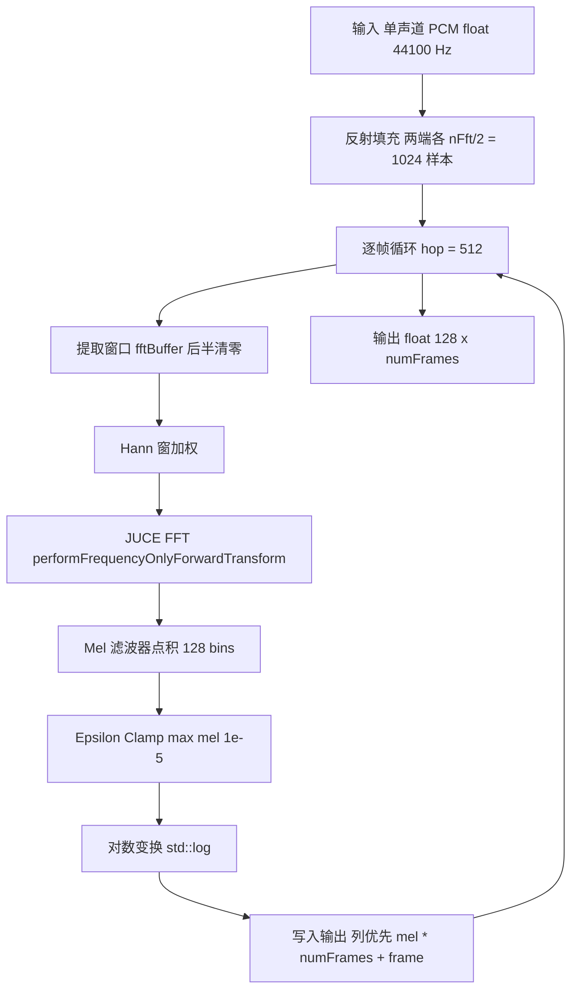
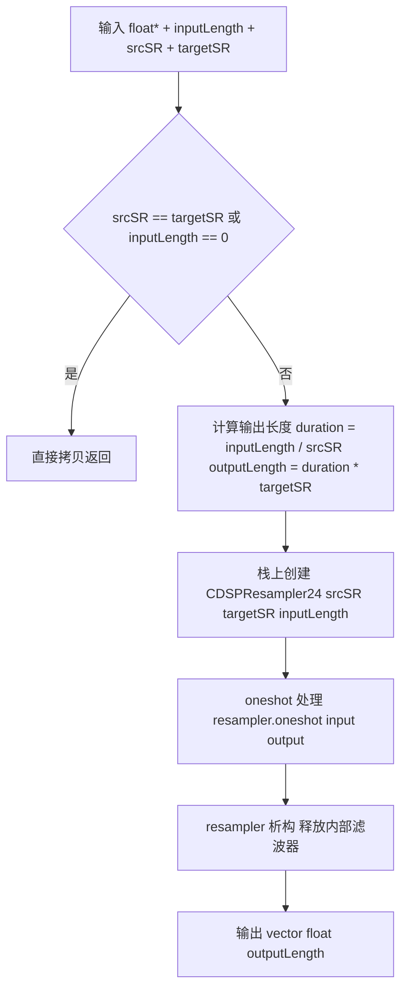
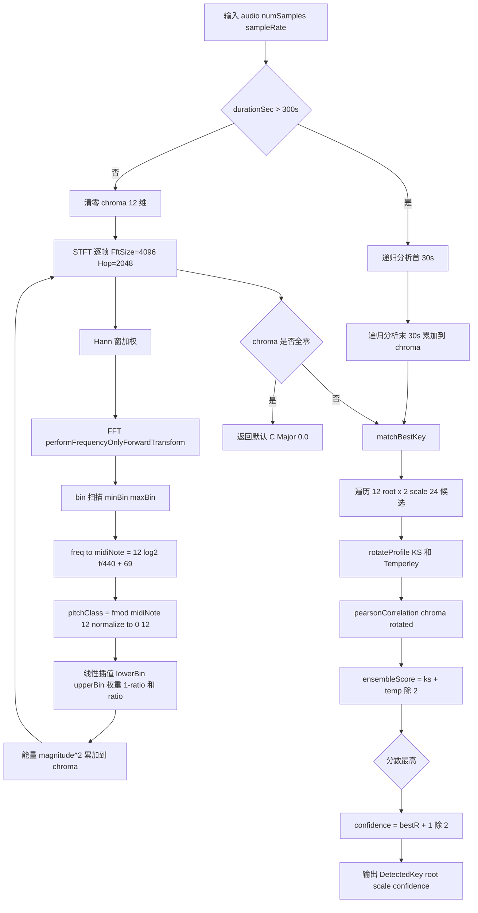
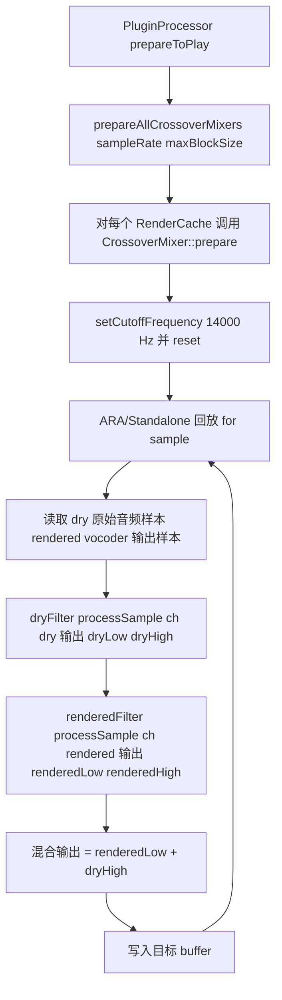

# DSP 模块 — 业务逻辑文档

## 模块定位

DSP 模块是 OpenTune 音频管线的**数字信号处理基础层**，为上层推理与渲染后处理提供四项核心能力：

1. **Mel 对数频谱计算** — 将时域音频转换为 NSF-HiFiGAN vocoder 所需的频谱表示。
2. **音频重采样** — 在不同采样率间高质量转换（44100 ↔ 16000 ↔ 设备采样率）。
3. **Chroma 调性检测** — 从音频 PCM 直接推断乐曲的主音与大/小调，支撑 AutoTune 音阶量化默认值。
4. **LR4 分频混音** — 将 vocoder 低频与原始音频高频通过 4 阶 Linkwitz-Riley 分频合成，保留原始音频高频细节，避免修音后高频"塑料感"。

---

## 核心业务规则

### R1: Mel 频谱参数（硬编码契约）

NSF-HiFiGAN vocoder 训练时使用以下固定参数，这些值贯穿整个渲染链路，**不可随意修改**：

| 参数 | 值 | 约束来源 |
|------|----|----------|
| 采样率 | 44100 Hz | `TimeCoordinate::kRenderSampleRate`，全局统一 |
| FFT 窗口 | 2048 | 必须为 2 的幂 |
| 窗口函数 | Hann | JUCE `WindowingFunction::hann` |
| 窗口长度 | 2048 | 等于 nFft |
| Hop 长度 | 512 | 帧率 = 44100/512 ≈ 86.13 fps |
| Mel bin 数 | 128 | 与 NSF-HiFiGAN 输入张量 `[1, 128, frames]` 对应 |
| 频率范围 | 40 ~ 16000 Hz | fMin=40 覆盖最低人声；fMax=16000 为 Nyquist 安全边界 |
| Log epsilon | 1e-5 | 防止 log(0)：等效于 `log(max(mel, 1e-5))` |
| Mel 刻度 | Slaney 混合（线性 + 对数分段） | hz<1000 线性，hz≥1000 对数 |
| 归一化 | Slaney（`2/(hzR-hzL)`） | 三角滤波器面积归一 |

### R2: 重采样精度规则

- 所有重采样使用 r8brain `CDSPResampler24`（24-bit 精度），质量等级固定。
- **oneshot 模式**：每次创建新 resampler 实例，处理完即销毁，无状态残留。
- **延迟补偿**：oneshot 模式内部自动处理延迟对齐。
- **输出长度精确计算**：`duration(s) = inputLength / srcRate`，`outputLength = round(duration × dstRate)`（通过 `TimeCoordinate` 工具链保证一致）；上限 `INT_MAX`，下限 1。
- **短路条件**：`srcSR == targetSR || inputLength == 0` 直接拷贝输入（无滤波）。

### R3: Chroma 调性检测规则

- **算法**：STFT → 幅度折叠到 12 pitch class → Pearson 相关模板匹配（**双 profile 集成**）。
- **STFT 参数**：`kFftSize = 4096`、`kHopSize = 2048`（50% overlap）、Hann 窗。
- **频率有效范围**：50 Hz ~ 5000 Hz（`kMinFreqHz` / `kMaxFreqHz`），滤除超低频鼓噪与极高泛音。
- **能量加权**：使用 `magnitude²` 作为能量权重，突出强频率成分。
- **Pitch Class 分配**：线性插值到相邻两个半音 bin（保留微分音信息）；参考音 A4 = 440 Hz。
- **长音频截断**：超过 5 分钟（`kMaxAnalysisDurationSec = 300s`）时，**递归**分析首尾各 30 秒累加到同一 chroma 向量，避免整首分析耗时。
- **模板集成**：对 24 个候选（12 root × {Major, Minor}），分别在 K-S 与 Temperley profile 上计算 Pearson r，**取平均**作为集成分数。
- **置信度**：`confidence = jlimit(0, 1, (bestPearsonR + 1) / 2)`，将 [-1, 1] 线性映射到 [0, 1]。
- **未产生枚举**：`Scale::Chromatic`、`HarmonicMinor`、`Dorian`、`Mixolydian`、`PentatonicMajor/Minor` 保留给外部 `ScaleSnapConfig` 使用或未来扩展，检测器**只返回 Major/Minor**。

### R4: LR4 分频混音规则

- **分频频率**：固定 `kCrossoverFrequencyHz = 14000.0f`（超出大部分人声基频和主要共振峰，集中处理空气感/齿音/高频噪声区域）。
- **滤波器阶数**：4 阶 Linkwitz-Riley（24 dB/oct）——两个串联 2 阶 Butterworth。
- **合成公式**：

```
output = LPF(rendered) + HPF(dry)
```

- **幅度平坦不变量**：当 `rendered == dry` 时，`LPF(dry) + HPF(dry) ≈ dry`（LR4 的 magnitude-flat 求和性质），即"无修正段落 = 原始音频"，避免 vocoder 固有的高频失真污染。
- **状态性**：每个 placement 独享一对 `LinkwitzRileyFilter<float>` 实例（存放于 `RenderCache` 中），保证滤波历史连续。

---

## 核心流程

### 流程 1: Mel 对数频谱计算



**数学流程**：

1. **反射填充**：`paddedAudio[i] = audio[reflectIndex(i - pad, numSamples)]`，`pad = nFft/2`。
2. **逐帧**（hop = 512）：
   - 取 `winLength = 2048` 个样本到 `fftBuffer_` 前半（后半零填充）。
   - Hann 窗加权：`window_->multiplyWithWindowingTable(fftBuffer_.data(), winLength)`。
   - `fft_->performFrequencyOnlyForwardTransform(fftBuffer_.data())` → `fftBuffer_[0..nFft/2]` 存放幅度谱。
3. **Mel 滤波器点积**：对每个 mel bin `m`，`melSums[m] = Σ_k fftBuffer_[k] · melFilterbank_[m][k]`。
4. **对数变换**：`output[m·numFrames + frame] = log(max(melSums[m], logEps))`。

### 流程 2: 音频重采样（r8brain）



**使用场景映射**：

| 调用方 | 方法 | src → dst | 用途 |
|--------|------|-----------|------|
| `F0InferenceService` / `F0ExtractionService` | `downsampleForInference` | 44100 → 16000 | RMVPE 输入 |
| `PluginProcessor::readPlaybackAudio` | `upsampleForHost` | 44100 → 设备采样率 | 播放输出 |

### 流程 3: Chroma 调性检测



**算法细节**：

1. **chroma 累加（computeChroma）**：
   - STFT 帧循环 `for frameStart = 0..numSamples - kFftSize step kHopSize`。
   - 对每个 bin `k ∈ [minBin, maxBin]`，幅度 `magnitude = fftBuffer_[k]`（若 ≤ 0 则跳过）。
   - 频率 `freq = k · freqResolution`，进一步 filter `freq ∈ [50, 5000]`。
   - MIDI 换算：`midiNote = 12 · log2(freq / 440) + 69`。
   - `pitchClass = fmod(midiNote, 12)`，若负则 `+ 12`。
   - 线性插值：`lowerBin = floor(pc) mod 12`, `upperBin = (lowerBin+1) mod 12`, `ratio = pc - floor(pc)`。
   - 累加能量权重：`chroma[lowerBin] += (1 - ratio) · magnitude²`，`chroma[upperBin] += ratio · magnitude²`。

2. **matchBestKey 模板匹配**：
   - 对 `root = 0..11` × `scale ∈ {Major, Minor}`：
     - `rotateProfile(kKSMajorProfile, root, ksRotated)` 将 C-based profile 旋转到指定 root。
     - 同样对 `kTemperleyMajorProfile` 得 `tempRotated`。
     - `ksScore = pearsonCorrelation(chroma_, ksRotated)`。
     - `tempScore = pearsonCorrelation(chroma_, tempRotated)`。
     - `ensembleScore = (ksScore + tempScore) / 2`。
     - 记录最高分对应的 `(root, scale)`。
   - `confidence = jlimit(0, 1, (bestScore + 1) / 2)`。

3. **Pearson 相关系数**：

```
           Σ (aᵢ - ā)(bᵢ - b̄)
  r = ─────────────────────────────────
       √( Σ(aᵢ - ā)² · Σ(bᵢ - b̄)² )
```

若分母 < `1e-10` 返回 0.0（避免除零）。

### 流程 4: LR4 分频混音



**数学原理**：

- **LR4 传递函数**：

```
H_LP(s) = [ ω₀² / (s² + √2·ω₀·s + ω₀²) ]²
H_HP(s) = [ s²  / (s² + √2·ω₀·s + ω₀²) ]²
```

其中 `ω₀ = 2π · 14000`。两个二阶 Butterworth 串联得到 4 阶（24 dB/oct）斜率。

- **magnitude-flat 求和**：

```
|H_LP(jω) + H_HP(jω)| ≈ 1   (∀ ω)
```

这使得 `LPF(x) + HPF(x) ≈ x`（幅度恒定，无 comb filtering），因此：

| 场景 | 输出表达式 | 说明 |
|------|-----------|------|
| 未修音（rendered = dry） | `LPF(dry) + HPF(dry) ≈ dry` | 近乎无损透传 |
| 已修音 | `LPF(rendered) + HPF(dry)` | 低频用 vocoder 修正、高频保留原始 |
| 交叉点 `ω = ω₀` | 两路各 −6 dB，合成 0 dB | 相位对齐（LR 特性） |

**为何选 14 kHz**：

- 高于人声基频 + 最高共振峰（F3/F4 通常 ≤ 4 kHz），避免修音痕迹；
- 覆盖齿音（sibilance, 6-8 kHz）修正效果；
- 保留 14 kHz 以上的"空气感"（原始麦克风捕获的环境高频、呼吸细节），避免 vocoder 重建的塑料感。

---

## 关键方法说明

### MelSpectrogramProcessor::compute()

**文件**: `Source/DSP/MelSpectrogram.cpp:156`

1. **反射填充**（`reflectIndex`）：镜像边界策略，等效 `numpy.pad(mode='reflect')`，避免边界截断伪影。
2. **FFT**：`juce::dsp::FFT::performFrequencyOnlyForwardTransform` 原位转换，直接输出幅度谱（非功率谱）到 `fftBuffer_` 前半。
3. **Mel 点积**：内联 `dotProduct` 循环（`float sum += a[i]·b[i]`），每帧 128 次 1025 维点积。
4. **对数变换**：先 epsilon clamp 再 `std::log`。
5. **输出布局**：`output[m * numFrames + f]` 列优先，与 ONNX 张量 `[1, 128, frames]` 布局一致。

### ChromaKeyDetector::detect()

**文件**: `Source/DSP/ChromaKeyDetector.cpp:73`

单入口：清零 `chroma_` → `computeChroma` → `matchBestKey`。无异常，输入非法返回默认 `DetectedKey{}`。长音频递归处理（见流程 3）。

### ChromaKeyDetector::matchBestKey()

**文件**: `Source/DSP/ChromaKeyDetector.cpp:154`

双 profile 集成 Pearson。当 chroma 全零（静音/无有效频率内容）返回默认结果而不强行匹配。

### CrossoverMixer::processSample()

**文件**: `Source/DSP/CrossoverMixer.cpp:21`

对 dry 与 rendered 各做一次 LR4 分频（`dryFilter_.processSample(ch, dry, dryLow, dryHigh)`、`renderedFilter_.processSample(ch, rendered, renderedLow, renderedHigh)`），返回 `renderedLow + dryHigh`。`renderedLow` 与 `dryHigh` 以外的两路（`dryLow`、`renderedHigh`）被丢弃。

### ResamplingManager::resample()

**文件**: `Source/DSP/ResamplingManager.cpp:42`

- 短路：`inputSR == targetSR || inputLength == 0` 拷贝返回。
- 构造 `r8b::CDSPResampler24(srcSR, dstSR, inputLength)`（含重采样系数计算）。
- `outputLength` 通过 `TimeCoordinate::samplesToSeconds` + `secondsToSamples` 计算，保证与渲染链其他模块长度一致。
- 调用 `resampler.oneshot(input, inputLength, output.data(), outputLength)` 一次性完成。

---

## 线程模型

| 组件 | 典型运行线程 | 并发安全机制 |
|------|--------------|--------------|
| `MelSpectrogramProcessor` | chunk 渲染 worker、推理 worker | **每线程独立实例**；自由函数 `computeLogMelSpectrogram` 使用 `thread_local` |
| `ChromaKeyDetector` | F0 提取回调（素材首次 Materialization） | **非线程安全**，每调用点构造临时实例（`PluginProcessor.cpp:3239`） |
| `ResamplingManager` | 调用者线程（多个 worker） | oneshot 无状态；`JUCE_DECLARE_NON_COPYABLE` 禁止共享 |
| `CrossoverMixer` | ARA 回放渲染线程、Standalone 回放渲染线程、导出 worker | **有状态**（滤波器延迟线），每 placement 独享一个实例；同一 placement 不应跨线程并发调用 |

---

## 与上下游的关系

```
┌────────────────────────────────────────────────────────────────┐
│ 上游                                                           │
│  clip.audioBuffer (44100 Hz)  ← PluginProcessor / Import       │
│  vocoder rendered PCM         ← Inference (RenderingManager)   │
│  F0 array (100 fps)           ← F0InferenceService/RMVPE       │
└───────┬──────────────┬──────────────┬──────────────┬───────────┘
        ▼              ▼              ▼              ▼
   ┌─────────┐  ┌────────────┐  ┌─────────────┐  ┌──────────┐
   │  Mel    │  │ Resampling │  │ ChromaKey   │  │ Crossover│
   │ Spect.  │  │  Manager   │  │  Detector   │  │  Mixer   │
   └────┬────┘  └──────┬─────┘  └──────┬──────┘  └─────┬────┘
        ▼              ▼               ▼               ▼
┌────────────────────────────────────────────────────────────────┐
│ 下游                                                           │
│  ChunkInputs.mel → NSF-HiFiGAN vocoder                         │
│  Resampled PCM   → 播放缓冲 / RMVPE 输入                       │
│  DetectedKey     → MaterializationStore → ScaleSnapConfig 默认 │
│  LR4 mix output  → AudioBuffer writeSlice (播放/导出)          │
└────────────────────────────────────────────────────────────────┘
```

---

## ⚠️ 待确认

### 业务规则

1. **分频频率 14 kHz 是否可配置** — 对不同素材（童声、男低音、电吉他）是否需要按需调整？当前硬编码 `kCrossoverFrequencyHz = 14000.0f`。
2. **Chroma 长音频截断（300s / 30s）参数依据** — 300 秒阈值与首尾各 30 秒是经验值还是实测最优？中段过长素材是否丢失结构化信息（过门、间奏调性）？
3. **NSF-HiFiGAN 训练时 Mel 归一化** — 本模块使用 Slaney 归一化 + `log`（非 `log10 · 20`）；训练侧是否一致？不匹配将导致整体谱偏移。

### 算法原理

4. **Pearson r 对绝对值不敏感的影响** — 短音频 / 静音段 chroma 量级极小，Pearson 仍可能给出高相关分数（与尺度无关）；是否应额外引入能量阈值门控？
5. **双 profile 平均权重** — 当前 `(K-S + Temperley) / 2` 等权；是否有音乐风格依赖的最优权重？
6. **LR4 相位特性** — LR4 在交叉点有 360° 累计相移，跨置换 dry/rendered 位置后可能产生不对称响应；当前 `dryFilter_` 与 `renderedFilter_` 参数完全相同，理论上对称。
7. **反射填充 vs 零填充** — Mel 使用反射填充匹配 librosa 默认；与 NSF-HiFiGAN 训练是否一致？

### 错误处理

8. **`ChromaKeyDetector` 的静默失败** — 输入无效返回默认 `{C, Major, 0}` 且无日志；是否应在 `numSamples <= 0` 时通过 `AppLogger` 打警告便于排查？
9. **`ResamplingManager` 无错误反馈** — `r8brain` 失败（OOM、参数异常）时行为未验证；是否需要增加 `Result<std::vector<float>>` 返回？
10. **`CrossoverMixer` 未初始化的处理** — 若 `prepare` 前就调用 `processSample`（构造函数已调用 `prepare(44100, 512, 2)`，但 `prepareToPlay` 失败时滤波器状态可能异常），是否有保底？

### 性能

11. **Mel 点积循环未显式 SIMD** — 当前用内联 `float sum += a[i]·b[i]`，依赖编译器自动向量化；在 `-O3` 下是否已充分矢量化？是否应替换为 `juce::FloatVectorOperations::innerProduct`？
12. **`CrossoverMixer::processSample` 逐样本调用** — 相比 JUCE 块级 `process(ProcessContext)` 开销大；chunk 渲染主循环若每样本调用，是否可改为块级 API？
