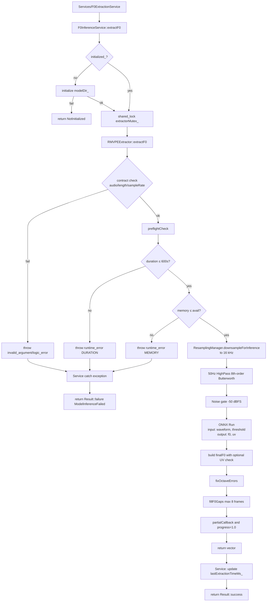
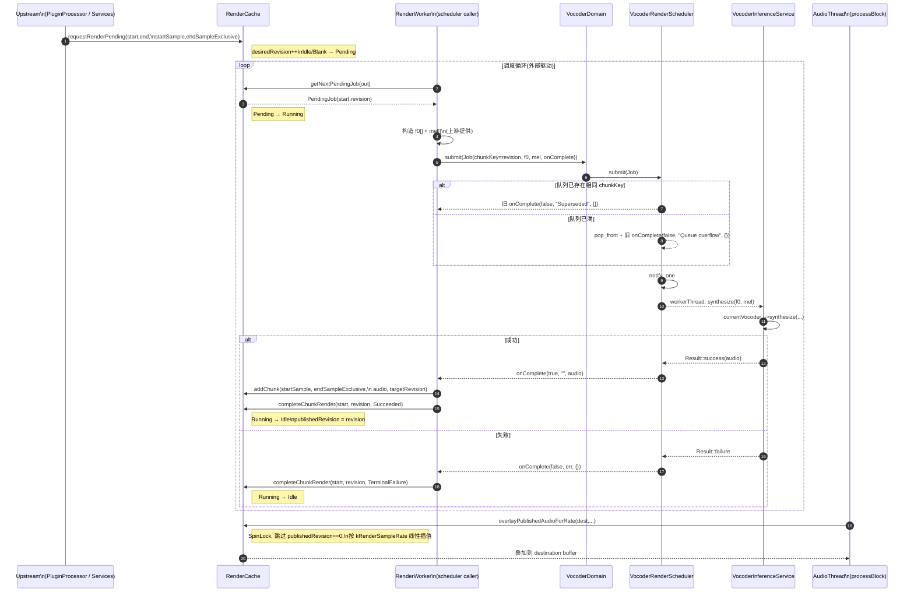

# Inference 模块业务流程

记录 Inference 模块中 F0 提取、声码器推理、渲染调度与缓存的完整业务管线。本文档配合 `api.md`（签名）和 `data-model.md`（数据结构）阅读。

---

## 1. F0 提取流程

### 1.1 触发路径

上层调用 `F0InferenceService::extractF0(audio, length, sampleRate, ...)`，通常由 `Services/F0ExtractionService`（异步任务）或单测直接驱动。服务层对并发读取友好（`shared_mutex`），允许多个 worker 线程同时提取不同音频。

### 1.2 完整调用链（Mermaid）



### 1.3 关键业务规则

**Fail-fast 预检**

- **时长闸门**：> 600 s 拒绝。避免长时间音频导致 ORT 张量超过可寻址内存，同时遏制 UI 端看似无响应的情况。
- **内存预算**：估算公式 `inputBytes + outputBytes + inputBytes * 6.0 + 350 MB`；可用内存 = `系统可用物理内存 - 512 MB`。VST3 构建减去 350 MB 模型常驻量，避免被宿主已加载的模型重复扣减导致误杀。
- **Session 可用性**：推理前最后一步校验，避免进入 ONNX Run 才报错。

**预处理**（CPU 上同步执行，不在 ORT 中完成）

- r8brain 高质量重采样到 16 kHz（`ResamplingManager::downsampleForInference`）
- 50 Hz 8 阶 Butterworth 高通（4 个级联 biquad）— 去除低频噪声与风声
- −50 dBFS 噪声门 — 静音帧强制归零，提升 RMVPE 在低信噪比段的 voiced 判定

**单次全量推理**

不分块、不拼接。整个 16 kHz 波形一次性送入模型，由模型自身决定 `num_frames`。该策略避免了分块边界处的 F0 不连续问题。

**后处理**

- `fixOctaveErrors`：检测连续浊音段内的 "突然减半"（比值 ∈ (0.45, 0.55)）并复原。RMVPE 在基频附近存在少量倍频误识别，这是常见人声检测错误模式。
- `fillF0Gaps`：相邻浊音段之间的空隙若 ≤ 8 帧（≈80 ms），用 log₂(F0) 线性插值填补。超过阈值则保留 unvoiced，避免强行连接不相关的音高段。

**后端选择**

- macOS：CoreML（MLProgram + CPUAndGPU），失败回退 CPU
- Windows / Linux：CPU
- F0 提取**不使用 DirectML**，理由是 F0 为低频后台操作，CPU/CoreML 已足够，降低 GPU 抢占风险

**空闲卸载**

`F0InferenceService::releaseIdleModelIfNeeded()` 由外部（推测是定时器或主循环）定期调用，若距离上次提取 ≥ 30 s 则 `shutdown()`，释放 361 MB 模型内存。下次 `extractF0` 会再次 `initialize`。

---

## 2. 声码器推理 + 渲染调度管线

### 2.1 业务目标

在用户编辑 MIDI/音高后，将对应时间段渲染为 44.1 kHz 音频并写入 `RenderCache`，保证：

1. **非阻塞播放**：`processBlock` 读取缓存时不被推理阻塞
2. **版本正确性**：用户快速编辑产生多次 revision，最终播放的是最新 revision 对应的结果
3. **资源可控**：DML session 串行使用；队列深度受限；总缓存内存有上限

### 2.2 完整调用链（Mermaid）



### 2.3 关键业务规则

**DML session 串行约束**

DirectML session 不支持并发 Run。`VocoderRenderScheduler` 用单 worker 线程 + 队列强制串行：`condition_variable::wait` 保证零忙等；queueMutex 仅覆盖入/出队的短临界区，ORT Run 在无锁区执行。

**同 chunkKey 替换 (supersede)**

若同一 chunk 的新请求进入队列，旧请求直接被替换；旧 `onComplete(false, "Superseded by newer revision", {})` 在锁外回调，避免用户快速编辑时堆积陈旧任务。

**队列上限 50**

防止异常情况下队列无限增长。超过时丢弃队首（最老的 job），而非新来的 job，确保最新编辑最快得到响应。

**后端选择与回退链**（`VocoderFactory::create`）

```
_WIN32
  ├─ AccelerationDetector 选中 DirectML
  │   ├─ 成功 → DmlVocoder (DML backend)
  │   └─ 失败 → overrideBackend(CPU) → 进入 CPU 分支
  └─ 未选中 DirectML → 进入 CPU 分支

__APPLE__
  └─ CoreML (MLProgram + CPUAndGPU)
      └─ 失败 → CPU 分支

其他平台 / CPU 分支
  └─ PCNSFHifiGANVocoder (CPU)
```

**DML 初始化诊断**

`DmlInitDiagnostic` 结构记录 `stage`、`hr`（HRESULT 的十六进制）、`detail`（ORT 错误码+消息）、`remediation`（运维建议）。所有诊断信息经 `AppLogger` 输出，用于运维分析 "为什么 GPU 模式初始化失败了"。

**IoBinding + 输出预分配**（DML only）

DML 后端的输出固定长度 `num_frames * 512`。首次推理时分配，后续同长度直接复用；长度变化才重新分配。避免每次推理重建 tensor 的开销。`SynchronizeOutputs()` 显式等待 GPU 完成，再返回 CPU 侧的 `outputBuffer_`。

---

## 3. RenderCache 状态机业务语义

### 3.1 状态语义

| 状态 | 含义 | 可观察副作用 |
|------|------|-------------|
| `Idle` | 无待处理需求；可能持有已发布音频（`publishedRevision > 0`） | overlay 路径可正常读取 |
| `Pending` | 有待渲染需求，等待 worker | 存在于 `pendingChunks_`；overlay 继续使用旧 published audio（如果有） |
| `Running` | 已被 worker 拾取，推理中 | 不在 `pendingChunks_`；overlay 仍读旧版本 |
| `Blank` | 无有效 F0，标记空白 | `audio.clear()`、`publishedRevision = 0`；overlay 跳过 |

### 3.2 版本协议（双 revision）

```
desiredRevision       publishedRevision    含义
-------------------------------------------------------------
0                     0                    全新 Chunk
≥1                    0                    已请求渲染但从未成功
≥1                    == desiredRevision   最新结果已发布
≥1                    < desiredRevision    旧结果可供 overlay，但已陈旧
```

**业务规则**

- `addChunk` 要求 `targetRevision == desiredRevision`，否则拒收。worker 从 `getNextPendingJob` 拿到 `targetRevision` 后，推理期间若 `requestRenderPending` 再次被调用，`desiredRevision` 递增；本次渲染完成时 revision 已陈旧，被拒收。
- `completeChunkRender(Succeeded)` 若 `revision != desiredRevision`，状态从 Running 回到 Pending，重新等待调度。此机制确保最终收敛到最新 revision。
- `completeChunkRender(TerminalFailure)`：本 revision 终态失败，**不重试**。Running → Idle。等待下一次 `requestRenderPending` 产生新 revision 才重新尝试（例如用户再次编辑）。

### 3.3 并发模型

| 路径 | 线程 | 锁 |
|------|-----|----|
| 编辑事件 → `requestRenderPending` | 消息线程 / 后台线程 | `SpinLock` |
| 调度循环 → `getNextPendingJob` / `completeChunkRender` | Worker 线程 | `SpinLock` |
| 推理结果写入 → `addChunk` | Worker 线程（调度 worker 的 onComplete） | `SpinLock` |
| 音频播放 → `overlayPublishedAudioForRate` | Audio 线程（实时） | `SpinLock`（Scoped，短临界区） |
| 渲染统计 → `getChunkStats` / `getStateSnapshot` | UI 线程 | `SpinLock` |

使用 `juce::SpinLock` 的考量：临界区极短（map 查找、几个字段写入）、读多写少、避免在 audio callback 中等待 mutex 被内核挂起。

---

## 4. LRU 驱逐与内存上限

### 4.1 全局字节统计

所有 `RenderCache` 实例共享：

```cpp
static std::atomic<size_t>& globalCacheLimitBytes();   // 默认 256 MB
static std::atomic<size_t>& globalCacheCurrentBytes(); // 写入减去驱逐后的净值
static std::atomic<size_t>& globalCachePeakBytes();    // 运行期最大值
```

### 4.2 驱逐触发点

仅在 `addChunk` 成功写入后：

```
if (newCurrent > limit && !chunks_.empty())
    for chunk in chunks_ (升序 by startSeconds):
        if (&chunk == currentChunk) continue     // 不删自己
        if (chunk.audio.empty())    continue     // 无可释放空间
        释放 chunk.audio
        chunk.publishedRevision = 0
        break   // 单次驱逐一个
```

### 4.3 业务含义与局限

- **近似时序驱逐**：由于 `chunks_` 按 `startSeconds` 升序遍历，最早时段的 chunk 最先被清空。适用于"用户从前往后编辑、回放以时间递增为主"的交互模式。
- **单步驱逐**：每次 addChunk 只释放一个 chunk。若新写入 chunk 极大（例如非常长的音频段），一次驱逐可能不足以将占用压到 limit 以下，下次 addChunk 会继续驱逐。
- **仅清空音频，保留状态**：被驱逐的 chunk 仍在 `chunks_` 中，状态保留，但 `publishedRevision = 0` 意味着不会被 overlay 使用，也不会贡献 `hasPublishedAudio`。若上层再次 `requestRenderPending` 该区段，状态流仍按常规路径推进。
- **线程安全**：驱逐在 SpinLock 保护下完成，不会与 overlay 读取路径发生数据竞争。

---

## 5. 跨模块协作约定

| 协作方 | 契约 |
|-------|------|
| `DSP/ResamplingManager` | F0 路径的唯一重采样入口；RMVPEExtractor 构造时注入 |
| `DSP/MelSpectrogram` | 上游负责产出正确 bins 的 mel；声码器不做 mel 计算 |
| `DSP/CrossoverMixer` | RenderCache 持有；`prepareCrossoverMixer` 在播放前配置；mixer 由播放端读取 |
| `Utils/AccelerationDetector` | 决定 Windows 下是否启用 DML；可通过 `overrideBackend(CPU)` 强制回退 |
| `Utils/CpuBudgetManager` | F0 session 线程预算来源；根据 `gpuMode` 计算 intra/inter |
| `Utils/Error::Result<T>` | F0 与声码器 Service 层统一返回；工厂层则用 `Result<unique_ptr<...>>` |
| `Utils/TimeCoordinate` | RenderCache 的秒 ↔ sample 转换唯一来源；`kRenderSampleRate` 为权威内部采样率 |

---

## ⚠️ 待确认

### 业务规则类

1. **F0 倍频修正的覆盖率**：当前仅检测 `curr/prev ∈ (0.45, 0.55)` 的"突然减半"一种模式，不处理"突然翻倍"（`curr/prev ∈ (1.8, 2.2)`）。是否业务上有意限定为单向修正（RMVPE 更容易将高八度识别到基频上）？
2. **`completeChunkRender(TerminalFailure)` 的业务期望**：文档描述"当前 revision 不可渲染、不重试"，但若原因是暂时性（如显卡驱动故障）而非内容本身，是否需要上层触发重试策略？现阶段没有看到相关重试代码。
3. **`markChunkAsBlank` 的触发源**：代码中有该 API 但未见调用。需确认业务上由哪一方（上游 pitch 决策？worker 在拿到空 f0 后？）标记空白 chunk，以及 Blank → Pending 在 `requestRenderPending` 时是否总是正确的语义。

### 数据模型类

4. **`mel` 维度布局与 `melNeedsTranspose_` 的业务含义**：基类检测 shape 为 `[*, *, 128]` 时认为 mel 需要转置。这意味着模型期待 `[batch, frames, bins]`，而内部缓冲按 `[bins, frames]` 排布。该约定是否写入 mel 生成侧的 spec（DSP/MelSpectrogram）？
5. **RMVPE F0 结果中 unvoiced 的编码**：`enableUvCheck_ == false` 时直接使用模型 f0 输出，unvoiced 帧 F0 是否已为 0？若模型输出所有帧的 f0 估计（不区分 uv），则关闭 uv 检查等同于禁用 unvoiced 检测，与业务期望可能冲突。

### 流程类

6. **VocoderDomain 的职责边界**：当前仅作为 Service + Scheduler 的生命周期聚合，`submit` 透传。是否预期未来加入批处理、优先级调度等逻辑，以避免直接在 Scheduler 层膨胀？
7. **`requestRenderPending` → `getNextPendingJob` 之间的调度驱动方**：代码层面没有 Inference 模块内部的循环调用两者。推测有外部 RenderWorker 在 PluginProcessor 或 Services 中。需要在 synthesis 阶段确认该 worker 的线程模型与触发频率。

### 跨模块类

8. **`AccelerationDetector::overrideBackend` 的副作用**：VocoderFactory 失败时调用 `overrideBackend(CPU)`，影响整个进程的后端选择。其他模块（如 F0 路径）是否也读取该选择？若是，DML 失败会意外降级 F0 的后端决策。
9. **`RenderCache` 全局 256 MB 上限**：对于长项目（数分钟音频 × 采样率）可能很快填满。需要确认上层是否有机制预估所需缓存、提前清理，或接受"滑动驱逐 + 反复重渲染"的代价。
