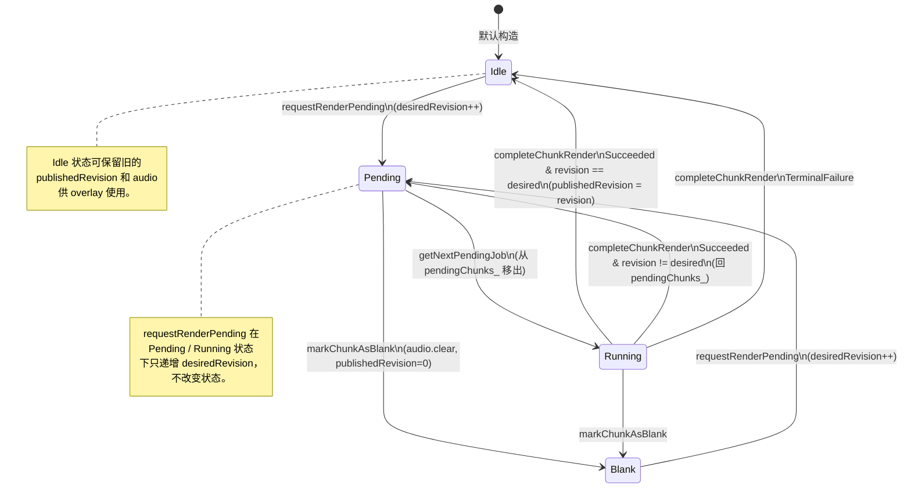

# Inference 模块数据模型

记录模块内所有关键内存结构、ONNX 模型的输入输出 schema，以及 RenderCache 的 Chunk 状态机。

---

## 1. F0 模型元数据

### 1.1 `F0ModelType`（`IF0Extractor.h`）

```cpp
enum class F0ModelType {
    RMVPE = 0    // Robust Multi-scale Vocal Pitch Estimator (361MB)
};
```

**说明**：当前仅支持 RMVPE；`ModelFactory::getModelPath` 将枚举映射到 `"<modelDir>/rmvpe.onnx"`。

### 1.2 `F0ModelInfo`（`IF0Extractor.h`）

```cpp
struct F0ModelInfo {
    F0ModelType type;
    std::string name;            // 小写 ID，如 "rmvpe"
    std::string displayName;     // 用户可见，如 "RMVPE (Robust)"
    size_t      modelSizeBytes;  // 361 * 1024 * 1024
    bool        isAvailable;     // 文件存在性
};
```

### 1.3 `RMVPEExtractor::PreflightResult`

```cpp
struct PreflightResult {
    bool        success = false;
    std::string errorMessage;
    std::string errorCategory;      // "MEMORY" | "DURATION" | "MODEL" | "SYSTEM"
    size_t      estimatedMemoryMB = 0;
    size_t      availableMemoryMB = 0;
    double      audioDurationSec = 0.0;
};
```

| 字段 | 填写时机 |
|------|----------|
| `success` | 三项检查（duration / memory / session）全部通过 |
| `errorCategory` | `"DURATION"` 时长闸门 / `"MEMORY"` 内存不足 / `"SYSTEM"` 参数非法 / `"MODEL"` session 未初始化（部分路径不填 category） |
| `estimatedMemoryMB` | `inputBytes + outputBytes + inputBytes * 6.0 + 350 MB` 的合计值 |
| `availableMemoryMB` | `getAvailableSystemMemoryMB() - 512 MB`（小于 0 计为 0） |
| `audioDurationSec` | 按入参 `sampleRate` 计算的音频秒数 |

---

## 2. 声码器推理缓冲

### 2.1 `VocoderScratchBuffers`（`OnnxVocoderBase.h`，v1.3 新增）

```cpp
struct VocoderScratchBuffers {
    std::vector<float>              melOwned;          // mel 为 nullptr 时生成的全零占位
    std::vector<float>              uvData;            // uv[i] = (f0[i] > 0 ? 1.0f : 0.0f)
    std::vector<float>              melTransposed;    // melNeedsTranspose_ 时的行列互换缓冲
    std::vector<const char*>        inputNamesC;      // 传给 ORT 的 C 字符串指针数组
    std::vector<Ort::Value>         inputTensors;     // 输入 tensor 列表（顺序任意）
    std::vector<std::string>        inputNameStorage; // inputNamesC 的底层存储（确保生命周期）
    std::vector<std::vector<float>>   extraFloatBuffers; // 未识别输入的零填充浮点缓冲
    std::vector<std::vector<int64_t>> extraInt64Buffers; // 未识别输入的零填充 int64 缓冲

    void resetForRun(size_t frameCount, size_t inputCount);
};
```

**生命周期**：`OnnxVocoderBase::synthesize` 使用 `thread_local` 实例，每次推理先调用 `resetForRun(frameCount, inputCount)` 清空容器（保留容量）。

**大小约束**

| 缓冲 | 容量目标 | 备注 |
|------|---------|------|
| `uvData` | `frameCount` | 每帧一字节语义（0/1 的 float） |
| `melOwned` / `melTransposed` | `melBinsHint_ * frameCount` | 每个浮点 4 字节 |
| `inputTensors` / `inputNamesC` / `inputNameStorage` | `inputCount` | 与模型输入数相同 |

### 2.2 `VocoderBackend` / `VocoderCreationResult`（`VocoderFactory.h`）

```cpp
enum class VocoderBackend { CPU, DML, CoreML };

struct VocoderCreationResult {
    std::unique_ptr<VocoderInterface> vocoder;     // 成功时非空
    VocoderBackend                    backend;     // 实际选择的后端
    std::string                       errorMessage;// 失败时非空
};
```

`backend` 即便在 `failure()` 构造时仍被赋值为调用方建议的回退目标（通常 `VocoderBackend::CPU`）。

---

## 3. 调度器与领域聚合

### 3.1 `VocoderRenderScheduler::Job` / `VocoderDomain::Job`

两者字段完全对齐（Domain 仅做透传）：

```cpp
struct Job {
    uint64_t                                                                       chunkKey{0};
    std::vector<float>                                                             f0;
    std::vector<float>                                                             mel;     // 展平后的 [melBins * numFrames]
    std::function<void(bool ok, const juce::String& err,
                       const std::vector<float>& audio)>                           onComplete;
};
```

**字段语义**

| 字段 | 说明 |
|------|------|
| `chunkKey` | 用于 supersede 匹配的唯一键；0 表示不参与替换（总是入队） |
| `f0` | 长度决定 num_frames；unvoiced 位置为 0 |
| `mel` | 可为空（此时 OnnxVocoderBase 构造零 mel）；否则必须精确等于 `melBins * numFrames` |
| `onComplete` | 必须保证线程安全（可能在 worker 线程、shutdown 线程、submit 线程执行） |

### 3.2 Scheduler 内部队列

```cpp
std::deque<Job>              jobQueue_;
mutable std::mutex           queueMutex_;
std::condition_variable      queueCV_;
std::atomic<bool>            acceptingJobs_{false};
std::unique_ptr<std::thread> worker_;
VocoderInferenceService*     service_{nullptr};
```

- 入队策略：**同 chunkKey 替换** > 队长 < 50 追加 > 队长满时丢弃队首
- 出队策略：FIFO（`pop_front`）

---

## 4. RenderCache 数据结构

### 4.1 `Chunk`

```cpp
struct Chunk {
    double startSeconds{0.0};          // 按 kRenderSampleRate 换算
    double endSeconds{0.0};
    int64_t startSample{0};            // 权威 sample 坐标
    int64_t endSampleExclusive{0};
    std::vector<float> audio;          // 采样在 kRenderSampleRate 下
    enum class Status : uint8_t {
        Idle,    // 无待处理渲染需求
        Pending, // 有待渲染需求，等待 worker 拉取
        Running, // 正在渲染中
        Blank    // 空白区域（无有效 F0），无需渲染
    };
    Status   status{Status::Idle};
    uint64_t desiredRevision{0};       // 目标版本（用户最新编辑产生）
    uint64_t publishedRevision{0};     // 已成功发布的版本
};
```

**不变量**

- `endSampleExclusive > startSample`（否则 addChunk 早期拒收）
- 若 `audio` 非空，则 `audio.size() == endSampleExclusive - startSample`
- `publishedRevision == 0` 表示尚未发布过有效音频
- `startSeconds` / `endSeconds` 必须由 `TimeCoordinate::samplesToSeconds(..., kRenderSampleRate)` 推导，避免采样率浮点误差

### 4.2 容器与索引

```cpp
mutable juce::SpinLock  lock_;
std::map<double, Chunk> chunks_;         // key = startSeconds
std::set<double>        pendingChunks_;  // 所有状态为 Pending 的 startSeconds
size_t                  totalMemoryUsage_ = 0;   // 本实例累计字节
```

**全局共享**

```cpp
static std::atomic<size_t>& globalCacheLimitBytes();   // 默认 256 MB
static std::atomic<size_t>& globalCacheCurrentBytes(); // 所有 RenderCache 实例总和
static std::atomic<size_t>& globalCachePeakBytes();    // 运行期峰值
```

### 4.3 `PendingJob`

```cpp
struct PendingJob {
    double   startSeconds{0.0};
    double   endSeconds{0.0};
    int64_t  startSample{0};
    int64_t  endSampleExclusive{0};
    uint64_t targetRevision{0};  // 出队时等于 chunk.desiredRevision
};
```

### 4.4 `ChunkStats` / `StateSnapshot`

```cpp
struct ChunkStats {
    int idle{0}, pending{0}, running{0}, blank{0};
    int  total() const        { return idle + pending + running + blank; }
    bool hasActiveWork() const{ return pending > 0 || running > 0; }
};

struct StateSnapshot {
    ChunkStats chunkStats;
    bool       hasPublishedAudio{false};  // 存在任意 publishedRevision > 0 && audio 非空
    bool       hasNonBlankChunks{false};  // 存在任意非 Blank 状态的 chunk
};
```

---

## 5. Chunk 状态机



**关键转移说明**

| 触发 API | 起始状态 | 终止状态 | 副作用 |
|---------|---------|---------|--------|
| `requestRenderPending` | Idle / Blank | Pending | `desiredRevision++`；插入 `pendingChunks_` |
| `requestRenderPending` | Pending / Running | 不变 | 仅 `desiredRevision++` |
| `getNextPendingJob` | Pending | Running | 从 `pendingChunks_` 移出；返回 `targetRevision = desiredRevision` |
| `completeChunkRender(Succeeded)`（版本匹配） | Running | Idle | `publishedRevision = revision` |
| `completeChunkRender(Succeeded)`（revision 过期） | Running | Pending | 回插 `pendingChunks_`；等待重新渲染 |
| `completeChunkRender(TerminalFailure)` | Running | Idle | 不更新 `publishedRevision` |
| `markChunkAsBlank` | Pending / Running | Blank | 清空 `audio`、`publishedRevision = 0`；从 `pendingChunks_` 移除（仅 Pending） |
| `addChunk` | 任意 | 不变 | revision 匹配时更新 `audio` 与 `publishedRevision`；触发 LRU |

---

## 6. ONNX 模型 I/O Schema

### 6.1 RMVPE（`modelDir/rmvpe.onnx`）

**输入**

| 名称 | dtype | shape | 说明 |
|------|-------|-------|------|
| `waveform` | float32 | `[1, num_samples]` | 16 kHz mono PCM，须经过高通+噪声门预处理 |
| `threshold` | float32 | `[1]` | UV 判定阈值（传入 `confidenceThreshold_`） |

**输出**

| 名称 | dtype | shape | 说明 |
|------|-------|-------|------|
| `f0` | float32 | `[1, num_frames]` | Hz；unvoiced 处为 0 |
| `uv` | float32 | `[1, num_frames]` | UV 概率；`enableUvCheck_` 为 true 时再用 `threshold` 过滤 |

**采样率与帧率**

- 采样率 16 kHz，hop 160 samples → 帧率 100 fps（10 ms）
- `num_frames = ceil(num_samples / 160)`（由模型自身决定，取 `f0Shape[1]`）

**预处理链**（`RMVPEExtractor::extractF0` 内部）

1. 必要时 r8brain 下采样至 16 kHz（`ResamplingManager::downsampleForInference`）
2. 50 Hz 高通 8 阶 Butterworth（`FilterDesign::designIIRHighpassHighOrderButterworthMethod` 级联 4 个 biquad）
3. 噪声门：`|sample| < 0.00316227766` (−50 dBFS) 置 0

**后处理**

1. `fixOctaveErrors`：连续浊音段 `curr/prev ∈ (0.45, 0.55)` → `f0[i] *= 2`
2. `fillF0Gaps`：空隙 ≤ 8 帧时 log₂(F0) 线性插值

### 6.2 NSF-HiFiGAN（`modelDir/hifigan.onnx`）

**I/O 识别**：基类 `OnnxVocoderBase::detectInputOutputNames` 自动扫描，下表给出典型模型的字段：

**输入**（字段 order 由模型决定，基类按名称匹配）

| 名称（lowercase contains） | dtype | shape | 说明 |
|---------------------------|-------|-------|------|
| `mel` / `c` | float32 | `[1, mel_bins, num_frames]` 或 `[1, num_frames, mel_bins]` | mel-spectrogram；最后一维为 128 时基类自动转置 |
| `f0` / `pitch` | float32 | `[1, num_frames]` | F0 Hz 曲线 |
| `uv` / `voiced` | float32 | `[1, num_frames]` | 由基类根据 f0 自动导出（> 0 → 1） |
| 其他任意 | float32 / int64 | 任意（含 -1 的动态维） | 基类自动填充全 0 |

**输出**

| 名称（默认 `audio`） | dtype | shape | 说明 |
|---------------------|-------|-------|------|
| `audio` | float32 | `[1, num_frames * 512]` 或 `[num_frames * 512]` | 44.1 kHz mono PCM；batch 必须为 1 |

**采样率与 hop**

- `getSampleRate() = 44100`（常量）
- `getHopSize() = 512`（常量）
- 输出长度硬编码为 `num_frames * 512`（在 DmlVocoder 内预分配）

### 6.3 Shape 约束公式

| 变量 | 公式 |
|------|------|
| `num_frames`（声码器） | 等于 `f0.size()` |
| `melSize`（参数） | 必须等于 `melBins * num_frames` |
| `melBins` | 优先 `melBinsHint_`（从模型 mel 输入 shape 反推），默认 128 |
| 输出音频长度 | `num_frames * 512` |
| RMVPE `num_frames` | 等于模型输出的 `f0Shape[1]` |

---

## 7. 错误码（`Utils/Error.h` 相关枚举）

模块使用的子集：

| 枚举 | 出现路径 |
|------|---------|
| `NotInitialized` | `F0InferenceService::extractF0` / `VocoderInferenceService::synthesize` |
| `ModelNotFound` | `ModelFactory::createF0Extractor`（文件缺失） |
| `SessionCreationFailed` | `ModelFactory::createF0Extractor`（`loadF0Session` 返回 nullptr） |
| `InvalidModelType` | `ModelFactory::createF0Extractor`（switch default） |
| `ModelLoadFailed` | `ModelFactory::createF0Extractor`（捕获 Ort/std 异常） |
| `ModelInferenceFailed` | `F0InferenceService` / `VocoderInferenceService` 的 synthesize/extract 异常路径 |

声码器工厂返回 `VocoderCreationResult`，**不使用** `ErrorCode`，错误以自由文本形式放在 `errorMessage`。

---

## 8. 关键常量汇总

| 常量 | 值 | 所在文件 |
|------|----|---------|
| `RMVPEExtractor::kMaxAudioDurationSec` | 600 s | `RMVPEExtractor.h` |
| `RMVPEExtractor::kMemoryOverheadFactor` | 6.0 | `RMVPEExtractor.h` |
| `RMVPEExtractor::kMinReservedMemoryMB` | 512 | `RMVPEExtractor.h` |
| `RMVPEExtractor::kModelMemoryMB` | 350 | `RMVPEExtractor.h` |
| `RMVPEExtractor::kMaxGapFramesDefault` | 8 | `RMVPEExtractor.h` |
| `RMVPEExtractor::hopSize_` | 160 | `RMVPEExtractor.h` |
| `RMVPEExtractor::sampleRate_` | 16000 | `RMVPEExtractor.h` |
| `RMVPEExtractor::fftOrder_` / `fftSize_` | 10 / 1024 | `RMVPEExtractor.h` |
| `F0InferenceService::Impl::kModelRetentionMs` | 30000 ms | `F0InferenceService.cpp` |
| `VocoderRenderScheduler::kMaxQueueDepth` | 50 | `VocoderRenderScheduler.h` |
| `RenderCache::kDefaultGlobalCacheLimitBytes` | 256 MB | `RenderCache.h` |
| `RenderCache::kSampleRate` | `TimeCoordinate::kRenderSampleRate` | `RenderCache.h` |
| Noise gate 阈值 | 0.00316227766（−50 dBFS） | `RMVPEExtractor.cpp` |
| 高通滤波频率 | 50 Hz（8 阶 Butterworth） | `RMVPEExtractor.cpp` |

---

## ⚠️ 待确认

1. **`melBinsHint_` 探测逻辑的边界情况**：若模型 mel 输入 shape 所有维度均为 1 或均为 128，探测不会更新 `melBinsHint_`（保持默认 128）。若模型实际使用 80 或 256 bins 且 shape 维度中没有暴露该值（全动态），则调用方需与模型协调。没有在代码中看到对该情况的显式保护或日志。
2. **`RenderCache::addChunk` 驱逐策略的公平性**：当前实现遍历 `chunks_`（按 `startSeconds` 升序），找到首个非空非当前 chunk 直接清空。这近似于"最早时间段优先驱逐"，并非真正的 LRU（无访问时间戳）。需要明确业务是否接受这种"时序驱逐"语义。
3. **`RenderCache` 全局上限实际值**：v1.0 参考文档称 1.5 GB，当前代码 `kDefaultGlobalCacheLimitBytes = 256 MB`。无法确定是否存在外部 setter 在运行期修改；需检查模块外调用方（PluginProcessor / Services）是否调用 `globalCacheLimitBytes().store(...)`。
4. **RMVPE 输出 `uv` 的实际语义**：输出描述为 "UV 概率"，但当前代码 `enableUvCheck_ == false` 时完全忽略该输出。需要模型文档确认 uv 取值范围是 [0,1] 还是 {0,1}，以确定 `confidenceThreshold_`（默认 0.5）与其语义是否匹配。
5. **`VocoderScratchBuffers` 的线程局部性**：使用 `thread_local` 意味着每个调用线程会有独立实例。虽然约定只有调度器 worker 线程调用，但若未来允许多 Service 实例共享同一线程（非 worker），thread_local 将跨 session 复用同一份缓冲，首次推理时 `resetForRun` 的容量阶梯上升可能产生隐蔽的内存累积。
