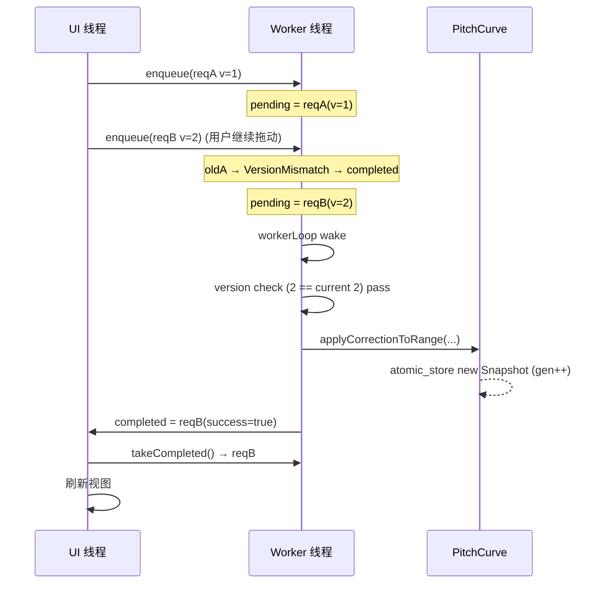
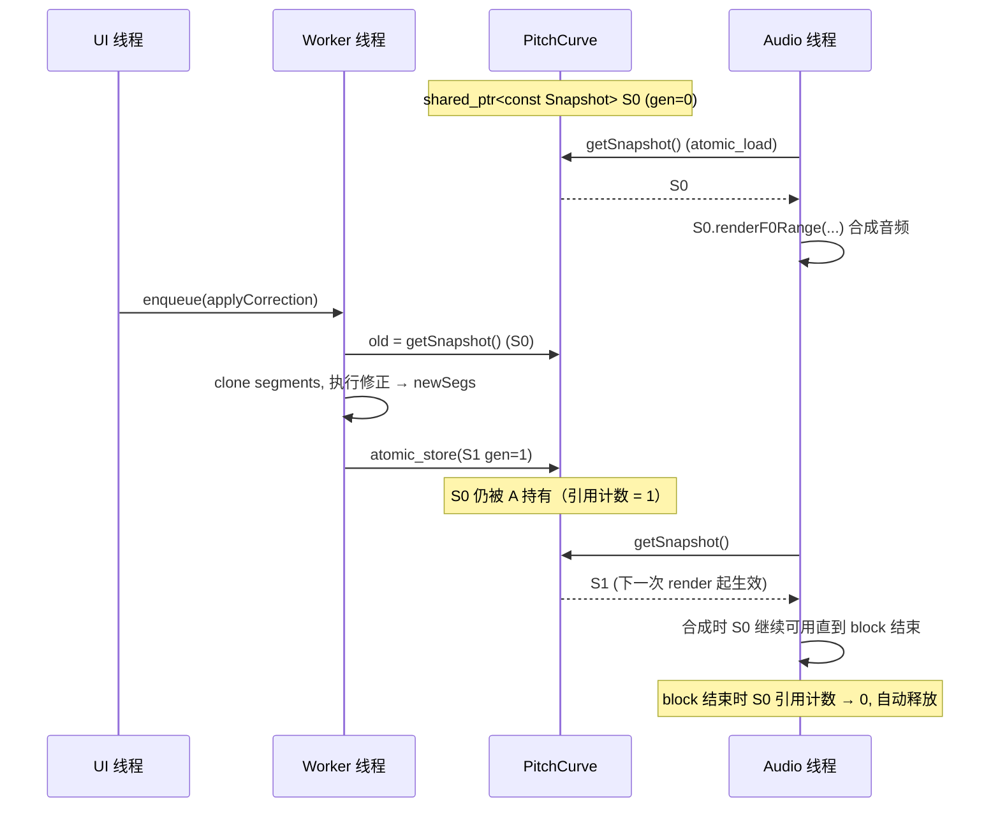

# pitch-correction -- Business Rules

本文档从业务视角描述 `pitch-correction` 模块的核心管线：从导入时的自动音符生成，到用户修正，再到后台异步重算，直至音频线程原子读取快照。

---

## 1. 整体业务管线

```mermaid
flowchart TD
    A[用户导入音频] --> B[Inference 推理 F0 + Energy]
    B --> C[PitchCurve::setOriginalF0 / setOriginalEnergy<br/>atomic_store 新 Snapshot]
    C --> D{是否开启 AutoTune?}
    D -- 是 --> E[Worker 入队 AutoTuneGenerate<br/>NoteGenerator::generate]
    D -- 否 --> F[用户手动创建 Note / LineAnchor]
    E --> G[候选 Note 排序 → 吸附音阶<br/>ScaleSnapConfig::snapMidi]
    G --> H[NoteSequence.setNotesSorted 去重叠]
    F --> H
    H --> I[用户编辑 pitch / pitchOffset / vibrato]
    I --> J[Worker 入队 ApplyNoteRange]
    J --> K[workerLoop 版本校验 + executeRequest]
    K --> L[PitchCurve::applyCorrectionToRange<br/>五阶段修正]
    L --> M[clearSegmentsInRangePreserveOutside<br/>+ insertSegmentWithUnifiedTransitions]
    M --> N[std::atomic_store 新 Snapshot<br/>renderGeneration_ ++]
    N --> O[UI takeCompleted() 刷新可视化]
    N --> P[Audio thread atomic_load<br/>renderF0Range 拉取 F0]
    P --> Q[Vocoder 合成 → 声卡输出]
```

---

## 2. 导入时音符自动生成（AutoTune Generate）

### 触发条件

- 用户在导入窗口勾选"自动生成音符"或通过菜单触发 `AutoTune Generate` 操作。
- `PianoRoll` 构造 `AsyncCorrectionRequest{ kind = AutoTuneGenerate }`，填入：
  - `autoOriginalF0Full`：`PitchCurve::getSnapshot()->getOriginalF0()` 的拷贝
  - `autoStartFrame` / `autoEndFrame`（inclusive）
  - `autoHopSize` / `autoF0SampleRate`
  - `autoGenParams`：含 `NoteSegmentationPolicy` 和可选 `ScaleSnapConfig`

### Worker 执行路径

```
enqueue(request)
  → incrementVersion → pending = request
  → notify_one
workerLoop:
  → version check (version == current?)
  → range check (autoEndFrame > autoStartFrame?)
  → executeRequest:
       NoteGenerator::generate(autoOriginalF0Full.data(),
                               size, nullptr,   ← energy 为空，跳过 PIP
                               autoStartFrame,
                               autoEndFrame + 1,
                               autoHopSize,
                               autoF0SampleRate,
                               audioSampleRate,
                               autoGenParams)
  → validate(notes)   // 仅日志，不抛
  → publishResult(true)
```

⚠️ 当前 `AutoTuneGenerate` 路径传入 `energy = nullptr`，所以 PIP 不会被激活，代表音高退化为 voiced 帧中位数。

### 分段决策逻辑（`NoteGenerator::generate`）

对每帧 `i ∈ [startFrame, endFrameExclusive)`：

1. **voiced 进入**：若 `f0[i] > 0` 且当前不在 note 中 → 开启新 note，`current.startTime = frameToTime(i)`。
2. **音高跳变切段**：若当前段已有 voiced 帧，计算 `diffCents = |1200 * log2(f0[i] / avgPitch)|`。当 `diffCents >= transitionThresholdCents (80)` → 调用 `commitNote` 结束当前段并立即开启新段。
3. **unvoiced 桥接**：若 `f0[i] <= 0` 且当前在 note 中 → `trailingUnvoiced++`。当 `trailingUnvoiced > gapBridgeFrames (≈1 帧 @ 10ms)` → 提交当前 note，end = `lastVoicedFrame + 1` 对应时间。
4. **尾部延伸**：`commitNote` 将 `endTime += tailExtendMs/1000`（默认 15ms）。
5. **最小时长过滤**：`duration < max(hopSecs, minDurationMs/1000)` 的 note 直接丢弃。
6. **代表音高**：有 energy 走 PIP（VNC + SSA + Energy），否则取中位数。
7. **音阶吸附**：`quantisePitch` 将代表 MIDI 经 `ScaleSnapConfig::snapMidi` 量化，然后 `round` 取整再 `midiToFrequency` 反算出 `pitch`（原值保留在 `originalPitch`）。

### 吸附后归一化

- 返回前按 `startTime` 升序，后者 startTime 截断前者 endTime，零时长被丢弃。
- Worker 完成后 UI 通过 `takeCompleted()` 拿到 notes，再调用 `NoteSequence::setNotesSorted` 注入当前 PianoRoll。

---

## 3. 用户修正 → Worker 后台重算流程

### 3.1 触发源

| 用户操作 | 产生请求 | 目标区间 |
|---|---|---|
| 拖动 Note 修改 `pitchOffset` / 调整 `vibrato*` / `retuneSpeed` | `ApplyNoteRange` | 受影响 note 覆盖的帧区间（可能多个 note 合并为一个 request） |
| 手绘 F0 曲线 | `setManualCorrectionRange(Source::HandDraw)` 同步写（不经 Worker） | UI 手势覆盖的帧区间 |
| LineAnchor 调整 | `setManualCorrectionRange(Source::LineAnchor, retuneSpeed)` 同步写 | 相邻锚点之间的区间 |
| 清除修正 | `clearCorrectionRange` / `clearAllCorrections` 同步写 | 用户选区 / 全部 |

**注意**：手绘 / LineAnchor 走 UI 线程同步写入（因为这是交互式高频小范围写，同步更自然）；note-based 批量修正走 Worker 异步（因为涉及整首歌重算）。

### 3.2 Worker 节流 + 取消（单槽 pending + 最新优先）



**关键策略**

- **单 pending 槽**：只保留最新请求；中间请求以 `ErrorKind::VersionMismatch` 立即 "退货"。
- **版本号 acq_rel**：workerLoop 在执行前再检一次 `request.version == getVersion()`，防止执行期间被覆盖时继续写入过期结果。
- **execute 时不持锁**：`pendingRequestMutex_` 仅保护队列读写，`applyCorrectionToRange` 本身通过 COW 无锁；因此 UI 可以继续入队新请求而不阻塞。
- **completed 单槽**：若 UI 在新请求完成前未及时 `takeCompleted`，前一个 completed 会被覆盖（丢失）；实测 PianoRoll 在 timer 回调里主动拉取，通常不会累积。

### 3.3 五阶段修正算法（`PitchCurve::applyCorrectionToRange`）

给定 notes、[start, end)、retuneSpeed / vibrato\* / audioSampleRate：

```
Stage 0 — 预处理
  captureSnapshot → 裁切范围 → clearSegmentsInRangePreserveOutside
  构建 NoteCorrectionInfo[]（仅与区间有交集的 notes）

Stage 1 — 斜率旋转补偿（可选）
  对 voiced 帧数 >= 6 的 note：
    取 early/late segCount 段的 midi 中位数
    slope = (lateMidi - earlyMidi) / deltaTime  (semitones/sec)
    signedAngleRad = atan(slope / 7.0)   ← 7 半音/秒 定义为 45°
    若 absAngleDeg ∈ [10°, 30°] → rotationRad = -signedAngleRad

Stage 2 — 对每帧（[start, end)）：
  若 f0 <= 0 → 结果 = 0，跳过
  timeSeconds = round(i * hop * audioSR / sr) / audioSR
  定位 activeNote（时间区间命中 start/end）
  若无 active note → 结果 = 原始 f0

Stage 3 — 颤音注入（若 noteVibratoDepth > 0）
  depthSemitones = (depth / 100) * 1.0
  lfoValue = depth * sin(2π * rate * timeInNote)
  targetF0 *= 2^(lfoValue / 12)

Stage 4 — 斜率旋转（若 rotationRad != 0）
  x = tSec - timeCenterSeconds
  y = freqToMidi(f0) - anchorMidi
  y' = x * sin(θ) + y * cos(θ)
  baseF0 = midiToFreq(anchorMidi + y')

Stage 5 — 音高偏移 + retune 混合
  shiftedF0 = baseF0 * 2^(offsetSemitones / 12)
  frameRetuneSpeed = (note.retuneSpeed >= 0) ? note.retuneSpeed : request.retuneSpeed
  result = mixRetune(shiftedF0, targetF0, frameRetuneSpeed)
           // log2 空间按 (1 - retuneSpeed) 缩放偏差

Stage 6 — 落地
  new CorrectedSegment(start, end, buffer, Source::NoteBased)
  insertSegmentWithUnifiedTransitions (Hermite smoothstep 10 帧)
  atomic_store 新 Snapshot (renderGeneration++)
```

### 3.4 过渡平滑（Hermite smoothstep）

- 左右各 10 帧（`kUnifiedTransitionFrames`）。
- 权重 `w = t² (3 - 2t)` 左，`1 - t²(3-2t)` 右；端点导数为 0，保证拼接无一阶突变。
- 仅当两侧原始 F0 全部 voiced 且不与现有段冲突时生成；否则跳过该侧（避免把静音 ramp 进修正）。

---

## 4. COW Snapshot 原子写入机制



**关键约束**

- 每次写都分配一个新 `shared_ptr<const PitchCurveSnapshot>` 并 `std::atomic_store` 替换内部指针。
- 旧快照不立即释放：只要任何读者持有 `shared_ptr`，旧对象就活着。释放发生在最后一个读者释放其 `shared_ptr` 时。
- `renderGeneration_` 只增不减；下游若以此做缓存 key，不同 generation ↔ 不同 snapshot ↔ 不同 F0 内容（但 `setHopSize/setSampleRate` 未递增 gen，参见 `api.md` 待确认）。

---

## 5. 音频线程读取协议

```cpp
// Audio block callback（实时线程）
auto snap = pitchCurve->getSnapshot();   // 原子 load，lock-free
if (snap->isEmpty()) return silence;
if (snap->hasCorrectionInRange(bStart, bEnd)) {
    snap->renderF0Range(bStart, bEnd,
        [&](int frameStart, const float* f0, int len) {
            vocoder.consumeF0(frameStart, f0, len);
        });
}
```

**保证**

- `atomic_load` 是 wait-free（`shared_ptr` 指针赋值保护下）。
- `renderF0Range` 内部只读遍历 `correctedSegments_` + `originalF0_`，零分配（除 LineAnchor 路径用临时 buffer）。
- 即使 worker 正在 `atomic_store` 新快照，音频线程 block 内持有的 `shared_ptr` 仍指向旧 snapshot；下一个 block 会观测到新 snapshot。
- **确定性**：一次 block 内看到的 snapshot 是一致的（所有字段同属一个 snapshot 实例）。

---

## 6. 错误处理与恢复

| 错误路径 | 处理策略 |
|---|---|
| `InvalidRange`（worker 内） | 立刻 publishResult(false)，不修改 PitchCurve |
| `VersionMismatch` | 立刻 publishResult(false) 带 "Superseded" 消息；新请求继续 |
| `ExecutionError` (std::exception / unknown) | AppLogger::error + publishResult(false)；PitchCurve 保持旧 snapshot，不可见副作用 |
| `applyCorrectionToRange` 内输入异常（empty F0 / start >= end / hop <= 0） | 直接 return，snapshot 不变 |
| Note 全 unvoiced | 修正段产生 `correctedF0Buffer` 全零，依然写入 snapshot（⚠️ 待确认：是否该退回原始 F0） |

---

## 7. 业务不变式总结

1. **单源写**：每个 PitchCurve 实例在任一时刻只能有一个写入线程（UI 或 Worker 择一）；跨线程写需上层协调。
2. **Generation 单调**：`renderGeneration_` 仅递增，永不回退或重复。
3. **Worker 最新优先**：旧 pending 永远被新 pending 取代，旧结果以 `VersionMismatch` 失败退回。
4. **过渡段两侧保护**：任何写入 `CorrectedSegment` 的路径（applyCorrection / setManualCorrection）都附加 Hermite smoothstep 过渡（仅当条件满足）。
5. **段落按 startFrame 排序 + 不重叠**：写操作前先 `clearSegmentsInRangePreserveOutside`，写后 `insertSegmentSorted`。
6. **音阶吸附只在导入**：`ScaleSnapConfig` 当前只通过 `NoteGenerator::quantisePitch` 生效；用户后续拖动 `pitchOffset` 不会重新吸附。

---

## ⚠️ 待确认

### 算法参数来源
1. **斜率角度阈值 `[10°, 30°]` + `slopeAt45DegSemitonesPerSecond = 7.0f`**：`PitchCurve.cpp` 硬编码。来源是调参实验还是音乐学先验？是否需要暴露为用户可调？
2. **`transitionThresholdCents = 80`**：80 cents 介于半音（100）与四分之一音（50）之间。是否考虑针对 vibrato 多的素材调大？
3. **`kUnifiedTransitionFrames = 10`**：按 hop=160 / sr=16000 约 100 ms。过渡时长是否该按 `hopSize / sampleRate` 动态推导？

### 业务语义
4. **全 unvoiced note 覆盖范围的输出**：`applyCorrectionToRange` 中 f0<=0 帧赋 0，但这 0 会落入 `correctedF0Buffer` 并进入 snapshot；下游 `renderF0Range` 会原样返回 0，导致声码器静音。这是预期吗？是否应退回原始 F0（也是 0）以便下游判空？
5. **LineAnchor 与 NoteBased 修正同时存在时的优先级**：`clearSegmentsInRangePreserveOutside` 按区间覆盖处理，后写覆盖前写。当用户在同一区间先画线再拖 note，应以谁为准？

### 线程 / 生命周期
6. **PitchCurve setter 缺并发保护**：多处写入（例如 Worker 写 correction + UI 同时 setOriginalF0）是否会竞争 snapshot_？是否需要在写路径加 mutex 或明确"单写者"约束？
7. **`pendingRequestCv_` 虚假唤醒**：workerLoop 的 `wait` 谓词已包含 stopFlag / pendingRequest 检查，但 `executeRequest` 异常传播出来后是否会导致 completed 积压？
8. **`takeCompleted` 丢弃策略**：UI 未及时拉取时，后续 completed 直接覆盖；是否需要改为 SPSC 队列以保留历史错误（用于 toast / 日志）？
