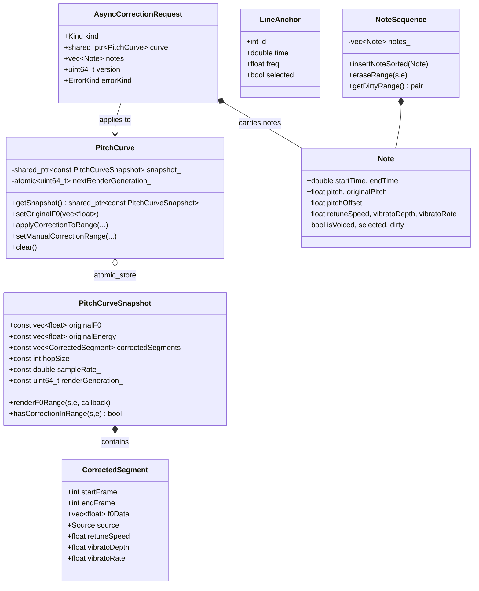

# pitch-correction -- Data Model

## 全局数据关系



---

## 1. `PitchCurveSnapshot`（COW 不可变快照）

### 字段定义

| 字段 | 类型 | 可变性 | 语义 | 约束 |
|---|---|---|---|---|
| `originalF0_` | `std::vector<float>` | `const` | 原始 F0（Hz），`<=0` 表示 unvoiced | 长度 = 帧数 N |
| `originalEnergy_` | `std::vector<float>` | `const` | 原始能量（RMS 或 dB，由上游定义） | 理论上 size == N；由 `setOriginal*` 维护 |
| `correctedSegments_` | `std::vector<CorrectedSegment>` | `const` | 修正段序列 | 按 `startFrame` 升序、段间不重叠 |
| `hopSize_` | `int` | `const` | F0 帧步长（样本数） | > 0 |
| `sampleRate_` | `double` | `const` | F0 采样率（**非 host**） | > 0 |
| `renderGeneration_` | `uint64_t` | `const` | 单调递增版本号 | 每次 COW 写 +1，用于下游缓存失效判断 |

### 不变式

1. **构造后永不 mutate**：所有读者通过 `shared_ptr<const Snapshot>` 持有，强 const 保证。
2. **段落有序**：`correctedSegments_[i].startFrame < correctedSegments_[i+1].startFrame`。
3. **段落不重叠**：任意两段满足 `seg_i.endFrame <= seg_{i+1}.startFrame`。
4. **f0Data 尺寸一致**：`seg.f0Data.size() == seg.endFrame - seg.startFrame`。

### 时间/帧索引关系

```
帧 index  ──▶  时间（秒）= index * hopSize_ / sampleRate_
时间  ──▶  帧 index       = floor(time * sampleRate_ / hopSize_)
```

注意 `applyCorrectionToRange` 在"帧 → 时间"时采用 `audioSampleRate` 做二次换算（为了对齐颤音相位）：

```
audioSamplePos = round(frame * hopSize_ * audioSampleRate / sampleRate_)
timeSeconds    = audioSamplePos / audioSampleRate
```

---

## 2. `CorrectedSegment`

| 字段 | 类型 | 语义 |
|---|---|---|
| `startFrame` | `int` | 半开区间起点（含） |
| `endFrame` | `int` | 半开区间终点（不含） |
| `f0Data` | `std::vector<float>` | 长度 = `endFrame - startFrame`，修正后 F0 |
| `source` | `enum class Source : uint8_t` | `None / NoteBased / HandDraw / LineAnchor` |
| `retuneSpeed` | `float` | `-1` = 不覆盖；否则 per-segment retune |
| `vibratoDepth` / `vibratoRate` | `float` | `-1` = fallback；否则 per-segment 颤音参数 |

### 构造路径

| 来源 | 谁创建 | 注意 |
|---|---|---|
| `Source::NoteBased` | `applyCorrectionToRange` 末尾 | 一次写覆盖整个 `[start, end)`，并附加两侧 Hermite smoothstep 过渡段（10 帧）|
| `Source::HandDraw` / `LineAnchor` | `setManualCorrectionRange` | 同样附加过渡段；`LineAnchor` 在渲染阶段额外叠加 `mixRetune` |
| `Source::None` | 构造默认值；实际路径下不应写入 | ⚠️ 待确认 |

### 过渡段（Hermite smoothstep）

- 左过渡：`[startFrame - 10, startFrame)`，权重 `w = t² * (3 - 2t)`，值域 0→1（从 originalF0 缓进到 boundary）。
- 右过渡：`[endFrame, endFrame + 10)`，权重 `1 - t² * (3 - 2t)`，1→0。
- **仅当两侧原始 F0 全部 voiced 且无段冲突时生成**；否则跳过。
- 过渡段 `source = center.source`（复用"这是哪一类修正"语义）。

---

## 3. `Note`

| 字段 | 默认 | 语义 | 约束 |
|---|---|---|---|
| `startTime` / `endTime` | 0.0 | 秒，host 时间轴 | `endTime > startTime`（非此者被 `normalizeNonOverlapping` 删除） |
| `pitch` | 0.0 | 基准音高（量化后，Hz） | `<=0` 视为静音/未生成 |
| `originalPitch` | 0.0 | 未量化代表值（PIP 或中位数） | 用于斜率旋转锚点 |
| `pitchOffset` | 0.0 | 半音（float）拖动偏移 | 不限制，UI 控制 |
| `retuneSpeed` | -1 | `-1` 回退 request；否则覆盖 | `[0,1]` 有效 |
| `vibratoDepth` / `vibratoRate` | -1 | 同上 | |
| `velocity` | 1.0 | 力度 | 目前未用于 F0 算法 |
| `isVoiced` | true | 有声标志 | 影响 UI 显示 |
| `selected` | false | UI 选中态 | |
| `dirty` | false | 增量渲染标记 | `eraseRange` 分裂后置 true |

### 派生计算

- `getAdjustedPitch() = pitch * 2^(pitchOffset/12)`；`pitch<=0` 返回 0。
- `getMidiNote() = round(69 + 12*log2(getAdjustedPitch()/440))`；`<=0` 返回 0。
- `getBaseMidiNote()` 同上但以 `pitch` 计算。

### `NoteSequence` 不变式

1. 按 `startTime` 升序。
2. 相邻无重叠：`notes[i-1].endTime <= notes[i].startTime`（由 `normalizeNonOverlapping` 保证；发生重叠时前者 endTime 被截断）。
3. `endTime > startTime`，零/负时长被丢弃。
4. `dirty` 在 `eraseRange` 的分裂两端自动置位，由上层调用 `clearAllDirty` 清理。

---

## 4. `LineAnchor`

| 字段 | 类型 | 语义 |
|---|---|---|
| `id` | `int` | 锚点 ID（由 UI 生成，全局唯一） |
| `time` | `double` | 秒 |
| `freq` | `float` | Hz |
| `selected` | `bool` | UI 选中态 |

LineAnchor 本身不作为 `PitchCurveSnapshot` 字段存储，UI 侧维护锚点列表，转换为 `CorrectedSegment (source = LineAnchor)` 后经 `setManualCorrectionRange` 写入。

---

## 5. `AsyncCorrectionRequest`（Worker 接口载体）

| 字段 | 类型 | 默认 | 语义 |
|---|---|---|---|
| `kind` | `Kind` | `ApplyNoteRange` | `ApplyNoteRange` / `AutoTuneGenerate` |
| `curve` | `shared_ptr<PitchCurve>` | null | `ApplyNoteRange` 必填 |
| `notes` | `vector<Note>` | 空 | ApplyNoteRange 输入；AutoTune 输出 |
| `startFrame` / `endFrameExclusive` | `int` | 0 | ApplyNoteRange 目标区间 |
| `retuneSpeed` | `float` | 1.0 | 默认 retune |
| `vibratoDepth` / `vibratoRate` | `float` | 0 / 5 | 默认颤音 |
| `audioSampleRate` | `double` | 44100 | host 采样率 |
| `version` | `uint64_t` | 0 | enqueue 时递增，workerLoop 校验 |
| `autoHopSize` | `int` | 160 | AutoTune 专用 |
| `autoF0SampleRate` | `double` | 16000 | AutoTune 专用 |
| `autoStartFrame` / `autoEndFrame` | `int` | 0 | AutoTune 范围（**endFrame inclusive**，worker 内 `+1` 变 exclusive） |
| `autoGenParams` | `NoteGeneratorParams` | {} | 分段策略 + 音阶 snap |
| `autoOriginalF0Full` | `vector<float>` | 空 | 输入 F0 全量拷贝 |
| `materializationEpochSnapshot` | `uint64_t` | 0 | 上游材料化版本（⚠️ 待确认语义） |
| `materializationIdSnapshot` | `uint64_t` | 0 | 上游材料化 ID（⚠️ 待确认语义） |
| `success` | `bool` | false | 执行结果 |
| `errorKind` | `ErrorKind` | `None` | `None/InvalidRange/VersionMismatch/ExecutionError` |
| `errorMessage` | `std::string` | "" | 失败详情 |

### 版本号生命周期

```
UI          Worker                       Worker                        Completed
 │  enqueue   │                             │                              │
 ├───────────▶│ incrementVersion()          │                              │
 │            │ pendingRequest_ = request   │                              │
 │            │ (cv.notify_one)             │                              │
 │            │  ── 如有旧 pending ──▶ errKind=VersionMismatch ───────────▶│
 │            │                              │                              │
 │            │ workerLoop wait             │                              │
 │            │ ── version != current? ─▶ errKind=VersionMismatch ────────▶│
 │            │ ── execute ok ──▶ success=true ────────────────────────────▶│
 │ takeCompleted() ◀─────────────────────────────────────────────────────┤
```

---

## 6. 帧索引系统

### 三套时间轴

| 名称 | 含义 | 典型值 |
|---|---|---|
| F0 帧索引 | `PitchCurveSnapshot` 内的 `startFrame` / `endFrame`；单位 = `hopSize / sampleRate` 秒 | hop=160, sr=16000 → 10ms/帧 |
| Host 时间 | Note 的 `startTime` / `endTime`（秒） | 以 `audioSampleRate` 为基准 |
| Audio 样本索引 | `audioSamplePos`，仅在 `applyCorrectionToRange` 内做颤音相位对齐 | `audioSampleRate = 44100` |

### 典型换算

```cpp
framePerSecond      = sampleRate / hopSize;        // F0 帧率
noteStartFrame      = floor(note.startTime * framePerSecond);
noteEndFrameCeil    = ceil(note.endTime * framePerSecond);
timeSecondsAtFrame  = frame * hopSize / sampleRate;   // 单路换算
audioSamplePos      = round(frame * hopSize * audioSampleRate / sampleRate);  // 双路换算
```

---

## 7. Voiced / Unvoiced 标记

| 场景 | 约定 |
|---|---|
| `originalF0_[i] > 0` | voiced 帧 |
| `originalF0_[i] <= 0` | unvoiced 帧（通常为 0 或 -1） |
| `CorrectedSegment.f0Data[i] > 0` | 修正有效帧 |
| `CorrectedSegment.f0Data[i] <= 0` | 修正后静音帧（`applyCorrectionToRange` 中 unvoiced 直接赋 0） |
| `Note.isVoiced` | 由 `NoteGenerator` 全部置 true；未来若支持静音 note 需扩展 |

过渡段构建强制要求两侧原始 F0 全部 voiced，否则跳过该侧过渡段（避免把静音 ramp 进修正曲线）。

---

## 8. 内存占用估算

`PitchCurveSnapshot::getMemoryUsage()` 返回：

```
originalF0_.capacity()     * sizeof(float)
+ originalEnergy_.capacity() * sizeof(float)
+ Σ (sizeof(CorrectedSegment) + seg.f0Data.capacity() * sizeof(float))
```

典型场景（3 分钟 16k F0，hop=160）：`originalF0_` 约 112 KB；10 个 1 秒修正段约 24 KB；合计数百 KB 量级。

---

## ⚠️ 待确认

1. **`originalF0_` / `originalEnergy_` 尺寸一致性**：`PitchCurveSnapshot` 构造器不做校验；`setOriginalF0` / `setOriginalEnergy` 有各自补齐逻辑；但 `setOriginalF0Range` / `setOriginalEnergyRange` 是否也覆盖所有边界情形（两侧 range set 交错时）？
2. **`Note.dirty` 标记消费者**：代码中仅 `NoteSequence::eraseRange` 置位 + `clearAllDirty` / `getDirtyRange` 查询。具体消费方（增量渲染？差异 diff？）未在本模块找到引用，疑在 PianoRoll UI 或 render 管线 — 需跨模块确认。
3. **`CorrectedSegment::Source::None` 是否仍被使用**：构造默认值存在，但 `applyCorrectionToRange` / `setManualCorrectionRange` 均传入具体 Source；是否可收紧为 `Source::NoteBased / HandDraw / LineAnchor` 三选一？
4. **`renderGeneration_` 包装溢出**：`uint64_t` 理论不会溢出，但 `clear()` 也调用 `incrementGeneration()` — 下游若用 generation 作缓存 key，在 `clear()` 之后是否要额外同步？
5. **`AsyncCorrectionRequest::materializationEpochSnapshot` / `materializationIdSnapshot`**：本模块不赋值也不读取；疑来自 `core-processor` 的材料化层（audio buffer materialization），需对齐语义与生命周期。
6. **`applyCorrectionToRange` 内使用的 `audioSampleRate`** 与 `snapshot_.sampleRate_` 的一致性约定：后者是 F0 采样率（16k），前者是 host（44.1k），混淆会导致颤音相位错位；是否需要在 PitchCurve 构造时记录 host SR 做防御？
