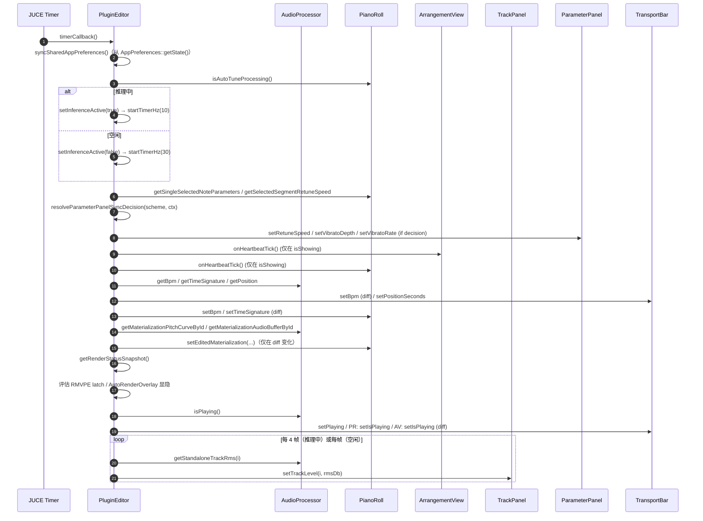
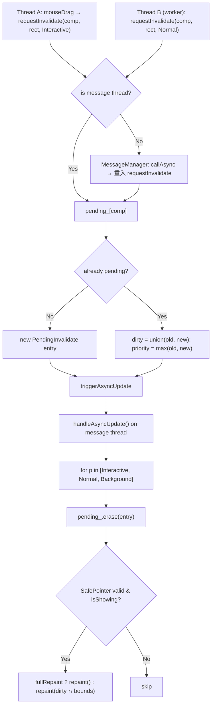
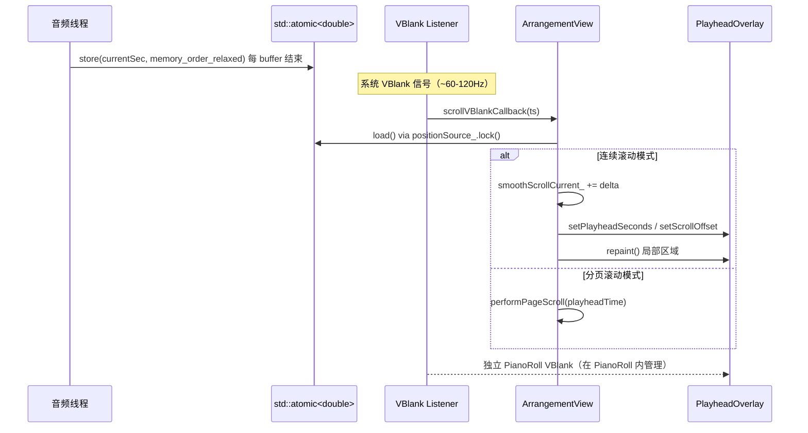
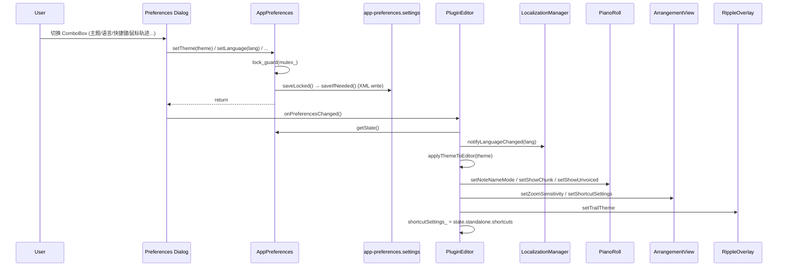

# ui-main 业务流程

本文档聚焦 UI 层最关键的五条业务流程：**心跳同步 / 帧调度 / 播放头绘制 / 编排视图缩放滚动 / 偏好保存加载**。

## 1. UI 心跳同步流程（30Hz/10Hz）

`OpenTuneAudioProcessorEditor` 是一个 `juce::Timer`，构造末尾调 `startTimerHz(kHeartbeatHzIdle = 30)`。推理中（`pianoRoll_.isAutoTuneProcessing() == true`）降频到 10Hz 以腾出消息线程时间片给 AUTO spinner 与 RMVPE 计算。

### 1.1 触发条件

| 事件 | 触发方 | 结果 |
|------|--------|------|
| 窗口创建 | `OpenTuneAudioProcessorEditor::ctor` | `startTimerHz(30)` |
| AUTO 开始 | `timerCallback()` 观察到 `pianoRoll_.isAutoTuneProcessing()` 为 true | `setInferenceActive(true)` → `startTimerHz(10)` |
| AUTO 完成 | 下一轮 timer 观察到 `isAutoTuneProcessing()` 为 false | `setInferenceActive(false)` → `startTimerHz(30)` |
| 窗口销毁 | `dtor` | `stopTimer()` + `waitForBackgroundUiTasks()` |

### 1.2 timerCallback() 顺序



### 1.3 Diff 优化

- BPM/时值：`std::abs(bpm - lastSyncedBpm_) > 0.001` 才 push
- PianoRoll materialization：对 `materializationId / sampleRate / curve pointer / buffer pointer` 做 4 元组 diff
- 播放状态：仅 `transportBar_.isPlaying() != processorRef_.isPlaying()` 时推送
- AutoRenderOverlay/RenderBadge 显隐：仅 `isVisible() != shouldShow` 时切换

## 2. FrameScheduler 节流流程

`FrameScheduler` 是单例 `AsyncUpdater`，为跨组件 repaint 请求提供聚合能力。

### 2.1 调用方

当前主要调用点：
- PianoRoll 的笔刷绘制（每次 mouseDrag 产生的局部 dirty 区域）
- 波形缓存构建完成后触发 ArrangementView 重绘
- 参数面板值变化 → 通知 PianoRoll 刷新曲线曲线 overlay

### 2.2 时序



### 2.3 与 VBlank 的关系

`FrameScheduler` 仅负责 dirty 区聚合，不直接对齐 VBlank。真正的 VBlank 同步发生在：
- `PlayheadOverlayComponent` 内部 VBlankAttachment（PianoRoll 侧创建）
- `ArrangementViewComponent::scrollVBlankAttachment_`（仅负责 smooth 自动滚动）

**重要**：`FrameScheduler` 处理 AsyncUpdater 回调时已经在消息线程，随后的 `comp->repaint()` 请求会由 JUCE 合并到下一帧 VBlank。

## 3. 播放头绘制流程

### 3.1 数据源

`OpenTuneAudioProcessor::getPositionAtomic()` 返回 `std::shared_ptr<std::atomic<double>>`，由音频线程写入当前播放时刻。UI 组件以 `std::weak_ptr` 形式持有（避免悬挂），VBlank 回调读取。

### 3.2 ArrangementView 播放头

`ArrangementViewComponent::setPlayheadPositionSource(weak)` 保存引用。内部有两条路径：
- **Overlay 绘制**：`PlayheadOverlayComponent playheadOverlay_`（浮于主组件之上），在 VBlank 或 `syncPlayheadOverlay()` 时 `setPlayheadSeconds()`
- **自动滚动**：`scrollVBlankAttachment_` 每次 VBlank 触发 `onScrollVBlankCallback(timestampSec)`，读 atomic → `updateAutoScroll()` 或 `performPageScroll()`

### 3.3 PianoRoll 播放头

同样通过 `setPlayheadPositionSource(getPositionAtomic())` 注入（由 `PluginEditor::ctor` 中同时推送给两个组件）。其独立 `PlayheadOverlayComponent` 实例在 `PianoRollComponent` 内部创建，与本模块的 `PlayheadOverlayComponent.h/cpp` 代码共享。

### 3.4 时序图



## 4. 编排视图缩放/滚动流程

### 4.1 输入来源

| 输入 | 处理 |
|------|------|
| `mouseWheelMove(wheel, mods)`, `Ctrl+wheel` | 缩放（调用 `setZoomLevel` 并更新 `zoomLevel_`） |
| `mouseWheelMove` 无修饰键 | 水平滚动 `scrollOffset_ += delta * scrollSpeed` |
| `Shift+wheel` | 垂直滚动 `verticalScrollOffset_`（与 TrackPanel 同步） |
| `scrollBarMoved` | `scrollOffset_` / `verticalScrollOffset_` 同步 |
| `fitToContent()` | 由 Editor 在无 user zoom 时调用，适配所有 placement |

### 4.2 Zoom/Scroll 联动

缩放后需保持鼠标下的时刻点稳定：
1. 读取鼠标点 `(mx, my)` 对应的当前时间 `tFocus = viewportXToAbsoluteTime(mx)`
2. 更新 `zoomLevel_` 并钳制（底层 TimeConverter 钳到 [0.02, 10.0]）
3. 重算 `scrollOffset_ = tFocus * pixelsPerSecond - mx`
4. 触发 `updateScrollBars()` + 重绘
5. 设置 `userHasManuallyZoomed_ = true`（防止后续 fitToContent 覆盖用户意图）

### 4.3 Y 轴同步

`TrackPanelComponent::verticalScrollChanged` 与 `ArrangementViewComponent::verticalScrollChanged` 双向同步（经 PluginEditor 的 Listener 转接），`trackHeight_` 同理（`trackHeightChanged(newHeight)` 两个组件都实现并互转）。

## 5. 偏好保存与加载流程

### 5.1 初始化

```
Application::initialise()
  → StandaloneFilterApp 构造 Processor
    → 构造 OpenTuneAudioProcessorEditor
      → 构造 AppPreferences appPreferences_({})    # 默认 StorageOptions
        → initialiseStorage()
          → resolveSettingsDirectory(userAppData/OpenTune).createDirectory()
          → processLock_ = InterProcessLock(settingsFile + ".lock")
          → properties_.setStorageParameters(options)
        → load()
          → properties_.getUserSettings() (读 XML 文件)
          → state_ = loadStateFromProperties(props)  # 每个字段带默认回退
```

### 5.2 打开偏好对话框

用户点击菜单 `Preferences` → `MenuBarComponent::menuItemSelected(OpenPreferences)` → `Listener::preferencesRequested()` → `PluginEditor::showPreferencesDialog()`：

```
StandalonePreferencePages::createAudioPages(deviceManager, prefs, onChanged, onRenderingChanged)
  → 返回 [音频设备页, ...]
SharedPreferencePages::create(prefs, onChanged)
  → 返回 [通用, 钢琴卷帘, 缩放, 音频方案, ...]
StandalonePreferencePages::createStandaloneOnlyPages(prefs, onChanged)
  → 返回 [快捷键, 鼠标轨迹]

合并 pages → new TabbedPreferencesDialog(pages)
  → juce::TabbedComponent 装载
DialogWindow::LaunchOptions options
options.content.setOwned(dialog); options.launchAsync()
```

### 5.3 保存（写时刻）

每次用户在页面内修改（ComboBox/Slider/ToggleButton）触发 `onChange`：
1. 调用对应 `appPreferences_.setXxx(value)`
2. `setXxx` 加锁修改 `state_`，调 `saveLocked()` 立刻 `properties.setValue(key, token)` + `userSettings->saveIfNeeded()`（因 `millisecondsBeforeSaving = 0`，XML 立即落盘）
3. 触发 page 构造时注入的 `onPreferencesChanged()` 回调 → `PluginEditor::syncSharedAppPreferences()`

### 5.4 应用到 UI（syncSharedAppPreferences）



### 5.5 关闭对话框

`closeButton_.onClick` → `findParentComponentOfClass<DialogWindow>()->exitModalState(0)`。由于 `launchAsync()` 是非模态 launch，对话框自身持有 `unique_ptr<Component>` 所以关闭后自动释放页面组件与本地状态。

## 6. 主题切换副作用

`themeChanged(ThemeId)` → `applyThemeToEditor(themeId)`：
1. `UIColors::applyTheme(themeId)`（全局颜色表切换）
2. `openTuneLookAndFeel_.refresh()` / `auroraLookAndFeel_.refresh()`
3. 广播 `applyTheme()` 到 TopBar / MenuBar / TransportBar / TrackPanel / ParameterPanel / ArrangementView
4. `pianoRoll_.applyTheme()` / `arrangementView_.setPlayheadColour(...)`
5. `getLookAndFeel().setColour(ResizableWindow::backgroundColourId, UIColors::backgroundDark)`
6. 整窗 repaint
7. 写入 AppPreferences

## 7. 多文件导入流水线

用户拖入 N 个文件或选择多文件后：
1. `filesDropped(files, x, y)` / FileChooser 回调 → 每文件构造 `PendingImport { placement, file, batchId, appendSequentially }` 入队 `importQueue_`
2. 若当前无进行中的导入（`isImportInProgress_ == false`），`processNextImportInQueue()` 取队首，调 `startPendingImport`
3. `startPendingImport` 交给 `asyncAudioLoader_.loadAsync(file, completionCallback)`，完成后回到消息线程：
   - 写入 TrackArrangement（processor 侧）
   - 若 `appendSequentially == true`，计算下一起始时间 `importBatchNextStartSeconds_[batchId] = currentEnd`
   - 递减 `importBatchRemainingItems_[batchId]`，为 0 时释放 batch 槽位 `releaseImportBatchSlot(batchId)`
4. `processNextImportInQueue()` 若队列非空则继续下一项

## ⚠️ 待确认

### 业务规则

1. 偏好切换到 CPU-first 后是否立即重建 ONNX 推理后端？`showPreferencesDialog()` 注入的 `onRenderingPriorityChanged` lambda 调 `processorRef_.resetInferenceBackend(forceCpu)`，但 RMVPE / HiFiGAN 二者是否同步重建未明确
2. 多轨道 Solo 组合规则：当用户对两条轨道同时开 Solo 时，是否为"或"逻辑（同时播两条）或"最后者优先"（互斥）？TrackPanel Listener 只上报 `trackSoloToggled(id, bool)`，具体 mix 由 Processor 决策

### 边界条件

3. 拖入空文件 / 格式不支持文件的错误提示路径：`asyncAudioLoader_.loadAsync` 失败时是否弹 AlertWindow、还是仅 AppLogger 静默失败
4. AUTO 处理期间用户切换主题或语言：AutoRenderOverlay 是否仍然拦截 keyPressed 导致偏好变更无法应用？
5. `WaveformMipmap::buildIncremental` 超时返回 false 的判定阈值（`timeBudgetMs`）与 ArrangementView 每 tick 传入值的组合，可能产生波形长时间未完整的情况

### 异常处理

6. `AppPreferences::initialiseStorage` 若目录创建失败（权限/磁盘满）未抛异常，`load()` 的 `jassert(userSettings != nullptr)` 在 Release 下被 noop，后续 `getState()` 仍返回默认态——需确认是否有用户可见的降级提示
7. `exportWorker_` 未 join 情况下析构：当前析构仅 `join()`（若 joinable），但 `exportInProgress_` 的等待语义（是否可能在 UI 销毁时仍在写文件）未明确
8. `FrameScheduler::handleAsyncUpdate` 处理期间如果某组件 `repaint()` 里又触发 `requestInvalidate`，会写入 `pending_` 但本轮不会再处理（需等下一次 triggerAsyncUpdate），是否可能出现 starvation 未验证

### 可观测性

9. `AppLogger` 在偏好保存 / 导入失败 / 主题切换等路径的日志覆盖密度未审计；debug 构建 `diagnosticHeartbeatCounter_` 每 300 帧（~10 秒）打一次 render 诊断，但 release 构建无同等可观测性
