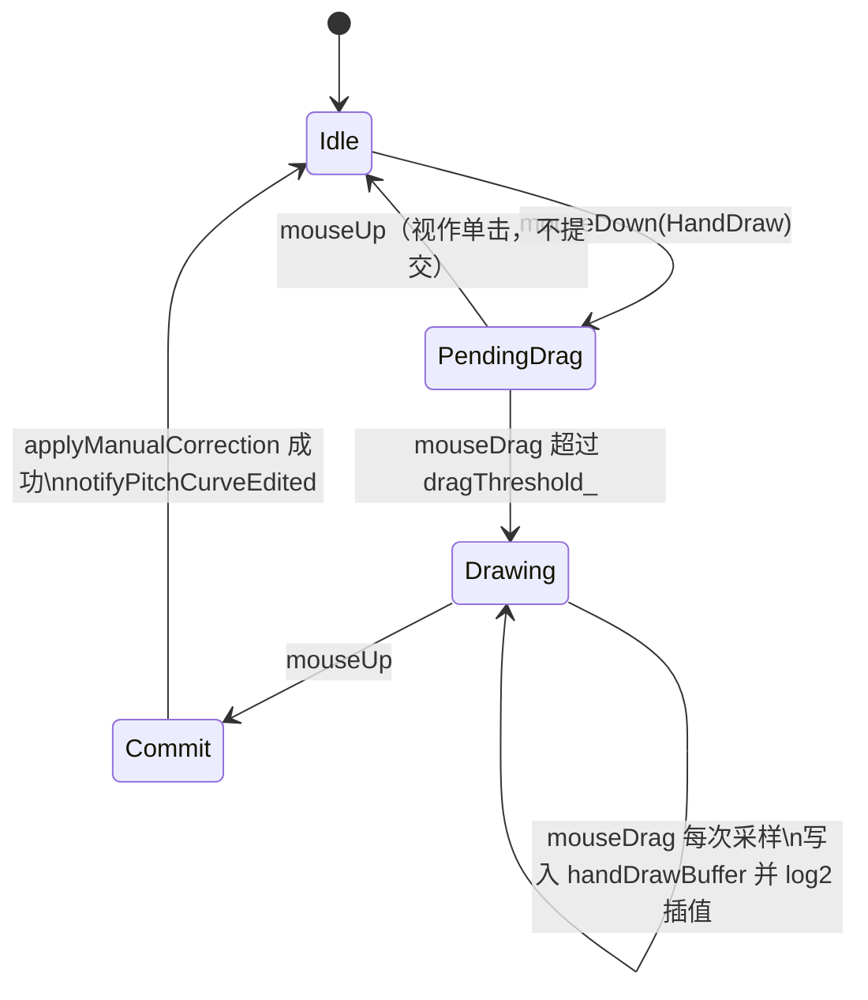
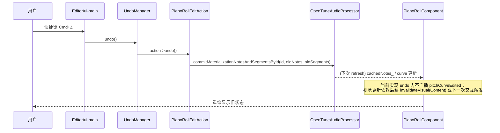
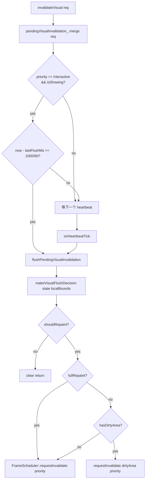

# ui-piano-roll 业务流程

本文档记录钢琴卷帘 UI 的关键交互流程与数据流转，配合 `api.md`（接口契约）与 `data-model.md`（数据结构）阅读。所有引用的类与方法均归属 `namespace OpenTune`。

---

## 1. 工具切换流程

**入口**：`PianoRollComponent::setCurrentTool(ToolId)` 或 `PianoRollToolHandler::keyPressed`（字符键 `2/3/4`、菜单 `5`、AutoTune 快捷键 `6`）。

```
1. toolChanged = (currentTool_ != tool)
2. 若当前处于 LineAnchor 预览（isPlacingAnchors）且要切离 LineAnchor：
     interactionState_.drawing.isPlacingAnchors = false
     interactionState_.drawing.pendingAnchors.clear()
     clearedAnchorPreview = true
3. currentTool_ = tool；toolHandler_->setTool(tool)
4. setMouseCursor：
     Select    → Normal
     DrawNote/LineAnchor/HandDraw → Crosshair
     AutoTune  → PointingHand
5. 若 toolChanged || clearedAnchorPreview：
     invalidateVisual(Interaction, getLocalBounds(), Interactive)  // 全屏失效（清除旧工具预览）
```

**右键菜单**（`showToolSelectionMenu`）：
- 仅在非预览状态下右键触发；若 LineAnchor 预览进行中则右键改为取消预览。
- 菜单项：`Select (3) / Draw Note (2) / Line Anchor (4) / Hand Draw (5)`。

---

## 2. 手绘（HandDraw）交互

### 2.1 状态机



### 2.2 按下

`handleDrawCurveTool` 被初次调用（从 `handDrawPendingDrag` 转入）时：
- `interactionState_.drawing.isDrawingF0 = true`；
- `dirtyStartTime / dirtyEndTime` 置 -1（下次 `writeFrame` 自动扩展）；
- `lastDrawPoint_ = (curveTime, targetF0)`；
- `handDrawBuffer.resize(originalF0.size(), -1.0f)`（与原始 F0 同长，未写帧为 -1）。

### 2.3 拖动（每帧采样）

1. `targetF0 = yToFreq(e.y)`；`curveTime = projectTimelineTimeToMaterialization(xToTime(e.x))`（带 clamp）；
2. `frameIndex = f0Timeline.frameAtOrBefore(curveTime)`；
3. `writeFrame(frameIndex, targetF0)`：
   - 若越界或 `!canEditFrame(scheme, originalF0, f)` 则跳过；
   - 否则 `handDrawBuffer[f] = v`，并更新 `dirtyStartTime/EndTime`；
4. 在 `[lastFrame, frameIndex]` 之间做 **log2 线性插值**（`log2 A + (log2 B - log2 A) * t`），逐帧 `writeFrame`；
5. `lastDrawPoint_ = (curveTime, targetF0)`；
6. `invalidateVisual` 合并 `getHandDrawPreviewBounds` 的前后并集。

### 2.4 释放

`handleDrawCurveUp`：
1. `dirtyStartTime/EndTime` 有效且 `handDrawBuffer` 非空才继续；
2. `drawnRange = f0Timeline.rangeForTimes(dirtyStart, dirtyEnd)`；
3. `appendManualCorrectionOps(ops, scheme, originalF0, drawnRange, valueForFrame, HandDraw)`：
   - 遇不可编辑帧或 ≤0 F0 则 flush 当前 Op，形成多段；
4. `setUndoDescription("手绘曲线")`；
5. `applyManualCorrection(ops, editedStart, editedEnd-1, false)`：同步 clone curve → `setManualCorrectionRange` → `commitEditedMaterializationCorrectedSegments`；
6. `notifyPitchCurveEdited(editedStart, editedEnd-1)`；
7. `selectNotesForEditedFrameRange`：按方案（`AudioEditingScheme::shouldSelectNotesForEditedFrameRange`）决定是否自动选中覆盖音符；
8. 清空 `isDrawingF0 / handDrawBuffer / dirtyStartTime`；重绘 preview bounds。

---

## 3. 线段锚点（LineAnchor）

### 3.1 放置与提交

```mermaid
flowchart TD
    A[mouseDown] --> B{isPopupMenu?}
    B -- yes --> C[取消预览 clearAnchors\nor showToolContextMenu]
    B -- no --> D{clickTime 是否可编辑?\ncanEditFrame}
    D -- no --> E[放弃]
    D -- yes --> F{isPlacingAnchors?}
    F -- no --> G{findLineAnchorSegmentNear\n命中已有 LineAnchor 段?}
    G -- yes --> H[选中/toggle 段 → 重绘预览区\nreturn]
    G -- no --> I[clearLineAnchorSegmentSelection\n创建 pendingAnchors[0]\nisPlacingAnchors=true]
    F -- yes --> J{e.getNumberOfClicks >= 2 ?}
    J -- yes --> K[commitLineAnchorOperation → 退出预览]
    J -- no --> L[按 log2 插值生成 ManualCorrectionOp\nsource=LineAnchor]
    L --> M[applyManualCorrection → notifyPitchCurveEdited]
    M --> N[selectNotesForEditedFrameRange]
    N --> O[anchors.push_back newAnchor]
    O --> P[invalidateVisual LineAnchorPreviewBounds]
```

关键要点：
- **pitch 吸附**：点击频率先 `midi = 69 + 12*log2(f/440)`，再 `round` 后转回频率（`snappedFreq`）；
- **段命中优先于新增锚点**：当方案允许选段 (`allowsLineAnchorSegmentSelection`) 且未在预览中，首次点击优先选段；
- **双击提交**：清空 `pendingAnchors` 和 `isPlacingAnchors`，仅保留已落段；
- **右键**：预览中直接取消并 `clearLineAnchorSegmentSelection`；其他情况弹工具菜单。

### 3.2 锚点移动/删除

当前实现**不支持**对已放置 anchor 的逐点移动或删除；锚点落下即固化为 `CorrectedSegment::Source::LineAnchor` 段。若需修改，须：
1. 用 Select 工具选中段（方案允许时），通过 `applyRetuneSpeedToSelectedLineAnchorSegments` 修改 retune；
2. 或者 HandDraw/再次 LineAnchor 覆写相应帧范围，产生新的 `CorrectedSegment` 覆盖旧段。

---

## 4. 音符绘制 / 编辑 / 删除

### 4.1 DrawNote：创建

```
mouseDown (handleDrawNoteMouseDown):
  beginNoteDraft()
  检测点击是否命中已有音符 → 若命中则 select/toggle
  drawNoteToolPendingDrag = true
  drawNoteToolMouseDownPos = e.position

mouseDrag:
  若 pendingDrag 且位移超阈值 → pendingDrag=false，
    用 mouseDown 位置调用 handleDrawNoteTool（起点）
    后续持续 handleDrawNoteTool(e)（末点）

handleDrawNoteTool(e):
  currentTime = clampMaterializationTime(projectTimelineTimeToMaterialization(xToTime(e.x)))
  midi = round(69 + 12*log2(yToFreq(e.y)/440))  → snappedF0
  首次：
    isDrawingNote=true; drawingNoteStart/End=currentTime; pitch=snappedF0
    插入 Note 到 notes 中（按 startTime 排序）
    drawingNoteIndex = 插入位置
  后续：
    更新 notes[idx].startTime / endTime = min/max(start, current)

mouseUp (handleDrawNoteUp):
  若 pendingDrag 仍为 true：视作单击 → commitNoteDraft("绘制音符") 返回
  否则：
    强制最小时长 0.02 s
    分割与新音符重叠的旧音符（留下左右残段）
    recalculatePIP(finalNote) → 得到 originalPitch 与 pitchOffset
    NoteSequence::insertNoteSorted 再用选中索引定位
    应用 retune/vibrato 参数（setUndoDescription="绘制音符"）
    若存在 curve：同步 clone + applyCorrectionToRange → commitNotesAndSegments（一次 Undo）
```

### 4.2 Select：拖拽移动

- `mouseDown`：若命中音符，`draggedNoteIndices = collectSelectedNoteIndices`，若选中音符已有手动修正帧（`hasCorrectionInRange`），则预计算 `initialManualTargets`（原始 F0 点位）与 `manualStart/EndTime`；
- `mouseDrag`：
  1. `deltaSemitones = 12 * log2(currentF0 / startF0)`；
  2. `workingNotes = baselineNotes`，对每个选中索引：`targetMidi = baseMidi + initialOffset + delta` → `snappedOffset = round(targetMidi) - baseMidi`；
  3. `updateNoteDragPreview(shiftFactor = 2^(appliedDelta/12))`：把 `initialManualTargets` 按比例平移到 `previewF0`；
- `mouseUp (handleSelectUp)`：
  - 若有 offset 变化（>0.001 半音）且存在原手动修正：
    - 生成单个 `ManualCorrectionOp { source=HandDraw, f0Data=previewF0 }`；
    - `commitNotesAndSegments(notes, buildSegmentsWithManualOps(curve, ops))`；
  - 否则 `applyCorrectionToRange(notes, range, retune, depth, rate)` 克隆 + `commitNotesAndSegments`；
  - `notifyNoteOffsetChanged` + `notifyPitchCurveEdited`；
  - 清 drag 状态。

### 4.3 Select：边缘调整 (Resize)

- `mouseDown`：命中边缘（`|e.x - x1|<=6` 或 `|e.x - x2|<=6`）且音高匹配（`|mouseMidi - noteMidi|<1`）→ 进入 Resize 状态；
- `mouseDrag`：`workingNotes = baselineNotes` 再修改目标 note 的 `startTime`（Left）或 `endTime`（Right），保持最小 0.02 s；
- `mouseUp`：
  - 清理 `startTime >= endTime` 的音符；
  - 若 `resizeWasDirty`，对受影响帧范围执行 `applyCorrectionToRange` + `commitNotesAndSegments`（描述 "调整音符长度"）；
  - 否则退回 `commitNoteDraft("编辑音符")`。

### 4.4 删除

`handleDeleteKey`（Delete 键或字符 '1'）：
```
1. beginNoteDraft
2. selectedIndices = 选中音符
3. 计算 deleteStartTime/EndTime:
     选中音符的 [min startTime, max endTime]
     ∪ 若 hasSelectionArea，扩展到 selection 的时间范围
4. deleteRange = f0Timeline.rangeForTimes(deleteStartTime, deleteEndTime)
5. 若选中音符：
     累积 correctionClearRanges 覆盖音符 range
     deleteSelectedNotes
6. 若选区存在：
     按时间重叠删除 notes
     累积 correctionClearRanges 覆盖选区 range
7. 一次性：
     clonedCurve.clearCorrectionRange(...) for each range
     commitNotesAndSegments(notes, clonedCurve.snapshot.correctedSegments)
8. notifyPitchCurveEdited(globalDirtyStartFrame..globalEndFrame)
```

关键：**删除音符 + 擦除对应修正在同一事务**，保证 Undo 撤销后两者同步恢复。

### 4.5 全选

`Cmd/Ctrl+A`（`KeyShortcutConfig::ShortcutId::SelectAll`）：
- 选中所有音符 → `commitNoteDraft("编辑音符")`；
- `selection.hasSelectionArea = true`，矩形覆盖 `[0, f0Timeline.endTime]` × `[minMidi, maxMidi]`；
- `updateF0SelectionFromNotes`。

---

## 5. 批量参数编辑

入口：`applyRetuneSpeedToSelection / applyVibratoDepthToSelection / applyVibratoRateToSelection` 或 UI 侧拖动参数滑块。

```
applyXxxToSelection(value):
  value = clamp(...)
  pendingUndoDescription_ = 对应描述
  if !currentCurve_: return false
  计算 hasSelectedNotesRange / hasF0Selection / hasSelectionAreaRange
  target = AudioEditingScheme::resolveParameterTarget(scheme, kind, context)
  switch target:
    SelectedLineAnchorSegments → applyRetuneSpeedToSelectedLineAnchorSegments
    SelectedNotes              → applyNoteParameterToSelectedNotes
    FrameSelection             → if hasHandDrawCorrectionInRange: return true
                                 else applyParameterToFrameRange → enqueueNoteBasedCorrectionAsync
    default                    → return false
```

要点：
- `SelectedLineAnchorSegments`：遍历选中段，若 `source != LineAnchor` 跳过；修改 `retuneSpeed`（clamp [0,1]），`commitEditedMaterializationCorrectedSegments`；
- `FrameSelection` 时若该帧范围内存在 `HandDraw` 段，**不改写 retune**（语义上 HandDraw 是绝对 F0，无 retune 概念），直接 `return true`；
- `applyParameterToFrameRange` 需先校验 `hasCorrectionInRange`，否则返回 false（无修正可调参数）。

---

## 6. Undo / Redo 流程

### 6.1 写入链

```
任一编辑入口
  ↓
setUndoDescription("...")   (工具内设置 pendingUndoDescription_)
  ↓
commitEditedMaterializationNotes / NotesAndSegments / CorrectedSegments
  ↓ captureBeforeUndoSnapshot（若尚未捕获）
  ↓ processor_.commit... (实际写入数据)
  ↓ refreshEditedMaterializationNotes / setEditedMaterialization
  ↓ recordUndoAction(pendingUndoDescription_)
       ├── after = (cachedNotes_, currentSegments)
       ├── action = PianoRollEditAction(processor, id, desc, before, after, ...)
       └── processor_.getUndoManager().addAction(std::move(action))
```

### 6.2 撤销/重做链



### 6.3 Snapshot 幂等

`undoSnapshotCaptured_` 防止同一事务多次触发 `captureBeforeUndoSnapshot`：
- 被第一次 `commit*` 调用置 true；
- 被 `recordUndoAction` 重置为 false；
- 也可由 `applyCorrectionAsyncForEntireClip` 等预先显式捕获。

### 6.4 AutoTune 异步的 Undo 时机

```
applyCorrectionAsyncForEntireClip:
  captureBeforeUndoSnapshot（主线程）
  pendingUndoDescription_ = "自动调音"
  correctionWorker_.enqueue(request)
  立即返回 true
...
heartbeat → consumeCompletedCorrectionResults:
  commitCompletedAutoTuneResult:
    processor_.commitAutoTuneGeneratedNotesByMaterializationId
    refreshEditedMaterializationNotes
    setEditedMaterialization (epoch++)
    recordUndoAction(pendingUndoDescription_)   // 此时产生 Undo
  autoTuneInFlight_ = false
```

若在异步期间 `materializationId` 或 epoch 变更（切换素材），结果会被 `commitCompletedAutoTuneResult` 早退丢弃，`captureBeforeUndoSnapshot` 也在 `setEditedMaterialization` 中被重置。

---

## 7. 视觉失效与局部重绘

### 7.1 触发矩阵

| 事件 | mask | priority | 脏矩形 |
|------|------|---------|--------|
| `setCurrentTool` | Interaction | Interactive | 全屏（`getLocalBounds`） |
| `setZoomLevel` / `setScrollMode` | Viewport | Interactive | fullRepaint |
| `setScrollOffset` | Viewport | Interactive | 若平移 < 视口宽度则脏矩形 `(pianoKeyWidth_,0,contentW,h)`，否则 fullRepaint |
| `setShowWaveform/Lanes/NoteName/ChunkBoundaries/UnvoicedFrames/OriginalF0/CorrectedF0` | Content | Normal | fullRepaint |
| `setMaterializationProjection` (变化时) | Viewport | Interactive | fullRepaint |
| `setEditedMaterialization` | Content | Normal | fullRepaint |
| 工具交互期间 `invalidateInteractionArea(rect)` | Interaction | Interactive | rect（来自 ToolHandler 的 `*PreviewBounds`） |
| AutoTune/修正完成 | Content | Normal | fullRepaint |
| Waveform 增量构建每帧完成 | Content | Normal | fullRepaint |

### 7.2 合并与 Flush



### 7.3 脏矩形来源

工具预览的矩形由 Component 实现：
- `getNotesBounds(notes)`：所有音符矩形的并集（含 4 px padding，与 viewport 相交）；
- `getSelectionBounds`：基于 time + midi 的矩形；
- `getHandDrawPreviewBounds`：`dirtyStartTime..dirtyEndTime` 覆盖的完整高度条；
- `getLineAnchorPreviewBounds`：所有 pendingAnchor + currentMousePos 的点集合外包；
- `getNoteDragCurvePreviewBounds`：previewF0 每帧 (timeToX, freqToY) 的点集合外包。

ToolHandler 调用 `invalidateNoteChange(ctx, before, after)` 时会合并 `getNotesBounds(before) ∪ getNotesBounds(after) ∪ getSelectionBounds() ∪ getNoteDragCurvePreviewBounds()`，保证前后状态都在脏区域内。

---

## 8. 试听键盘（PianoKeyAudition）

```
UI 线程：
  用户点击/拖过左侧琴键 → noteOn(midi)
    ├── SPSC eventBuffer_ 写入 NoteEvent{on, midi}
    └── pressedNote_.store(midi)
  放开 → noteOff(midi)
    ├── SPSC 写入 NoteEvent{off, midi}
    └── CAS pressedNote_: midi → -1

音频线程（processBlock → mixIntoBuffer）：
  processEvents(sampleRate):
    遍历未读 NoteEvent：
      on  → startVoice(midi)  占用空闲/抢占 voice[0]，position = onsetSample
      off → stopVoice(midi)   置 releasing=true，releaseDecrement = 1/(0.05 * fs)
  对每个 active Voice：
    线性插值采样 * gain
    若 releasing：乘以递减 releaseGain
    累加到所有 output 通道
    position += playbackRate (= 44100 / fs)
    若到末尾或 releaseGain ≤ 0 → active = false
```

约束：
- `loadSamples` 在消息线程一次性加载全部 88 份 MP3（`BinaryData::piano_{midi}_mp3`）；未找到或解码失败时跳过；
- Voice 池满抢占第 0 号 voice（**不** 做 tail-release）；
- `playbackRate = kSampleRate / outSampleRate`（所有音采用其原生采样，无变调）；
- Voice 播放完毕（`position >= srcLen`）或 release 衰减 ≤0 → `active=false`。

---

## 9. 滚动与缩放

### 9.1 Continuous 模式下的 PlayheadFollow

```
VBlank 回调 → readProjectedPlayheadTime
  若 pendingSeekTime_ >= 0:
    若 |hostTime - pendingSeekTime_| < 50ms: 接受 hostTime, pendingSeekTime_ = -1
    否则使用 pendingSeekTime_（seek 尚未被 host 确认）
  否则 playheadTime = hostTime

  计算 centeredScroll = getPlayheadAbsolutePixelX(playheadTime) - visibleWidth/2
  scrollSeekOffset_ *= 0.95 （平滑 seek 的偏移 → 0）
  setScrollOffset(max(0, centered + scrollSeekOffset_))
```

- `userScrollHold_`：用户手动滚动后暂停自动居中，直到下次 seek 或 stop；
- `pendingSeekTime_`：ARA/host 尚未确认 seek 时的"假定"时间，避免播放头抖动。

### 9.2 Page 模式

当播放头移出视口右侧 → `scrollOffset += visibleWidth`；移出左侧 → 跳到包含播放头的"页"起点。

### 9.3 缩放

`setZoomLevel`：clamp `[0.02, 10.0]`，写 `timeConverter_`；触发 `Viewport Interactive` 失效。用户使用 `handleHorizontalZoomWheel / handleVerticalZoomWheel`（带 `ZoomSensitivitySettings` 缩放系数）。

---

## 10. 关键跨模块契约

| 合作方 | 我们写入 | 我们读取 | 契约点 |
|--------|--------|---------|--------|
| `OpenTuneAudioProcessor` | `commitMaterializationNotesAndSegmentsById` / `setMaterializationNotesById` / `setMaterializationCorrectedSegmentsById` / `commitAutoTuneGeneratedNotesByMaterializationId` / `getUndoManager().addAction` | `getMaterializationNotesSnapshotById` / `getMaterializationPitchCurveById` | 音符与段必须原子提交以保证 Undo 一致；commit 失败时保留 draft 以便重试 |
| `PitchCurve` | `clone()` + `setManualCorrectionRange` / `clearCorrectionRange` / `applyCorrectionToRange` | `getSnapshot()` / `getOriginalF0` / `hasCorrectionInRange` / `renderF0Range` | 所有 F0 修改先 clone，再将新 snapshot 的段 commit 回 processor；避免直接修改共享 curve |
| `UndoManager` | `addAction(unique_ptr<PianoRollEditAction>)` | — | 每条 Action 必须携带 before/after 的 notes+segments |
| `PianoKeyAudition` | `noteOn/noteOff` | `getPressedNote()` | 消息线程写，音频线程读；事件经 SPSC 传递 |
| `FrameScheduler` | `requestInvalidate(priority)` / `requestInvalidate(dirtyArea, priority)` | — | 优先级对齐 InvalidationPriority |
| `WaveformMipmap` | `setAudioSource` / `buildIncremental` | 内部使用 | 增量构建每 heartbeat 推进；完成即触发一次 Content 失效 |
| `Listener`（ui-main） | `pitchCurveEdited/noteOffsetChanged/autoTuneRequested/playheadPositionChangeRequested/...` | — | 仅通知，不期待同步返回值 |

---

## ⚠️ 待确认

### 流程合理性
1. **Select 工具 mouseUp 的 note 拖拽分支**：当 `hasManualTargets` 为 true，`ManualOp.source` 固定写为 `HandDraw`（而非 `LineAnchor` 等原来源），可能导致拖拽原本由 LineAnchor 生成的段后其 source 被覆盖为 HandDraw，后续无法再通过段选中功能管理。需确认是有意还是缺陷。
2. **`handleDeleteKey` 的选区删除**：当 `hasSelectionArea=true` 但选区内无任何音符时仍会清空选区范围的 F0 修正 — 这是预期的"选区清除修正"行为还是应要求至少一个选中音符？Undo 描述为"删除音符"可能与用户预期不符。

### 边界/异常
3. **AutoTune 异步期间用户继续编辑**：`autoTuneInFlight_` 在 `commitCompletedAutoTuneResult` 结束后清零，期间用户仍可手绘/画音符。若 AutoTune 落回时又会再次 `setEditedMaterialization` 并 `clearNoteDraft`，是否会丢弃用户中间编辑？需检查 draft 保留策略。
4. **`handDrawPendingDrag` 退出路径**：`handleDrawCurveUp` 中 `handDrawPendingDrag` 为 true 时直接 return，但此前 `mouseDown` 并未做任何写入 — 单击 HandDraw 工具是否应当也产生一个点状修正？目前被完全忽略。

### 跨模块协议
5. **`PianoRollEditAction::undo/redo` 未通知 `pitchCurveEdited`**：依赖 UndoManager 的调用方（通常是 Processor 或 Editor）补发失效，否则撤销后 Vocoder 缓存等下游可能不会及时失效。现有是否所有调用链都覆盖了？
6. **`applyManualCorrection` 在 `triggerRenderEvent=false` 时不广播 `pitchCurveEdited`**：HandDraw / LineAnchor 都传 false，改由上层显式 `notifyPitchCurveEdited` 补发。若未来新增入口忘记补发，渲染缓存可能不刷新。

### 性能
7. **手绘过程中每次 mouseDrag 都合并 `getHandDrawPreviewBounds`**：当拖拽极快/F0 跳跃大时脏矩形会覆盖整列高度（`viewport.getHeight()`），几乎等价于 fullRepaint，节流依赖 60 fps 阈值，确认是否可在绘制时进一步限制更新频率或使用差分矩形。
