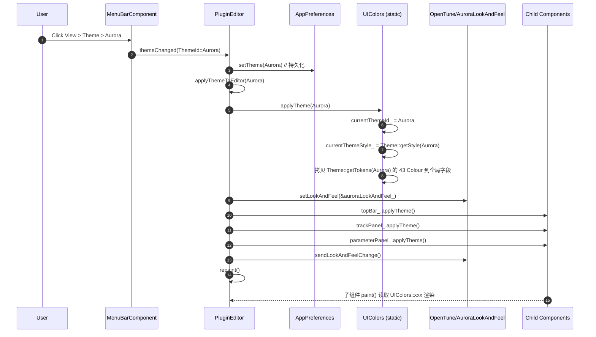

# ui-theme 业务规约

## 1. 主题切换机制

### 1.1 触发时机

1. **应用启动**
   `PluginEditor` ctor 读取 `AppPreferences.getState().shared.theme`（`ThemeId`）→ 调用 `UIColors::applyTheme(id)`，然后在 ctor 末尾触发一次 `applyThemeToEditor(id)` 设定 LookAndFeel。
2. **用户通过主菜单切换**
   `MenuBarComponent` 把 View → Theme 子菜单的三个命令（`ThemeBlueBreeze` / `ThemeDarkBlueGrey` / `ThemeAurora`）映射为 `Listener::themeChanged(ThemeId)` 广播。
   `PluginEditor` 作为 Listener 实现 `themeChanged`：先 `appPreferences_.setTheme(themeId)` 持久化，再 `applyThemeToEditor(themeId)` 刷新视图。
3. **AppPreferences 外部变更**
   `PluginEditor::sharedPreferencesChanged(...)` 会检测 `sharedPreferences.theme` 并调用 `applyThemeToEditor(sharedPreferences.theme)`。适用于跨实例（Standalone / 未来插件宿主）的偏好联动。

### 1.2 主流程时序



### 1.3 关键约束

- **只能在 UI 线程调用** `UIColors::applyTheme` — 否则其他线程 paint 时读取的 static 字段可能撕裂。
- **Aurora 用独立 LookAndFeel**，其他两主题共用 `OpenTuneLookAndFeel` 并在内部按 `UIColors::currentThemeId()` switch 分派到 `drawBlueBreezeXxx` / `drawDarkBlueGreyXxx`。因此**切换 Aurora ↔ 非 Aurora 需要 `setLookAndFeel(nullptr)` 然后重设**；切换 BlueBreeze ↔ DarkBlueGrey 可以只改 `UIColors::currentThemeId_`，但为一致起见统一走 `applyThemeToEditor`。
- **强制 `sendLookAndFeelChange()`** — 仅 `repaint()` 不足以让持有自定义 LookAndFeel 指针的子组件感知变化（JUCE 的 LAF change 通知需要显式触发）。

## 2. LookAndFeel 应用链

### 2.1 选择策略

`PluginEditor::applyThemeToEditor(id)` 硬编码如下分支：

```cpp
if (themeId == ThemeId::Aurora)
    setLookAndFeel(&auroraLookAndFeel_);
else
    setLookAndFeel(&openTuneLookAndFeel_);   // BlueBreeze / DarkBlueGrey 共用
```

两个 LookAndFeel 实例作为 `PluginEditor` 的成员字段长期存活（`OpenTuneLookAndFeel openTuneLookAndFeel_; AuroraLookAndFeel auroraLookAndFeel_;`），切换只是把 `setLookAndFeel` 指针在两者间调度，**不会销毁实例**。析构时 `setLookAndFeel(nullptr)` 解绑。

### 2.2 子组件覆盖的特例

部分子组件持有自己的专用 LookAndFeel（不受主题切换影响）：

| 组件 | 专用 LAF | 用途 |
|------|----------|------|
| `TrackPanelComponent` 的 `volumeSlider` | `knobLnF_`（自定义 knob） | 所有主题下一致的旋钮样式 |
| `ArrangementViewComponent` 的 `scrollModeToggleButton_` / `timeUnitToggleButton_` | `smallButtonLookAndFeel_` | 小号字 toggle |
| `OpenTuneTooltipWindow` | `tooltipLookAndFeel_` | 独立 tooltip 样式 |

这些组件在析构时各自 `setLookAndFeel(nullptr)`。它们读取颜色时仍来自 `UIColors::xxx`，因此主题色仍会跟着主题切换变化，只是绘制算法独立。

## 3. 颜色查询路径

### 3.1 两条路径并存

JUCE 标准做法：组件 → `findColour(ColourId)` → `LookAndFeel::findColour`。本项目并未走这条路径——`OpenTuneLookAndFeel` / `AuroraLookAndFeel` 的 draw* 方法**不通过 `findColour`**，而是**直接读取 `UIColors::xxx`** 的 static 字段。

```mermaid
flowchart LR
    subgraph 标准 JUCE 路径（未使用）
      A1[Component::paint] -->|findColour| B1[LookAndFeel::setColour 映射]
    end
    subgraph OpenTune 实际路径
      A2[Component::paint] -->|直接读取| C[UIColors::xxx static field]
      A3[LookAndFeel::drawXxx] -->|直接读取| C
      A3 -->|分支判断| D[UIColors::currentThemeId]
      D -->|Aurora| E[Aurora::Colors::xxx 命名空间常量硬编码]
      D -->|BlueBreeze/DarkBlueGrey| F[UIColors::xxx 字段]
      A2 -->|读取 currentThemeStyle| G[ThemeStyle::panelRadius/shadowAlpha...]
    end
```

`PluginEditor::applyThemeToEditor` 仅对按钮的四个 JUCE 标准 ColourId 调用 `openTuneLookAndFeel_.setColour(...)`（`TextButton::buttonColourId/buttonOnColourId/textColourOffId/textColourOnId`），其余色值路径都绕开 `findColour`。

### 3.2 取值优先级

对任意一个绘制点，颜色来源按可能性递减：
1. **硬编码的主题命名空间常量**（AuroraLookAndFeel 几乎完全走这条路径：`juce::Colour(Aurora::Colors::Cyan)`）
2. **`UIColors::xxx` 全局字段**（OpenTuneLookAndFeel 和所有子组件 paint 的主路径）
3. **`UIColors::currentThemeStyle().xxx`**（读取非颜色的 style 参数：shadowRadius、panelRadius、vuLow 等）
4. **`findColour`**（仅 SmallFontTextButton 和少数 JUCE 标准控件回退时）

## 4. 三套主题的视觉语言

| 维度 | BlueBreeze | DarkBlueGrey | Aurora |
|------|-----------|--------------|--------|
| 整体色调 | 浅色柔和蓝灰（Soothe2 风） | 深蓝灰现代（克制拟物） | 暗色毛玻璃 + 霓虹 |
| 旋钮 | 钢琴漆黑底 + 银白指针 + 顶部白色高光 | 深黑金属底 + 3D bevel + 冷色投影 | 深色圆底 + 霓虹动态色弧 + 外发光 |
| 按钮 | 透明底 + hover 白覆盖 | 深灰底 + 细边框 + hover 轻提亮 | 玻璃渐变 + 霓虹边框（激活）/透明（默认） |
| 阴影 | 25% 纯黑，radius 10 | 冷色 #050A12 分 L1/L2/L3 三级 | 25% 纯黑 + Glow 叠加 |
| 描边 | 1.0 细 / 2.0 粗 | 1.2 细 / 2.0 粗 | 1.0 细 / 2.0 粗 |
| 动画时长 | 150ms | 120ms（最快） | 200ms（最慢） |
| 文字色 | 深色文字（#2C3E50） | 浅色文字（#E6EDF5） | 纯白（#FFFFFF） |
| Toggle 打勾 | 白底 + 黑勾 | 蓝底 + 白勾 | 霓虹青 + 外发光 |
| VU 表 | 蓝 / 黄 / 红 / 亮红 | 青绿 / 柔蓝 / 暖黄 / 柔红 | 青蓝 / 黄 / 红 / 粉 |
| 时间显示 | 7 段数码管风格（timeSegmentStyle=true） | 普通字体 | 普通字体 |

## 5. 为什么 BlueBreezeTheme / DarkBlueGreyTheme / AuroraTheme 没有独立 .cpp

三个主题定义文件（`BlueBreezeTheme.h` / `DarkBlueGreyTheme.h` / `AuroraTheme.h`）**纯 header-only**，**不配对 .cpp**，原因：

1. **只包含 `static const` / `static constexpr` 常量**
   `Colors` 和 `Style` 两个嵌套 struct 内部全是 `static const juce::uint32` 和 `static constexpr float`/`int`，不包含任何函数体或需要定义的非 constexpr 静态成员。C++17 后 `static constexpr` 的类内初始化视为定义，`static const` 整型/枚举类型类内初始化也是隐式定义（C++17 起 inline 语义下兼容链接）。
2. **无状态，无构造**
   不需要初始化顺序保证，不依赖其他 TU（Translation Unit）的符号。
3. **降低编译时依赖**
   `ThemeTokens.h` 直接包含三个主题 header 并在 inline 函数中取用这些常量完成 `ThemeTokens` / `ThemeStyle` 的构造；如果拆成 `.cpp`，需要额外的 `extern` 声明和链接器符号。当前一体化头文件可内联展开，编译器可做常量折叠，运行时零开销。
4. **Aurora 是特例**
   Aurora **有** `AuroraLookAndFeel.cpp`，不是因为主题常量需要，而是因为 `AuroraLookAndFeel` 的 draw 方法体积大（440 行）、包含复杂的发光绘制逻辑；为避免 inline 带来的编译时膨胀与二进制重复，选择拆出 .cpp。`OpenTuneLookAndFeel.h` 虽然同样庞大（1339 行），但出于历史原因保持 header-only。

## 6. 字体管理

`OpenTuneLookAndFeel` ctor 注册了项目内嵌的 `HONORSansCNMedium` 为 JUCE 全局默认无衬线字体：

```cpp
OpenTuneLookAndFeel()
{
    auto typeface = juce::Typeface::createSystemTypefaceFor(
        BinaryData::HONORSansCNMedium_ttf,
        BinaryData::HONORSansCNMedium_ttfSize);
    if (typeface != nullptr)
        juce::LookAndFeel::setDefaultSansSerifTypeface(typeface);
}
```

这是**一次性的、全局进程级设置**。即使后来 `setLookAndFeel(&auroraLookAndFeel_)`，默认字体仍是 HONOR Sans CN（因为它注册在 `juce::LookAndFeel` 基类的静态字段）。

`UIColors::getUIFont` / `getHeaderFont` / `getLabelFont` 显式请求 `juce::Font::getDefaultSansSerifFontName()`，拿到的就是 HONOR Sans CN。`getMonoFont` 请求 `getDefaultMonospacedFontName()`（平台默认等宽）。

## 7. 导航栏度量统一

`UIColors::navControlHeight = 50` / `navFontHeight = 20.0f` 是为 TopBar / TransportBar 规定的**强制度量**，避免"一大一小"。按钮可通过 `button.getProperties().set("navFont", true)` 让 `getTextButtonFont` 自动返回 `navFontHeight`；或者通过 `setProperties("fontHeight", v)` 显式指定。

## 8. 已知边界情况

1. **`currentThemeId_` 初始值 = Aurora**，但 `UIColors` 的字段初始化值是柔和蓝灰（约等于 DarkBlueGrey 但不完全等于）。应用启动后第一帧到 `applyTheme(appPreferences_.theme)` 之间存在极短的视觉不一致窗口，但正常流程下不可见。
2. **`applyTheme(const ThemeTokens&)` 不更新 `currentThemeId_`**，所以如果有人用这个低层重载，`currentThemeId()` 会返回过时值；代码内目前没有这种用法。
3. **`OpenTuneLookAndFeel` 对 Aurora 的 fallback** — 虽然 `AuroraLookAndFeel` 独立，但某些子组件持有自己的 LookAndFeel 时，仍可能间接命中 `OpenTuneLookAndFeel` 的 Aurora 回退分支；需确认是否完全 clean。
4. **CMake 链接** — `AuroraLookAndFeel.cpp` 是当前 8 文件中**唯一**的 `.cpp`；整个模块基本 header-only。新增主题时如需拆 `.cpp`，需要在 `CMakeLists.txt` 的源码列表中登记。

## 待确认

1. **主题切换是否应提供 ThemeListener 接口**？当前硬编码的 `topBar_ / trackPanel_ / parameterPanel_.applyTheme()` 调用链对新增顶级 UI 组件不友好。
2. **BlueBreeze ↔ DarkBlueGrey 切换时能否跳过 `setLookAndFeel`**？两者共用 `OpenTuneLookAndFeel`，仅需改 `currentThemeId_`；但目前一律走 `applyThemeToEditor` 完整流程。性能是否需要优化？
3. **`OpenTuneLookAndFeel` 对 Aurora 的覆盖完整性** — 如果某个子组件持有自己的 LookAndFeel 指向 `openTuneLookAndFeel_`，当主题是 Aurora 时会回退到哪套分支（BlueBreeze？DarkBlueGrey？）？需代码审计。
4. **`UIColors` 作为全局静态状态的线程安全** — 当前无 atomic 保护；如果有工具提示窗口、动画计时器等从非 UI 线程间接读取（如 `juce::Timer` 回调在消息线程，理论 OK，但如音频线程 `triggerAsyncUpdate` 异步到 UI 之前的读窗口）需审计。
5. **为什么菜单打勾逻辑用 `UIColors::currentThemeId() == xxx` 而非 `appPreferences_.getState().shared.theme == xxx`**？两者应当等价，但来源不同；持久化与运行态分离是否需要？
