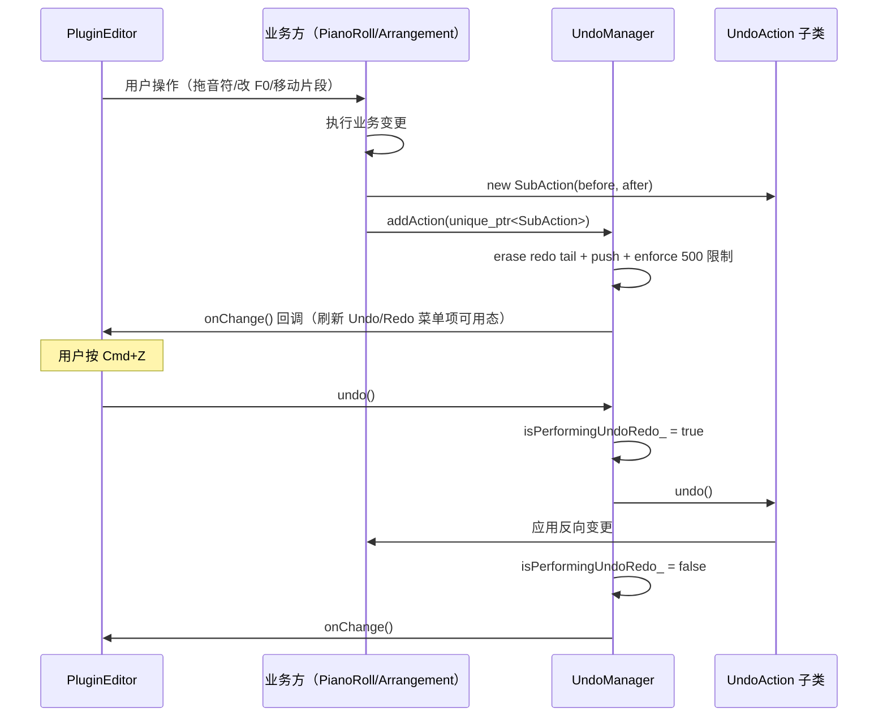
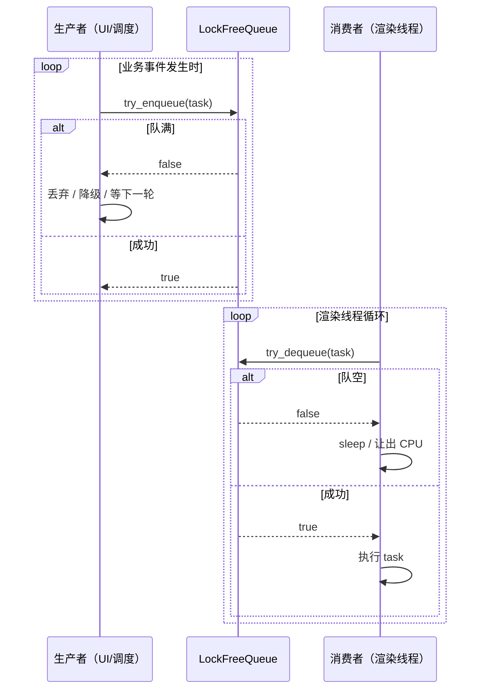
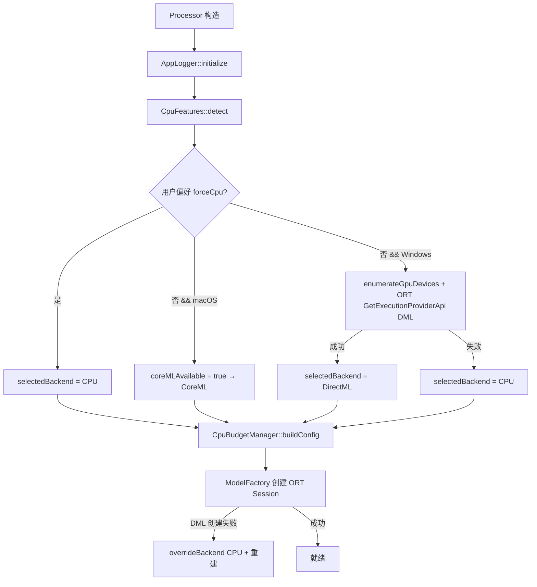
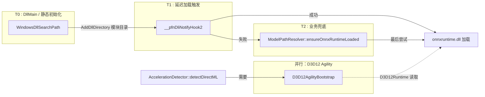

# Utils 模块使用约定与关键时序

> `utils` 是基础设施模块，无业务语义。本文档以"数据访问规约 + 关键读写时序"的基础设施视角，梳理各组件的使用约定、线程安全契约、平台差异点、加载顺序。

## 1. 线程安全契约总表

| 组件 | 同步原语 | 可并发写 | 可并发读 | 约束 |
|---|---|:---:|:---:|---|
| `AppLogger`（静态接口） | `juce::CriticalSection` | ✅ | ✅ | 所有方法均可跨线程调用 |
| `UndoManager` | ❌ 无 | ❌ | ❌ | **仅 message thread**；`undo/redo` 期间 `isPerformingUndoRedo_` 守卫 |
| `LockFreeQueue<T>` | `std::atomic` + cache-line 对齐 | ✅ MPMC | ✅ MPMC | `clear()` 不可与其他操作并发 |
| `PresetManager` | ❌ 无 | ❌ | ❌ | message thread |
| `CpuFeatures::getInstance` | Meyers singleton | `detect()` 非并发 | ✅ | 启动期初始化后只读 |
| `AccelerationDetector::getInstance` | Meyers singleton | `detect()/reset()/overrideBackend()` 非并发 | ✅ | 启动期初始化后只读 |
| `CpuBudgetManager` | 全静态纯函数 | N/A | ✅ | 无状态 |
| `SilentGapDetector::getConfig/setConfig` | `std::mutex` | ✅ | ✅ | 检测函数本身无状态 |
| `LocalizationManager::getInstance` | `juce::ListenerList` | ❌ | ❌ | message thread（UI 一致约束） |
| `ModelPathResolver` | 全静态纯函数 | N/A | ✅ | Windows `LoadLibraryExW` 本身线程安全 |
| `KeyShortcutConfig` 工具函数 | N/A | N/A | ✅ | `KeyShortcutSettings` 由持有者负责同步 |
| 平台 shim（DLL/delay-load） | N/A | - | - | 全局静态初始化 + DLL loader 序列化 |

## 2. 撤销/重做使用流程

业务方通过三步使用 `UndoManager`：

1. **定义子类**：在业务模块（如 `Source/Utils/PianoRollEditAction.h`、`Source/Utils/PlacementActions.h`）继承 `UndoAction`，实现 `undo()/redo()/getDescription()`。
2. **构造并 addAction**：业务操作完成后 new 一个子类实例 + `unique_ptr` 包装 + 提交到 `UndoManager::addAction`。
3. **键绑定触发 undo/redo**：`PluginEditor` 拦截快捷键（通过 `KeyShortcutConfig::matchesShortcut` 匹配 `ShortcutId::Undo/Redo`）后调用 `UndoManager::undo/redo`。

### 触发链时序



关键护栏：
- `isPerformingUndoRedo_ = true` 期间，业务方在 `undo()` 内部若误调用 `addAction`，直接被 `if (isPerformingUndoRedo_) return;` 拦截，栈状态不被破坏
- `cursor_` 始终满足 `0 <= cursor_ <= actions_.size()` 不变量
- 栈溢出（>500）：`actions_.erase(begin)` 丢弃最早一条，代价是第 501 次修改之后再也无法回到初始状态

## 3. 锁无关队列 producer/consumer 协议

`LockFreeQueue<T>` 的约定用法（以 `VocoderRenderScheduler` 为典型）：



规约：
- **队满处理**：生产者必须处理 `false` 返回值（不能无限 retry 造成 spin）
- **队空处理**：消费者应让出 CPU（condition_variable / sleep）而非 busy-wait
- **容量为 2 的幂**：构造时 `assert((capacity & (capacity-1)) == 0)`
- **不要在并发读写时调用 `clear()`**：非原子操作
- `size()` 可能**短暂不精确**，仅用于监控

## 4. CPU 预算的查询/更新时序

`CpuBudgetManager` 是纯函数工具（无状态），由 `PluginProcessor` 在初始化链中调用：

1. `AppLogger::initialize()`
2. `CpuFeatures::getInstance().detect()` —— 拿到 `logicalCores_`
3. `AccelerationDetector::getInstance().detect()` —— 确定是否为 GPU 模式
4. `auto cfg = CpuBudgetManager::buildConfig(gpuMode=isDirectMLSelected, hw=logicalCores);`
5. `ModelFactory` 创建 ORT `SessionOptions` 时读取 `cfg.onnxIntra/onnxInter/onnxSequential/allowSpinning`

关键约束：**计算一次，整个会话不变**。播放/暂停不重算预算（避免 ORT session 重建）。

## 5. 加速检测的初始化时机

`AccelerationDetector::detect(forceCpu)` 在如下时机调用：

- **启动时**：`PluginProcessor::PluginProcessor()` 中早期调用，`forceCpu` 来自 `AppPreferences::useCpuPreferredBackend`
- **设置页改动后**：用户在 UI 设置"渲染优先级"切换 CPU/GPU 时，`AppPreferences` 通知 → Processor 调 `reset()` → 再 `detect(forceCpu=...)`
- **Fallback 时**：`VocoderFactory::createVocoder` 创建 DML session 失败 → 调 `overrideBackend(AccelBackend::CPU)` 更新选中后端，避免 UI 显示与实际不一致

### 初始化链完整时序



## 6. 平台 shim 加载顺序（Windows）

Windows 平台 ONNX Runtime DLL 加载有三层防护，按**时间先后**：

1. **T0：进程启动（`main` 之前）**
   - `WindowsDllSearchPath.cpp` 全局静态对象 `WindowsDllSearchPathInitializer` 构造
   - `SetDefaultDllDirectories(SEARCH_DEFAULT_DIRS | SEARCH_USER_DIRS)` 关闭当前目录默认搜索（安全加固）
   - `AddDllDirectory(moduleDir)` 把插件/EXE 所在目录纳入搜索
   - 效果：后续任何 `LoadLibrary` 都会优先在模块目录找 DLL

2. **T1：首次访问 ORT 符号（延迟加载）**
   - MSVC 链接器看到 `delayload:onnxruntime.dll` → 触发 `__pfnDliNotifyHook2` 回调
   - `OnnxRuntimeDelayLoadHook.cpp` 的 `onnxRuntimeDelayLoadHook`：按**模块目录 → ProgramFiles/OpenTune → ProgramData/OpenTune** 顺序尝试 `LoadLibraryExW`
   - 返回 HMODULE 给链接器，链接器解析后续符号
   - **已加载（`GetModuleHandleW("onnxruntime.dll") != nullptr`）则直接返回 nullptr**（让默认行为生效）

3. **T2：业务代码兜底调用**
   - `ModelPathResolver::ensureOnnxRuntimeLoaded()`：在创建 ORT 对象前由业务方主动调用
   - 已加载直接返回 true
   - 未加载时再按 Program Files → ProgramData → 模块目录尝试 `LoadLibraryExW(LOAD_WITH_ALTERED_SEARCH_PATH)`
   - 作为延迟加载钩子失效时的最后保险

同时，`D3D12AgilityBootstrap.cpp` 的两个导出符号（`D3D12SDKVersion / D3D12SDKPath`）在 D3D12 Runtime 初始化 DirectML 设备时被读取，指示运行时加载 `./D3D12/` 子目录下的新版 Agility SDK。

### 关系图



## 7. 本地化订阅与字符串解析

### 双层机制

- **`LanguageState` 绑定栈**：`AppPreferences`（或测试代码）构造 `shared_ptr<LanguageState>`，通过 `ScopedLanguageBinding` RAII 压入；`Loc::get(key)` 通过 `resolveLanguage()` 读取栈顶
- **`LanguageChangeListener` 观察者**：UI 组件在 `componentPeerChanged` 时 `addListener`，`Preferences` 写入后主动 `notifyLanguageChanged(lang)` → 各监听者收到通知刷新文案

### 典型调用链

```
AppPreferences::setLanguage(Chinese)
    ├─ languageState_->language = Chinese
    └─ LocalizationManager::getInstance().notifyLanguageChanged(Chinese)
         └─ listener.languageChanged(Chinese)
              └─ component.repaint() 或 rebuildMenus()
```

### 翻译查找
`Loc::get(key)` → `LocalizationManager::resolveLanguage()` → `Loc::get(lang, key)` → 线性 `strcmp` 查翻译表 → 未命中返回 key 本身（作为降级 fallback）。

## 8. 静音配置查询/修改

`SilentGapDetector::DetectionConfig` 全局单例 + `std::mutex` 保护：

- 读取：`getConfig()`（拷贝）
- 写入：`setConfig(cfg)` 内部 `sanitizeConfig` 强制参数合法化
- 重置：`resetConfig()` 恢复 `kDefault*` 常量

UI 设置页在用户调整阈值时调用 `setConfig`；渲染调度在计算 chunk 边界前调 `detectAllGapsAdaptive` 使用当前配置。

## 9. 日志初始化/关闭

### 初始化
`AppLogger::initialize()` 幂等，目录创建策略：
1. 尝试 `userApplicationDataDirectory/OpenTune/Logs`
2. 失败回退到 `tempDirectory/OpenTune/Logs`
3. 使用 `juce::FileLogger::createDateStampedLogger`（每天一个 `.log` 文件）
4. 绑定为 `juce::Logger::setCurrentLogger`，所有 JUCE `DBG` 输出也一并写入

### 关闭
`AppLogger::shutdown()` 在 `PluginProcessor` 析构时调用，解绑 JUCE logger 并释放 FileLogger。非关键路径失败不中止进程。

## 10. 错误传播约定

- 业务代码使用 `Result<T>` 作为返回值，不跨 API 边界抛异常
- 调用方 `if (!result.ok()) { AppLogger::error(result.error().fullMessage()); ... }`
- `value()` 仅在确认 `ok()` 后访问，否则会抛 `std::runtime_error`（用于快速失败调试）
- 错误链路：业务方用 `Result::failure(ErrorCode::X, "ctx")` 构造 → 上层累积 context → 日志输出 `fullMessage()`（包含上下文）

## ⚠️ 待确认（综合四类）

**使用约定类**：
1. `UndoManager::clear()` 当前由业务方（如打开新文件时）显式调用，无自动触发点 —— 是否需要项目级"清栈"事件钩子
2. `LockFreeQueue` 的队满/队空降级策略未在 utils 层规约，由各调用方自定 —— 是否应提供默认 retry-with-backoff 辅助函数

**线程安全类**：
3. `AccelerationDetector::overrideBackend` 的写入未加锁，依赖"只在 VocoderFactory fallback 时调用一次"的约定 —— 多插件实例同时 fallback 是否会竞态
4. `LocalizationManager::listeners_` 是 `juce::ListenerList`，按约定只在 message thread 访问，但 `notifyLanguageChanged` 无断言验证 —— 需确认是否需要加 `JUCE_ASSERT_MESSAGE_MANAGER_IS_LOCKED`

**平台差异类**：
5. macOS 上 `ModelPathResolver::getModelsDirectory` 只查找 `Resources/models`（app bundle），未处理 `/Library/Application Support/OpenTune/models` —— 系统级安装场景是否存在
6. `AccelerationDetector::detectCoreML` 无条件返回 true，但 ORT 在某些旧 macOS 版本（< 10.15）CoreML EP 不可用 —— 实际失败时回退路径需确认

**性能/测试类**：
7. `CpuBudgetManager` 预算计算 `floor(hw * 0.60)`，在 32 核以上机器上分配 19 线程 —— 是否与 ORT 实际吞吐曲线匹配
8. `SilentGapDetector::detectAllGaps` 的频域约束与 `detectAllGapsAdaptive` 差异：v1.3 仓库中 `detectAllGapsAdaptive` 可能等同 `detectAllGaps`（仅传入默认配置）—— 确认两者当前是否真正不同
